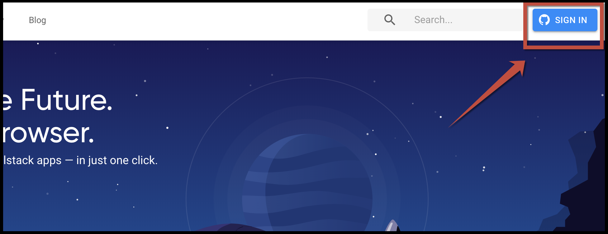
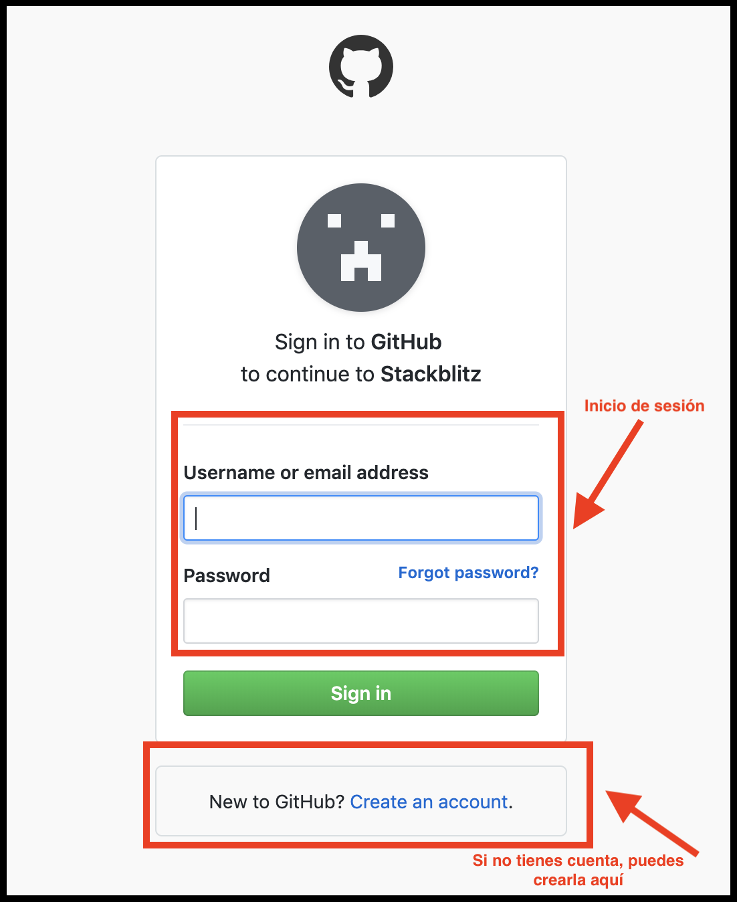

# ⚡ ¡Utiliza Stackblitz! ⚡

[**Stackblitz**](https://stackblitz.com/) ****es una página web que te permite crear aplicaciones de Angular en el navegador. Eso quiere decir que ¡no tienes que instalar nada más! 😎

[Video de Eric Simons ](https://youtu.be/Q0VPt2kF-Z0)📹📹📹

### Paso \#1 📺

Entra a **www.stackblitz.com**, y verás algo como esto:


En Stackblitz puedes crear un proyecto de Angular, React, Ionic, TypeScript, RxJS o Svelte ¡en segundos! ⏰


### Paso \#2 🅰

Selecciona **Angular,** y una vez se cree el proyecto verás algo como esto:

### Paso \#3 📂

En el panel de archivos y carpetas verás la carpeta `app`, esta carpeta es donde se encuentra nuestra aplicación. El resto de archivos son parte de la configuración de Angular. Algo por lo que no te debes preocupar aún 😉

Dentro de la carpeta `app`, vamos a buscar el archivo `app.component.html` , este archivo tiene el contenido de lo que estás viendo a la derecha. Si lo editas ¡automáticamente verás los resultados! ⚡️

Reemplaza: `Start editing to see some magic happen :)`, por `I 💙 Angular!`

## Lo lograste! 💪


Has completado este mini **desafío**, te invitamos a leer nuestro CoC - Código de Conducta **👇**


