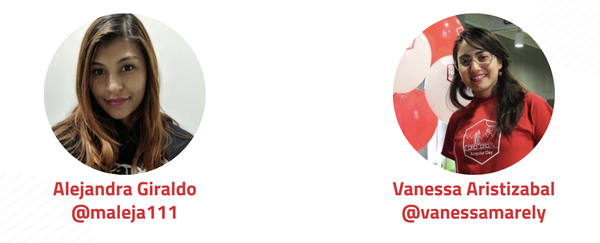

# 💃 Bienvenid@s a She Codes Angular 💃

## 1. Introducción 💪

She Codes Angular es una comunidad, enfocada en el cumplimiento de nuestra misión, que es la de empoderar y brindar un espacio seguro y de aprendizaje para las chicas de la ciudad. Nos basamos en la filosofía 👉  "**Aprender Haciendo o** _**Learning by Doing**_", basándonos en esta premisa nuestros eventos son workshops. 

En el Workshop se abordan diferentes temas de Angular, orientado a ser realizado por personas sin ninguna experiencia en programación, hasta las más expertas. No negamos el acceso a nadie, pero damos prioridad de acceso a las chicas.

## 2. Origen 🧠

En el 2018 se realizó NgGirls en la linda ciudad de Medellín. Para este evento 3 de los organizadores de este evento,  decidieron unirse para crear una nueva comunidad de Angular enfocada principalmente al público femenino. 

Del amor por Angular,  pasión por ayudar a la comunidad y compartir el conocimiento, surgió She Codes Angular, comunidad  de Medellín, creada por [Alejandra Giraldo](https://twitter.com/maleja111), [Juan Herrera](https://twitter.com/jdjuan) y [Vanessa Aristizabal](https://twitter.com/vanessamarely). 

Por motivos personales [Juan Herrera](https://twitter.com/jdjuan), emprendió nuevos rumbos 🛫🛫y ya no hace parte del equipo, el equipo actual  esta conformado por: [Alejandra Giraldo](https://twitter.com/maleja111) y [Vanessa Aristizabal. ](https://twitter.com/vanessamarely)

Nuestra primera versión de She codes Angular, se realizó el [19 de Enero del 2019](https://www.meetup.com/She-Codes-Angular/events/257810892/), esta versión fue organizada por: [Alejandra Giraldo](https://twitter.com/maleja111), [Juan Herrera](https://twitter.com/jdjuan) y [Vanessa Aristizabal](https://twitter.com/vanessamarely).

She Codes Angular participó en el [IWD - International Women's Day 2019 en marzo](https://www.meetup.com/She-Codes-Angular/events/259451451/), en conjunto con otras comunidades aliadas.

Una segunda versión se realizó de la comunidad el [1 de Junio del 2019](https://www.meetup.com/She-Codes-Angular/events/260742676/), organizado por las actuales organizadoras: [Alejandra Giraldo](https://twitter.com/maleja111) y [Vanessa Aristizabal.](https://twitter.com/vanessamarely) 

En Agosto 3 del 2019, se presento nuevamente el taller V2 de Medellín en Bogotá,  liderado por [Mayra Rodriguez](https://twitter.com/TheNativeGeekG).

Esperamos en nuestros eventos brindarte la mejor experiencia posible, que aprendas, te diviertas mucho y sobretodo  que nos puedas acompañar en las futuras versiones de nuestros eventos. 👍


Queremos que tengas un pequeño contexto que es **Angular**, por ello te invitamos a conocerlo a continuación **👇**


