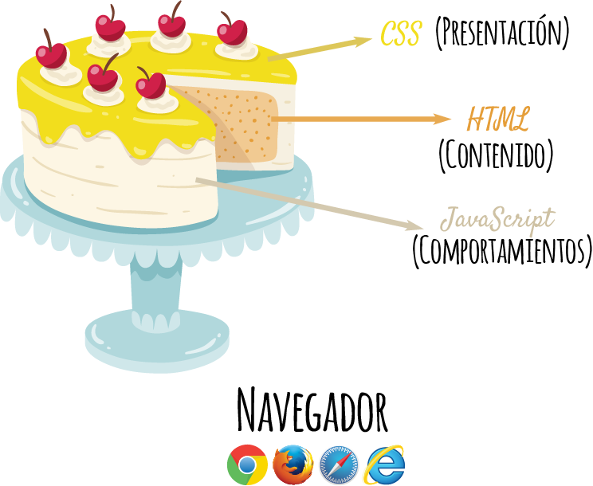
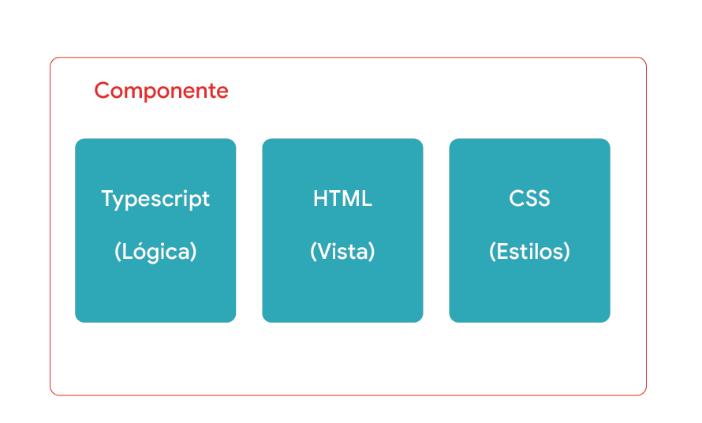

# 🅰️ ¿Qué es Angular? 🅰️

Angular, es un **Framework** que nos permite crear páginas **Web**. 👍


**¿Qué es un Framework?** 

Es ****un marco de trabajo, o un modelo, que te da una guía de que puedes usar para la construcción de tu aplicación. 🧰


## Historia 🕰️

**AngularJS**, creado por Google, fue la primera versión lanzada en el 2009, basado en JS.


**¿Qué es JS ó Javascript?** 

Es un lenguaje de programación que nos permite darle vida, dinamismo, interactividad a nuestras aplicaciones.


**Angular2**, implementó Typescript o TS como lenguaje de programación. Se quitó del nombre la palabra JS a solo Angular. Cada 6 meses se lanza una nueva versión. Actualmente fue lanzada la versión 8.


**¿Qué es TS o Typescript?**

Es un superset de JS \(quiere decir que es un lenguaje creado sobre otro lenguaje\), creado por Microsoft. Este lenguaje potencia las características de JS. 💪

Te invitamos a leer este artéculo si quieres saber más sobre TS 👉 [`Qué Es TypeScript`](https://codigofacilito.com/articulos/typescript)


## Características 🏷️

* Tiene una gran documentación
* Es un Framework rápido
* Fácil de usar
* Tiene una gran comunidad 

## Estructura de Angular

La estructura de una aplicación en Angular está conformada por componentes.


**¿Qué es un componente?**

Un componente es un elemento que hace parte una composición o de un todo, en nuestro caso de una página Web. Una lista de items, un botón, un encabezado de una página, el pie de página, podrían ser un componente.


Un componente tiene principalmente un archivo de Typescript \(donde pondremos la lógica\), uno de CSS \(donde pondremos los estilos para hacerlo bonito\) y otro de HTML \(que es lo que queremos mostrar en el navegador\). Puede tener más archivos.

## ¿Confundida?

Hasta este punto te hemos mencionado conceptos que tal vez conocías y tal vez no, pero no te preocupes a medida que avances en el taller puedes ir preguntándonos sobre ellos, a los organizadores y a nuestros increíbles mentores 😀

¿Por qué no resolvemos ahora esas dudas? porque todos van a tener dudas particulares y diferentes así que no te preocupes ¡¡las resolveremos todas!! Estamos ansiosos de que nos preguntes, así que te invitamos a preguntarnos👍👍.

Tal vez tengas otra duda más, ¿necesitas saber programación para este taller o lógica?, pero de pronto no te has dado cuenta que toda tu vida has usado la lógica que se requiere en este taller, desde el hecho que tengas que decidir que ropa usar cada mañana, si deseas café o té, este tipo de interrogantes mentales o verbales es la lógica que se usa en este taller, solo aplicada a un ejercicio en particular y transformada a código. 💪

Así que la respuesta es: no necesitas saber nada previo 👍


Ahora que sabes que es **Angular** te invitamos a conocer una herramienta para crear tus Apps: **¡Stackblitz! 👇**


