# 2. ¡Ordena los números! 👩🏻‍🎨

## 💡 Introducción 💡    

El desafío consiste en construir un juego, usando el súper Framework de Angular 😛, en el cual de una lista de números aleatorios irás seleccionando los números en orden. Si seleccionas el orden correcto de menor a mayor verás un mensaje de felicitación, de lo contrario la lista desaparecerá, como por arte de magia 🧙, y verás un mensaje de error 😞

¿Estás lista?

**¡¡Claro que sí!! ¡¡ya eres toda una experta!! 👍**

[**¡Aquí puedes encontrar el demo!**](https://angular-order-numbers.stackblitz.io)

## ✨ Paso 1: Crear el título ✨

Como en el desafío anterior, iniciaremos por el título. Para ello simplemente iremos al archivo **app.component.html,** borramos todo el contenido y vamos a colocar lo siguiente:



```markup
<div class="container">
  <h1>💃💃🏻💃🏽 ¡¡¡Ordenemos los números!!! 💃💃🏻💃🏽</h1>
</div>
```



Pondremos unos emojis para hacerlo más bonito 💙💙.  
¿Además, viste que puse otra etiqueta llamada **&lt;div&gt;**? esta etiqueta es opcional, pero es bueno darle más orden a nuestro documento y que nuestras etiquetas no estén por ahí, huerfanitas 😢. Nos podría servir para personalizar luego nuestro juego con **CSS**.


¡**Te explicaré que hemos visto hasta ahora!**👇

**Etiquetas:** Las etiquetas o tags son la forma de escribir código HTML, es la semántica del HTML. Son fragmentos de texto rodeados por corchetes angulares `< >,` que tienen funciones y usos específicos, existen muchas etiquetas como **&lt;div&gt;&lt;/div&gt;**, **&lt;p&gt;&lt;/p&gt;**, ****entre otras. 

**&lt;div&gt;**: Es una etiqueta que se emplea para definir un bloque de contenido o sección de la página

**&lt;h1&gt;:** Es una etiqueta para los títulos

**class="":** Es un atributo \(hace referencia a un selector de **clase**, que es algo que se usará en el CSS para darle estilos\)


Deberías ver algo así: 👇

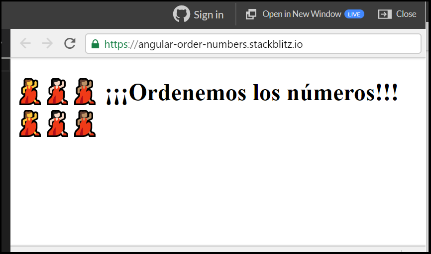

## 🆒 Paso 2: Agregar los botones 🆒

Ahora vamos a agregar **los botones.** Para hacerlo vamos a usar la etiqueta **&lt;button&gt;**:



```markup
<button type="button">5</button>
```



Pero espera, solo veo una, ¿qué paso con el resto? 🤔🤔🤔  
Para los demás botones vamos a ser como los "Pros"👩‍🎓👩‍🎓,  un montón de botones usando el código, pero más adelante.  
Como ya sabes añadir la etiqueta **&lt;div&gt;**, vamos a agregarla,  dentro de ella pondremos nuestro botón y le pondremos una clase llamada **"numbers-container"** para después usarla en los estilos.  
Como sé que tú eres una tesa 💪🏻, no te daré el pastel 😋, solo un tip: es igual que cuando agregaste el título.😉😉

Ahora, solo veremos algo así: 👇

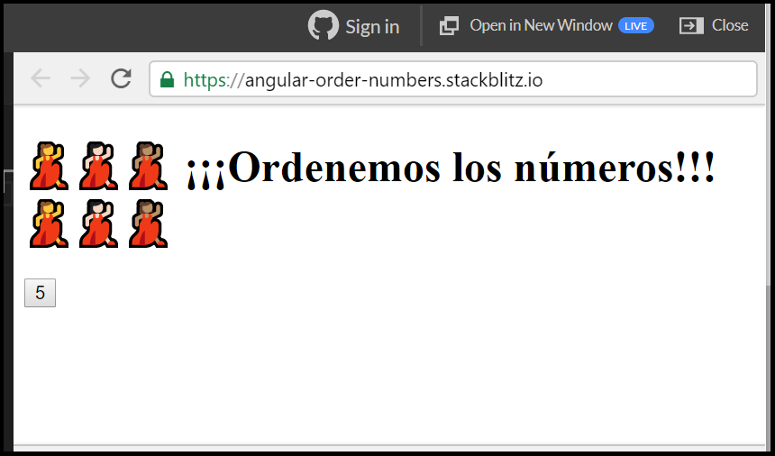

## 💬 Paso 3: Agregar el mensaje 💬

Ahora pondremos nuestro mensaje, para ello podemos usar dos etiquetas, un **&lt;div&gt;** y dentro de esta etiqueta añadimos un **&lt;p&gt;** 



```markup
  <div>
    <p>Mensaje</p>
  </div>
```



El texto dentro de las etiquetas es opcional, después haremos algo súper chévere y automático 🤓🤓Nuestro progreso sería éste: 👇

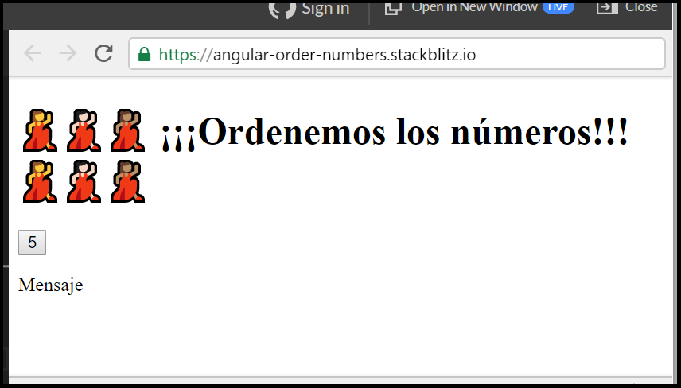

## 🍭 Paso 4: Agregar los estilos 🍭

Ahora sí, vamos a ponerlo bonito!! 💅. Vamos a agregar un poco de **CSS** para darle color a nuestro juego. Reemplaza el contenido de **app.component.css** con el siguiente:



```css
* {
  font-family: Lato;
}

.container h1 {
  color: #333;
  text-align: center;
}

.numbers-container {
  display: flex;
  flex-direction: row;
  flex-wrap: wrap;
  justify-content: space-between;
  margin: 0 auto;
  width: 50%;
}

.numbers-container button {
  cursor: pointer;
  background: #f45c41;
  border: 0;
  border-radius: 6px;
  color: white;
  font-size: 16px;
  height: 60px;
  margin-bottom: 10px;
  text-align: center;
  width: 60px;
}

.message {
  border-radius: 20px;
  box-shadow: 5px 5px 20px #cbcdd3;
  margin: 0 auto;
  height: 200px;
  padding: 20px;
  text-align: center;
  width: 50%; 
  /* Alinear texto verticalmente*/
  display: flex;
  align-items: center;
  justify-content: center;
}

.message > p {
  color: #fcfcfc;
  font-size: 35px;
  line-height: 40px;
  padding-bottom: 5px;
  text-transform: uppercase;
}
```



Ahora puedes decir que eres una experta 👩‍💻 en **CSS** y tu App \(o juego\) luciría así: 👇

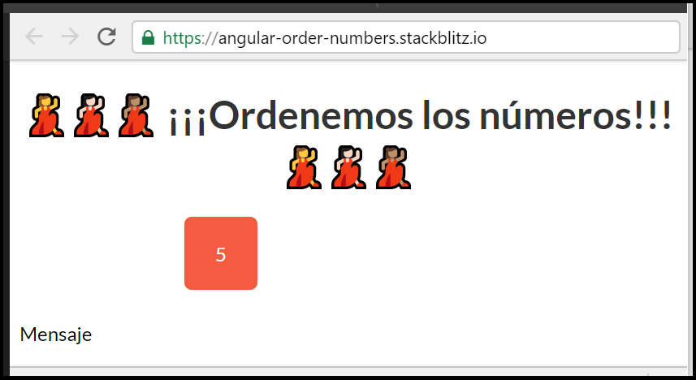

Ahora iniciaremos con la lógica o código. Estás lista!!!😎

## 👩‍🔧 Paso 5: Generemos la lista de números aleatorios 👩‍🔧

Empecemos con el código.  
Seguiremos utilizando TypeScript, que como mencionamos es JavaScript sólo que con súper poderes 💪.  
Lo primero que haremos es que definiremos las variables que vamos a usar en el archivo "**app.component.ts"**, todo esto será dentro de la clase **AppComponent** \(en código una Clase nos permite definir propiedades y comportamientos o funciones\):



```typescript
export class AppComponent  {
  arrayRandomNumbers;
}
```



El segundo paso es generar nuestra lista de números. Para ello crearemos una función \(comportamiento\) que genere los números de manera aleatoria. La llamaremos **generateArrayRandomNumbers\(\):**



```typescript
export class AppComponent  {
  arrayRandomNumbers;

  generateArrayRandomNumbers() {
    const maxNumber = 10;
    const array = [];
    for(let i=0; i < maxNumber; i++) {
      const randomNumber = Math.round(Math.random() * maxNumber);
      array.push(randomNumber);
    }
    return array;
  }
}
```



¿Qué fue todo lo anterior?👆, no te preocupes, ahora te vamos a explicar detalladamente 😉 👇.


**Te explicaremos todo, para que no tengas ninguna duda**

**1.** Definimos una variable llamada **maxNumber** \(¿qué es una variable??, es como un caja, donde puedes poner cosas 🎁\). Ésta almacenará el número máximo de datos que queremos que tenga nuestra lista de números aleatorios. Puedes cambiarlo por **20**, **100** o **1000 👍**, si quieres ordenar mucho.

**2.** Creamos un array, nombrémoslo **array** \(¿qué es esto??, es otra caja, donde puedes poner otro montón de cosas 📇\). Éste almacenará la lista de números aleatorios🔀.

**3.** Crearemos un **for**, \(otra cosa rara, ¿qué es eso??, un **for**, o un iterador, es algo que te permite hacer un proceso x cantidad de veces 🔁\). El **for** tiene una estructura definida entre los \(\), le pasas primero una variable que lo inicializa, luego haces una condición que te permite definir hasta cuando quieres que se repita el proceso y por último le dices a tu variable que vaya incrementando su valor.

**4.** Dentro del **for** dentro de las llaves **{}**, vamos a añadir una variable llamada **randomNumber**, a la cual le asignaremos las dos funciones que usamos en el juego anterior, la **Math.round\(\)** para quitar los decimales y la **Math.random\(\)** para generar números aleatorios.

**5.** Después de nuestro **for**, añadiremos un **return**, éste nos va a permitir devolver el array, en donde vayamos a llamar nuestra función **generateArrayRandomNumbers\(\)**


Ahora vamos a llamar nuestra función **generateArrayRandomNumbers\(\)**, en otra función llamada **generateNumbers\(\)**, que actualizará la variable **arrayRandomNumbers**👇



```typescript
export class AppComponent {
  arrayRandomNumbers;

  generateNumbers(){
    this.arrayRandomNumbers = this.generateArrayRandomNumbers();
  }

  generateArrayRandomNumbers() {
    const maxNumber = 10;
    const array = [];
    for (let i=0; i < maxNumber; i++) {
      const randomNumber = Math.round(Math.random() * maxNumber);
      array.push(randomNumber)
    }
    return array;
  }
}
```



Para que el código funcione debemos asegurarnos de llamar a la función que acabamos de crear. Para ello podemos usar el constructor \(es una función o método, equivalente a una Clase, que son constructores que permiten definir propiedades y comportamientos=funciones\): 👇



```typescript
export class AppComponent {
  arrayRandomNumbers;

  constructor() {
    this.generateNumbers();
  }

  generateNumbers(){
    this.arrayRandomNumbers = this.generateArrayRandomNumbers();
  }

  generateArrayRandomNumbers() {
    const maxNumber = 10;
    const array = [];
    for (let i=0; i < maxNumber; i++) {
      const randomNumber = Math.round(Math.random() * maxNumber);
      array.push(randomNumber)
    }
    return array;
  }
}
```



Ahora añadamos lo que hicimos en nuestro **HTML** para mostrar esa lista de números que generamos en nuestro archivo **app.component.html**, así: 👇



```markup
  <div class="numbers-container">
     <div class="button-container" *ngFor="let number of arrayRandomNumbers">
        <button type="button">{{ number }}</button>
     </div>
  </div>
```



Notaste que colocamos otro **&lt;div&gt;,** la clase en él es opcional, pero tiene algo llamado **"\*ngFor"**, no te preocupes ya te explicaremos todo**🤗**👇


**\*ngFor** es una directiva en Angular, nos permite presentar una lista de elementos en pantalla de una forma sencilla. Tiene una sintaxis no muy compleja, se inicializa una variable que la podemos llamar **number**, que será el elemento que nos irá mostrando de la lista de nuestros números aleatorios **arrayRandomNumbers**

**Directiva** es un atributo en una etiqueta HTML\(etiquetas como **&lt;div&gt;** o **&lt;button&gt;**\), que tiene un comportamiento definido por **Angular** como con la directiva **\*ngFor**

**String Interpolation** como lo vimos en el juego anterior, es la técnica que nos permite mostrar los números en la vista \(HTML\). Para ello simplemente basta con tener las variables declaradas \(en el "**app.component.ts"**\) y utilizar las llaves para mostrarla así:


¡Verás la lista de todos los elementos que se generaron aleatoriamente! 🎉🎉🎉

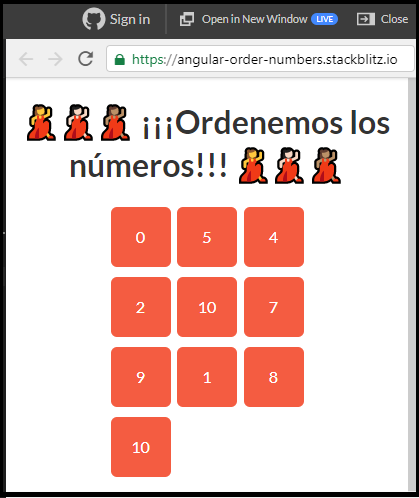

## 🧐 Paso 6: Seleccionemos un número en orden de menor a mayor🧐

¡Es momento de que seleccionemos un número de nuestra lista y lo vayamos ordenando! Necesitaremos crear una nueva función que nos permita realizar esta operación.

**¿Qué haremos?**

* Crearemos una variable que nos permita almacenar cuál fue el número previo seleccionado, **previousNumber** y le asignaremos un 0.



```typescript
...
  export class AppComponent  {
    arrayRandomNumbers;
    previousNumber= 0;
  }
...
```



* Crearemos una función **clickMe\(\)**, que recibirá el número seleccionado para ****compararlo con el anterior y determinar si la respuesta es correcta. Si es correcta se actualiza la variable.



```typescript
...
  clickMe(number){
  }
...
```



* Empecemos a comparar dentro de la función el número que seleccionamos con el que vamos almacenando.



```typescript
...
  clickMe(number){
    if(number >= this.previousNumber){
      this.previousNumber = number;
    }else{
    }
  }
...
```



Interpretemos un poco el código, éste está más sencillo 😉


**Así funciona: 🤓**

Vamos a preguntar si la variable **previousNumber** es menor al número seleccionado, de ser menor actualizamos nuestra variable. En el caso de que sea mayor no hacemos aun nada.⭐️


* Falta poco para acabar. Sólo nos hace falta llamar a nuestra función en los botones. 💪

Para hacerlo vamos a ir a **app.component.html** y vamos a añadir la función así:



```markup
<div class="button-container" *ngFor="let number of arrayRandomNumbers">
     <button type="button" (click)="clickMe(number)">{{ number }}</button>
  </div>
```



¿Te parece claro? 👆


**Por si tienes alguna duda. Aquí te explicamos cómo funciona: 👷‍♀️**

**1.** Como en el juego anterior, utilizaremos una técnica llamada **Event Binding.** Ella nos permite agregar eventos a nuestra vista. En este caso utilizamos el evento de **Click**, pero pueden ser muchos tipos: **\(keyup\)**, **\(change\)**, **\(resize\)**, etc 💻

**2.** Luego escribimos la función que deseamos llamar cuando el evento se ejecute. En este caso estamos llamando a la función **clickMe\(\)** que creamos arriba👆.


Visualmente no es mucho el cambio en nuestro juego 👇

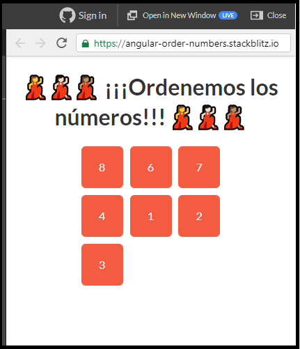

## 👻Paso 7: Ocultemos el número y limpiemos la lista 👻

Ahora vamos a ocultar el número que vamos seleccionando. Necesitaremos crear una nueva función que nos permita realizar esta nueva operación.

¿Qué haremos?

* Crearemos una función llamada **removeElement\(\)**, que va a recibir un parámetro **number**, que será el número que vamos a ocultar o quitar de la lista. 



```typescript
...
  removeElement(number){
  }
...
```



* Dentro de la función crearemos una variable **position**, la cual va a guardar la posición en la cual se encuentra el número que vamos a quitar de nuestra de lista de aleatorios. A ésta le asignamos nuestra función de aleatorios **arrayRandomNumbers\(\)** seguida del método **indexOf\(\)** al cual le pasaremos nuestro número.



```typescript
...
  removeElement(number){
    const position = this.arrayRandomNumbers.indexOf(number);
  }
...
```



* Al tener la posición lo único que nos falta es quitarlo de nuestra lista de aleatorios. Para eso usaremos otro método llamado **splice\(\)**. Debajo de nuestra variable **position** haremos la operación de remover el elemento.



```typescript
...
  removeElement(number){
    const position = this.arrayRandomNumbers.indexOf(number);
    this.arrayRandomNumbers.splice(position, 1);
  }
...
```



Interpretemos que hicimos 😉


**Así funciona: 🤓**

**1.** Buscamos la posición que tiene el número que seleccionamos al dar clic en el botón, esto lo hacemos en nuestra variable **position** usando el método **indexOf** que nos permitirá buscar la posición del elemento.

**2.** A nuestro array de números aleatorios le vamos a remover el número usando el método **splice\(\)**, este método permite añadir o remover elementos de un array, en nuestro caso el array es la lista de números aleatorios y lo único obligatorio que debemos pasarle al método **splice\(\)** es la posición.  **¡Notaste que pasamos la posición y el 1!** el 1 lo pasamos porque estamos indicando que solo vamos a remover un elemento, que lo demás lo deje como está

Espero que ahora este todo más claro **👍**


* Ahora debemos llamar a nuestra función. Esto es super fácil. En nuestra función **clickMe\(\)**, lo que haremos dentro de nuestras condiciones \(o cada una de las preguntas\), es llamar la función donde lo necesitemos.



```typescript
...
  clickMe(number){
   if(number >= this.previousNumber){
      this.previousNumber = number;
      this.removeElement(number);
    }else{
    }
  }
...
```



¿Por qué hicimos esto?, ya te explicamos 👇


**Así funciona: 🤓**

Al seleccionar un número o darle clic, evalúa la primera condición y  pregunta si el número seleccionado es mayor o igual a nuestra variable **previousNumber**, si se cumple la condición entonces eliminemos este número y llamemos a nuestra función **removeElement\(number\)** 


Ahora espero sea todo más claro. Lo que haremos será limpiar la lista de nuestros números aleatorios, cuando un número seleccionado sea mayor al de nuestra variable **previousNumber** y nos borre toda la lista. 

Haremos lo siguiente:

* En nuestro **else** vamos a limpiar nuestro array de números aleatorios, para ello solo es necesario asignarle al **arrayRandomNumbers** los corchetes \[\]. Así: 👇



```typescript
...
  clickMe(number){
   if(number >= this.previousNumber){
      this.previousNumber = number;
      this.removeElement(number);
    }else{
      this.arrayRandomNumbers = [];
    }
  }
...
```



Nuestra lista se vería así:

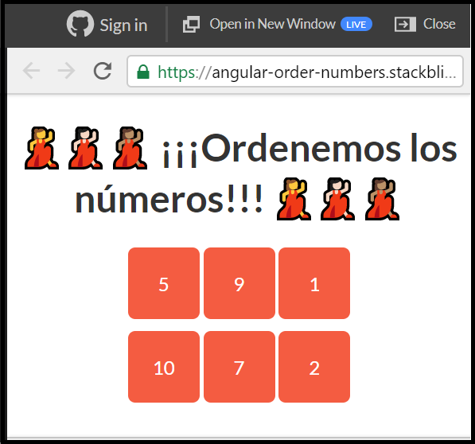

Al seleccionar y eliminar los elementos quedaría así:

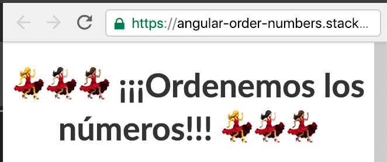

**¿Te pareció súper fácil?,** al principio todo se ve complicado, pero poco a poco es más fácil de entender después de la practica 🤗🤗

## 🧠Paso 8: Muestra el mensaje 🧠

Tenemos nuestro juego casi terminado, solo falta mostrar un mensaje cuando estemos seleccionado bien los números para felicitar a nuestro usuario, y un mensaje de error cuando falle.

Haremos lo siguiente:

* Crearemos tres variables, una para mostrar el mensaje llamada **showSuccessMessage**, ****otra **showErrorMessage** y **message** que tendrá el texto del mensaje**.** En nuestro archivo "**app.component.ts"**, crearemos nuestras variables, debajo de las demás que hemos creado anteriormente:



```typescript
...
  export class AppComponent  {
    arrayRandomNumbers;
    previousNumber= 0;
    showSuccessMessage = false;
    showErrorMessage = false;
    message;
  ...
```



* En la función **clickMe\(\),** le pondremos un valor a nuestras variables.



```typescript
...
  clickMe(number){
    if(number >= this.previousNumber){
      this.previousNumber = number;
      this.removeElement(number);
      this.message = "Estas haciendolo muy bien!! 💪";
      this.showSuccessMessage = true;
      this.showErrorMessage = false;
    }else{
      this.arrayRandomNumbers = [];
      this.message = "Fallaste 😟";
      this.showSuccessMessage = false;
      this.showErrorMessage = true;
    }
  }
  ...
```



**¡Te explicare todo para que quede más claro!!**


**Hicimos lo siguiente: 🤓**

**1.** Primero creamos nuestras variables y le asignamos a **showSuccessMessage** y **showErrorMessage** el valor de **false** para controlar que inicialmente no muestre el mensaje**👍**

**2.** En nuestra función  **clickMe\(\)**, en nuestro primer condicional en el **if** le asignamos un texto en la variable **message** para indicar que esta haciéndolo bien,  a la variable **showSuccessMessage** le asignamos **true** para controlar que muestre el mensaje y a  **showErrorMessage** le asignamos **false** para ocultarlo.

**3.** En el condicional **false** en la variable **message** le asignamos el mensaje de error, a **showSuccessMessage** le asignamos **false** para ocultarlo y a  **showErrorMessage** le asignamos **true** para mostrarlo.


* Ahora es necesario modificar un poco nuestro HTML del mensaje. Vamos a ir al archivo **app.component.html** y vamos a modificar nuestro mensaje así:



```markup
<div class="message succes-message" *ngIf="showSuccessMessage">
  <p>{{ message }}</p>
</div>
<div class="message error-message" *ngIf="showErrorMessage">
  <p>{{ message }}</p>
</div>
```




**Por si tienes alguna duda. Aquí te explicamos cómo funciona: 👷‍♀️**

**1.** Creamos dos mensaje uno para mostrar el mensaje de error y el otro cuando estes ordenando correctamente.

**2.** En nuestras etiquetas **&lt;div&gt;&lt;/div&gt;** añadimos una directiva llamada **\*ngIf**. Esta directiva nos permite ocultar o mostrar contenido. En nuestro caso nos permitirá ocultar o mostrar el mensaje, con nuestras variables **showSuccessMessage** y **showErrorMessage**. Además pondremos el atributo class="" y en él colocamos la clase message y una clase para cuando sea el mensaje exitoso **succes-message** y en la otra la clase del mensaje de error **error-message.**

**3.** Usando el concepto de interpolación que te habíamos explicado antes \( **{{ variable }}** \)👆, colocamos nuestra variable **message**, entre las etiquetas **&lt;p&gt;&lt;/p&gt;**


Ahora ya tenemos nuestro juego terminado. 🎆🎆🎆

Así lucirá nuestro juego cuando seleccionamos el primer número y cuando seleccionemos los siguientes en orden solo que con un emoji diferente.


Así luce cuando fallamos.

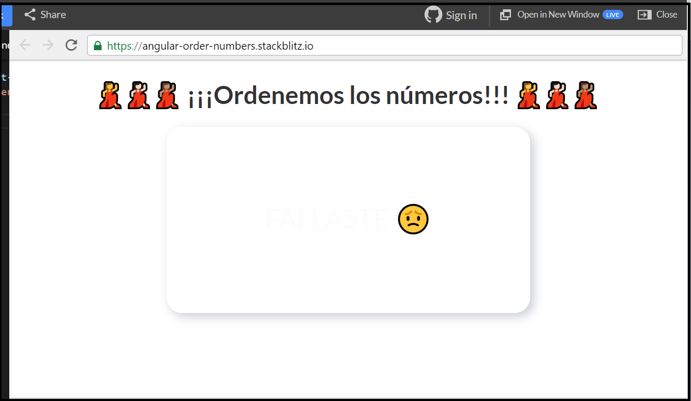

¡Pero espera falta ponerla más bonita, el color del texto no se ve claramente y tiene un fondo blanco! 😕

## 🤡Paso 9: Pongámoslo más bonito y mejorémoslo!! 🤡

En el paso anterior añadimos unas clases en nuestras etiquetas. Ahora vamos a usarlas para colocarle más color y vida a nuestro juego.  
Vamos a agregar más **CSS** y para ello al final de los estilos que habíamos añadido en el archivo  **app.component.css**, añade las siguientes líneas: 



```css

.error-message {
  background: linear-gradient(to bottom left, #EF8D9C 40%, #FFC39E 100%);
}

.error-message > p {
  color: #cf0404;
}

.succes-message {
  background: linear-gradient(to bottom right, #B0DB7D 40%, #99DBB4 100%);
}

.succes-message > p{
  color: #3e6a29;
}

```



Vamos a ver nuestros mensajes así:

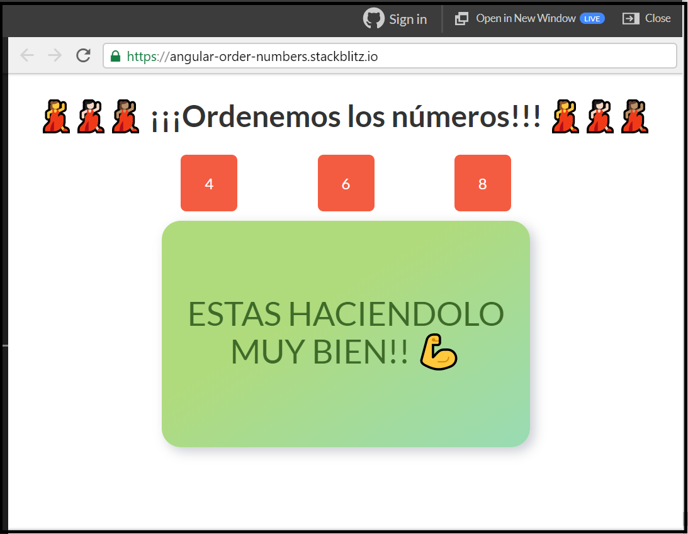

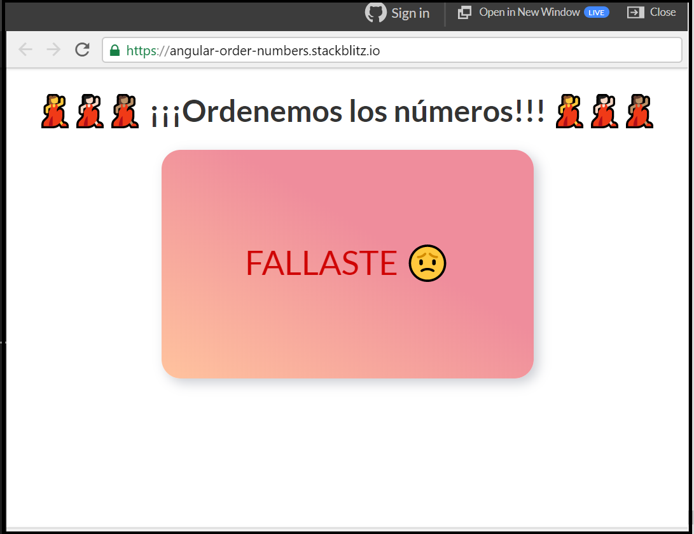

Ahora es tiempo que juegues un poco con tú creatividad y lo aprendido y pongas más estilos **CSS** si quieres o más **HTML**. La idea es que lo personalices un poco.

Puedes mejorar el juego añadiéndole un funcionalidad extra. Cuando un usuario falle, puedes mostrar un botón, que te permita mostrar de nuevo la lista de números aleatorios, para iniciar el juego. 

Para hacer la funcionalidad extra, te daré el siguiente tip:

* Añade un botón al final de tu **HTML**, donde le pondrás el evento click **\(click\)=""** , es similar a como lo hicimos con la función **clickMe\(\),** pero llamando a una nueva función que crees en donde llamaras a la función **generateNumbers\(\)**, para volver a generar la lista de números aleatorios. Ademas en esta nueva función debes ocultar el mensaje de error \(actualizando la variable **showErrorMessage= false**\). Este botón solo debes mostrarlo cuando el usuario falle \(usa la directiva **\*ngIf** \).

En este caso no te daré el pastel, porque se que tu puedes hacerlo sola 💪 solo debes aplicar todo lo aprendido. Si tienes dudas pregúntale a los mentores 👍

## 💪 Misión Cumplida 💪

Tu aplicación está lista 👍👍

¡Cumpliste el segundo desafío!👏👏👏👏


\*\*\*\*[**Aquí**](https://stackblitz.com/edit/angular-order-numbers) puedes encontrar el ejercicio resuelto.


## 🎉 ¡**LO LOGRASTE!** 🎉


Has completado el **desafío \#3**, ahora vamos a el **desafío \#4 👇**



**Nota:**

Si necesitas mentoría con este ejercicio puedes contactar a:

Vanessa Marely  
Twitter: @vanessamarely  
Correo: vanessamarely@gmail.com


