# 3. ¿Cuál fue el emoji? 👑

## 💡 Introducción 💡 

Construiremos un juego de memoria. 🧠  
  
**Tendremos:** Un botón que inicie el juego, un contador de segundos que nos dirá cuanto tiempo hemos llevamos jugando, e inmediatamente se nos presentará un emoji que vamos a memorizar, paso siguiente, aparecerá una serie de emojis en pantalla y tú tendrás que responder si es el emoji que tenias que recordar o no, ademas celebraremos cuando identifiques exitosamente el emoji ¡¡Con una linda imagen de un gatito 😻😻!!

¿Estás lista?

**¡Claro que sí! ¡Ya tienes experiencia! 💪**

[**¡Aquí puedes encontrar el demo!**](https://angular-last-emoji.stackblitz.io/)**​**

## Paso 1: Crear vista del tablero de juego **🎮**  <a id="paso-1-crear-el-titulo"></a>

Vamos a crear el entorno donde vamos a jugar. Para ello iremos al archivo **app.component.html** y borramos todo el contenido para adicionar lo siguiente:



```markup
<div class="scoreScreen">
	<label>
    Score:
  </label>
  <label>
    {{scoreGame || 0}}
  </label>
	<label>
    / Timer:
  </label>
  <label>
    {{0}}s
  </label>
</div>

<div class="fatherScreen">
  <div class="childScreen" *ngIf='showBtnStart'>
    <button (click)="startGame()">Iniciar Juego</button>
  </div>
</div>
```



**Deberías ver algo así: 👇**



**Por si tienes alguna duda. Aquí te explicamos cómo funciona: 👷‍♀️**

**1.** La etiqueta **Div** nos ayuda a definir un orden.  
  
**2.** La etiqueta **label**  es usada para contener texto.  
  
**3.** El elemento **{{}}**  es una forma de comunicar nuestro [componente](https://platzi.com/tutoriales/1153-angular/1619-que-son-los-componentes-en-angular/).   
De esta manera el **app.component.ts**, se comunica con **app.component.html,** y ****el **\|\|** dentro ****del ****elemento es una condición "o" que nos va a mostrar el número cero mientras no exista datos en las variables.  
  
**4.** El elemento [**class**](https://css-tricks.com/almanac/selectors/c/class/)**=""** nos va a ayudar a definir los estilos de nuestra aplicación \(no solo tiene esa utilidad, pero la usaremos para eso en el ejercicio de hoy\).  
  
 **5.** El elemento **\***[**ngIf**](https://angular.io/api/common/NgIf)**=** nos va a ayudar a ocultar o mostrar elementos, depende de la variable que tengamos asignada dentro del **\*ngIf=**, en este caso tenemos la variable **showBtnStart** donde la asignaremos en el **app.component.ts** más adelante.   
  
**6.** El elemento **button** nos va a crear un botón que será el que usaremos para iniciar nuestro juego.  
  
**7.** El elemento **\(click\)=""** controla el evento cuando tú le des clic a él botón y se va a llamar la función **startGame\(\)**.


## Paso 2: Adicionar la lógica al tablero de juego 🔭 <a id="paso-1-crear-el-titulo"></a>

Ahora vamos a modificar el archivo **app.component.ts**, ****en ****este vamos a adicionar la declaración de variables que vimos en el archivo **app.component.html** y además vamos a agregar unas funciones.  
En este archivo vamos a encontrar el siguiente código:




```typescript
  scoreGame = '';
  showBtnStart = true;

  startGame() {
    this.randomEmoji();
  }
  randomEmoji() {
  }

```




**Por si tienes alguna duda. Aquí te explicamos cómo funciona: 👷‍♀️**

**1.** A la variable **scoreGame** se le asigna vacío, de esta manera le estamos diciendo que es [tipo](https://www.uno-de-piera.com/tipos-en-typescript/) **String**.  
  
**2.** A la variable **showBtnStart** se le asigna **true**, de esta manera le estamos diciendo que es [tipo](https://www.uno-de-piera.com/tipos-en-typescript/) **Boolean.**  
Además, cuando le asignamos **true**, en nuestro \***ngIf** de **app.component.html** deberá mostrar todas las líneas de código que contenga éste, pero cuando su valor sea false ocultará las lineas de código.

**3.** Creamos una función llamada **startGame\(\)**, en esta función adicionaremos la lógica que se deberá ejecutar cuando tú le des clic al botón "Iniciar Juego".

**4.** La función **startGame\(\)** llamará ****a ****su ****vez a la función **randomEmoji\(\),** que ****analizaremos ****en ****el ****paso **5**, por eso la creamos pero la dejamos sin lógica.


## Paso **3**: Agregar estilos al tablero de juego 🎨🖌

¡Vamos a hacer que nuestro tablero tenga color agregando CSS! ¿recuerdas las clases que usamos en nuestro **app.component.html**? ¡llego el tiempo de usarlas!   
Reemplaza el contenido de **app.component.css** con éste:



```css
button {  /* Afecta todas las etiquetas HTML button */
  background-color: seashell; /* Determina el color de fondo de nuestro botón */
  border: none; /* Nos elimina el borde a nuestro botón */
  border-radius: 12px; /* Hace los extremos de nuestro botón redondeados */
  padding: 16px;  /* Crea un espacio entre el borde de nuestro botón y el centro del botón */
  font-size: 20px; /* Determina el tamaño de letra dentro de nuestro bóton */
  font-weight: bold; /* Hace que nuestro texto se vea en Negrita */
  margin-right: 10px /* Crea un espacio entre el borde de nuestro botón y el exterior del mismo */
}

button:hover { /* Afecta todas las etiquetas HTML button en el momento que el cursor este sobre el */
  background: salmon; /* Determina el color de fondo de nuestro botón */
  border-style: solid; /* Nos crea un borde a nuestro botón de línea continuia */
  border-color: pink; /* Nos da un color a el borde de nuestro botón */
}

label { /* Afecta todas las etiquetas HTML label */
  white-space: nowrap; /* hace que nuestro texto no se quiebre, y se vea en una sola línea */
}
.childScreen { /* El . hace referencia a una clase, así que va a afectar todos los elementos HTML con esta clase */
  width: 120px; /* Determina el ancho de la sección */
}

.fatherScreen { /* El . hace referencia a una clase, así que va a afectar todos los elementos HTML con esta clase */
  height: 350px; /* Determina la altura de la sección */
  display: grid;  /* Define el elemento como un contenedor de cuadrícula */
  justify-content: center; /* Centra los elementos horizontalmente */
  align-items: center; /* Centra los elementos verticalmente */
  background: #e9dbf1; /* Determina el color de fondo de la sección */
  border-radius: 15px; /* Hace los extremos de nuestra sección redondeados */
}

.scoreScreen { /* El . hace referencia a una clase, así que va a afectar todos los elementos HTML con esta clase */
  background: #e9dbf1;  /* Determina el color de fondo de la sección */
  border-radius: 15px; /* Hace los extremos de la sección redondeados */
  box-sizing: content-box; /* controla cómo se maneja el elemento al que se aplica.
Los valores de ancho y alto se aplican al contenido, el relleno y el borde. */
  padding: 20px; /* Crea un espacio entre el borde de la sección y el centro la sección */
  margin-bottom: 8px; /* Crea un espacio entre el borde de la sección y el exterior de la misma */
  font-weight: bold; /* Hace que nuestro texto se vea en Negrita */
  font-size: 30px; /* Determina el tamaño de letra dentro de la sección */
}
```



¿Luce como mucho verdad?  
Pero en cada una de las líneas puedes encontrar la explicación sobre su funcionamiento.   
Si quieres profundizar tus conocimientos en CSS, aquí te dejo una Wiki con gran cantidad de definiciones y artículos. 🤓[https://css-tricks.com/](https://css-tricks.com/).

**Deberías ver algo así: 👇**


## Paso 4: Crear elementos para emoji **🚧**

Llego el momento de mostrar un emoji en pantalla, este emoji nos definirá ¡todo el juego! con este compararemos los demás emojis que saldrán aleatoriamente y ¡no solo eso! pondremos un contador de 5s a 0s donde decrementará el tiempo en el que nos memorizaremos éste.  
Actualmente nuestro **app.component.html** tiene el siguiente código, pero lo modificaremos así:




```markup
  <div class="childScreen" *ngIf='countDownEmoji > -1 && !showBtnStart'>
    <label class='emoji'>
      {{emojiArray[emojiIndex]}}
    </label>
    <br />
    <label>
      Tendrás {{countDownEmoji}}s para recordar este emoji
    </label>
  </div>
```




**Por si tienes alguna duda. Aquí te explicamos cómo funciona: 👷‍♀️**

**1.** Utilizando la línea \***ngIf**='**countDownEmoji** &gt; -1 && !**showBtnStart**', estamos diciendo lo siguiente **➤** Deberá mostrar las líneas de código que contiene solo si la variable **countDownEmoji** es ****mayor ****a ****-1, y si la variable **showBtnStart** contiene su valor en **false.**

**2.** Vamos a crear un array de emojis llamado **emojiArray** y ****según el valor de la variable **emojiIndex**, será el emoji que lograremos visualizar en pantalla para memorizar.

**3.** Tendremos una variable **countDownEmoji**, esta será la encargada de permitirnos visualizar en pantalla los segundos que van a disminuir.


## Paso 5: Generación del emoji que debemos recordar ⏲

¡Ahora sí! vamos a hacer la lógica para que nuestro emoji aparezca y se oculte a los 5s.  
Vamos a tomar nuestro archivo **app.component.ts** que ****actualmente luce así, pero adicionaremos lo siguiente:




```typescript
  // adicionamos en la línea 12, declaraciones de variables
  countDownEmoji: number;
  emojiArray = ['🚗', '🌌', '📻', '👻', '🍦', '👽', '👯'];
  emojiIndex: number;
  maxNumberEmoji = this.emojiArray.length - 1;
  countDownEmojiSize = 5;

  // adicionamos en la línea 15
  this.showBtnStart = false;
  
  // adicionamos en la línea 20, las siguientes funciones
  randomEmoji() {
    this.emojiIndex = Math.round(Math.random() * this.maxNumberEmoji);
    this.startcountDownFirstEmoji();
  }

  startcountDownFirstEmoji() {
    const intervalEmoji = setInterval(() => this.intervalEmojiControl(intervalEmoji), 1000);
  }

  intervalEmojiControl(intervalEmoji) {
    this.countDownEmoji = this.countDownEmojiSize--;

    // Cuando termine el numero de segundos para recordar la imagen, se debe parar el setInterval
    if (this.countDownEmoji < 0) {
      clearInterval(intervalEmoji);
    }
  }

```




**Por si tienes alguna duda. Aquí te explicamos cómo funciona: 👷‍♀️**

**1.** Declaramos la variable **countDownEmoji** como tipo number, haciéndolo así de tipo entero y será la encargada de llevar la cuenta de nuestro contador cuando este disminuya.  
  
**2.** Creamos la variable **emojiArray** ésta será la encargada de contener nuestra lista de emojis posibles.

**3.** Declaramos la variable **emojiIndex** como tipo number, haciéndolo así de tipo entero.   
Depende del número que tenga será la posición en el array de **emojiArray** y a su vez el emoji que podremos ver.

**4.** Creamos la variable **maxNumberEmoji** y le asignamos el valor del tamaño de nuestro **emojiArray** menos 1, esto es porque vamos a generar un número random para que sea diferente cada vez y nuestro array inicia en 0, así que si tenemos un array de 7 posiciones, el valor máximo que podríamos seleccionar seria 6.

**5.** Creamos la variable **countDownEmojiSize**, esta variable nos ayudará a definir cuántos segundos vamos a esperar para memorizarnos el emoji.

**6.** Asignamos a la variable **showBtnStart** con el valor false para que desaparezca de la pantalla y permita la visualización del emoji que debemos memorizar.

**7.** En la función **randomEmoji\(\)** generaremos un número [random](https://developer.mozilla.org/en-US/docs/Web/JavaScript/Reference/Global_Objects/Math/random) de 0 a 6 \(**emojiArray** tiene 7 posiciones\) y lo asignaremos a **emojiIndex**, con esto procedemos a llamar la función que se encargara de llamarse cada segundo.

**8.** En la función **startcountDownFirstEmoji\(\)** nos encargaremos de llamar la función que nos va a decrementar el contador cada segundo con un [**setInterval**](https://css-tricks.com/snippets/javascript/intervals/). ****Ésta función ejecuta en intervalos específicos de tiempo \(en milisegundos\) una función o las líneas de código que tenga asignadas.   
El método **setInterval\(\)** se continuará llamando hasta que se llame la función **clearInterval\(\)** o se cierre la ventana.   
La función clearInterval la explicaremos más adelante.

**9.** Creamos la función **intervalEmojiControl\(\)** ésta recibe como parámetro una variable llamada **intervalEmoji** que almacena todo el **setInterval**, esto nos ayudará a detenerlo cuando la variable **countDownEmoji** sea menor a 0 con la función [**clearInterval**](https://developer.mozilla.org/en-US/docs/Web/API/WindowOrWorkerGlobalScope/clearInterval)**\(\),** ésta borra el intervalo establecido por la función setInterval\(\) y esto hace que el contenido de la función **setInterval\(\)** no se ejecute nunca más.


## Paso 6: Agregar estilos al emoji a recordar 🎨🖌

Vamos a hacer que nuestro emoji resalte agregando un poco de CSS. Adiciona en **app.component.css** lo siguiente:



```css
.emoji { /* El . hace referencia a una clase, así que va a afectar todos los elementos HTML con esta clase */
  font-size: 100px; /* Determina el tamaño de letra dentro de la sección */
}
```



**Deberías ver algo así: 👇**


## Paso 7: Crear elementos para comparar el primer emoji **🔎** <a id="paso-4-crear-elementos-para-emoji"></a>

¡Vas muy bien! ya tenemos el emoji que debemos memorizar y desaparece a los 5s. Ahora vamos a hacer que aparezcan emojis random de nuestra lista de emojis y responder un "Si" o "No" dependiendo si él emoji que se nos presenta es el esperado.  
Para esto en el archivo **app.component.html** vamos a encontrar el siguiente código:




```markup
<div *ngIf='emojiAskIndex >= 0 && !youWin'>
  <label class='emoji'>
    {{emojiArray[emojiAskIndex]}}
  </label>
  <label>
    ¿este es tu emoji?
  </label>
  <br />
  <button class="childScreen" (click)="compareAnswer('YES')">Si</button>
  <button class="childScreen" (click)="compareAnswer('NO')">No</button>
</div>

```




**Por si tienes alguna duda. Aquí te explicamos cómo funciona: 👷‍♀️**

**1.** En la condición \***ngIf**='**emojiAskIndex** &gt;= 0 && !**youWin**' estamos diciendo lo siguiente **➤** Deberá mostrar las líneas de código que contiene solo si la variable **emojiAskIndex** es ****mayor o igual a 0 y si la variable **youWin** contiene su valor en **false.  
  
2.** Tenemos un array de emojis almacenados en **emojiArray** y ****según el valor de la variable **emojiAskIndex**, será el emoji que lograremos visualizar en pantalla para decir si es nuestro emoji o no.

**2.** También tendremos 2 botones, cada uno mediante el evento clic llama a la misma función pero le enviará valores diferentes.


## Paso 8: Generación de elementos para comparar **🔦**

Adicionaremos la lógica que nos generará de manera random los emojis a comparar y la función a donde irán nuestras respuestas de si/no. Haciéndonos acumular ✅o ❌en nuestro score dependiendo de nuestra respuesta.  
En caso de no ser el emoji correcto llamaremos una función que nos generará otro emoji random para comparar.  
El **app.component.ts** actualmente luce así, pero adicionaremos lo siguiente:


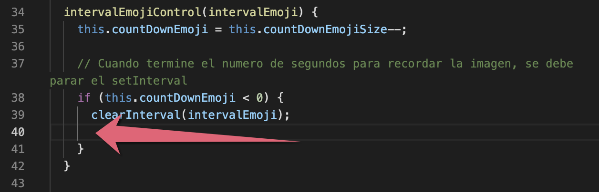

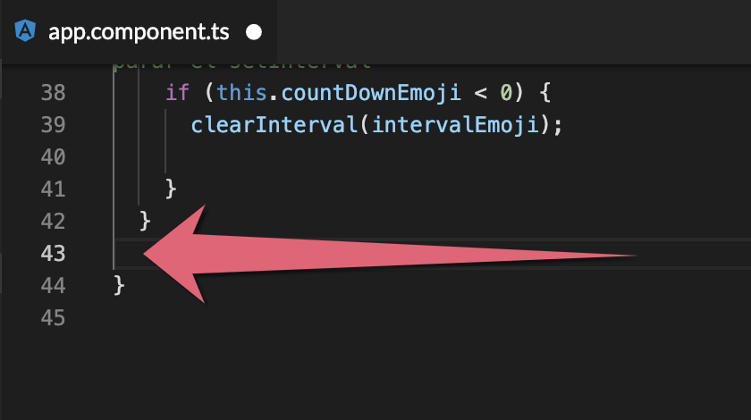



```typescript
// adicionamos en la línea 17
emojiAskIndex: number;
youWin = false;

// adicionamos en la línea 40
this.thisIsYourEmoji();

// adicionamos en la línea 43
  compareAnswer(answer) {
    switch (answer) {
      case 'YES':
        if (this.emojiIndex === this.emojiAskIndex) {
          this.scoreGame = this.scoreGame + '✅';
        } else {
          this.scoreGame = this.scoreGame + '❌';
        }
        break;
      case 'NO':
        if (this.emojiIndex !== this.emojiAskIndex) {
          this.scoreGame = this.scoreGame + '✅';
          this.thisIsYourEmoji();
        } else {
          this.scoreGame = this.scoreGame + '❌';
        }
        break;
    }
  }

  thisIsYourEmoji() {
    this.emojiAskIndex = Math.round(Math.random() * this.maxNumberEmoji);
  }

```




**Por si tienes alguna duda. Aquí te explicamos cómo funciona: 👷‍♀️**

**1.** Declaramos la variable **emojiAskIndex** como tipo number, haciéndolo así de tipo entero.   
Depende del número que tenga asignado, este será la posición en el array de **emojiArray** y a su vez el emoji qué podremos comparar.

**2.** Declaramos la variable **youWin** en **false** porque será la variable que nos ayudará a controlar cuando el usuario gane, mientras se mantenga en false el usuario aún no habrá ganado.

**3.** Esta función **compareAnswer\(\)** será la encargada de administrar nuestra respuesta, recibirá como parámetro la variable **answer** que tendrá el valor 'YES'/'NO', mediante un [**switch**](https://developer.mozilla.org/en-US/docs/Web/JavaScript/Reference/Statements/switch) compararemos si el actual emoji es igual o diferente al que debemos memorizar y adicionar al score una ✅ en caso de respuesta correcta y ❌ en caso de respuesta incorrecta.

**4.** ¿Qué es un [**switch**](https://developer.mozilla.org/en-US/docs/Web/JavaScript/Reference/Statements/switch)? Se utiliza para agilizar la toma de decisiones múltiples; trabaja de la misma manera que lo hace un if, en nuestro caso el **case: 'YES'** es como si tuviéramos un **if \(answer === 'YES'\)** y **case:'NO'** es como si tuviéramos un **if \(answer === 'NO'\)**.

**5.** Esta función **thisIsYourEmoji\(\)** tiene la responsabilidad de generarnos un nuevo **emojiAskIndex** de manera random cuando el actual emoji no es el correcto.   
Cada vez que un emoji presentado en pantalla no sea el emoji para memorizar y confirmemos con nuestra respuesta que no es el esperado, podremos visualizar un siguiente emoji gracias a esta función.


**Deberías ver algo así: 👇**

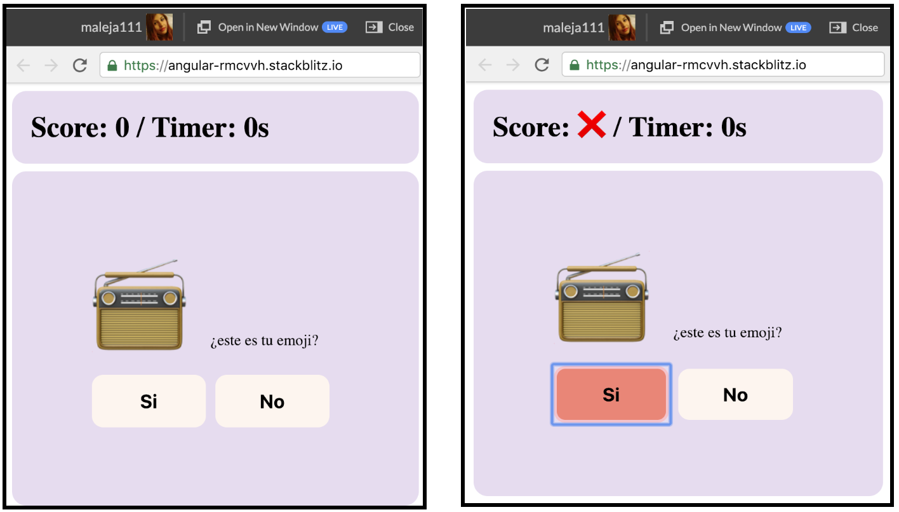

## Paso **9**: Adicionar mensaje ganador 🏆

Vamos a adicionarle un mensaje que salga cuando respondas correctamente identificando entre los emojis random el emoji correcto a memorizar.  
Actualmente nuestro **app.component.html** tiene el siguiente código, pero vamos a adicionar lo siguiente:

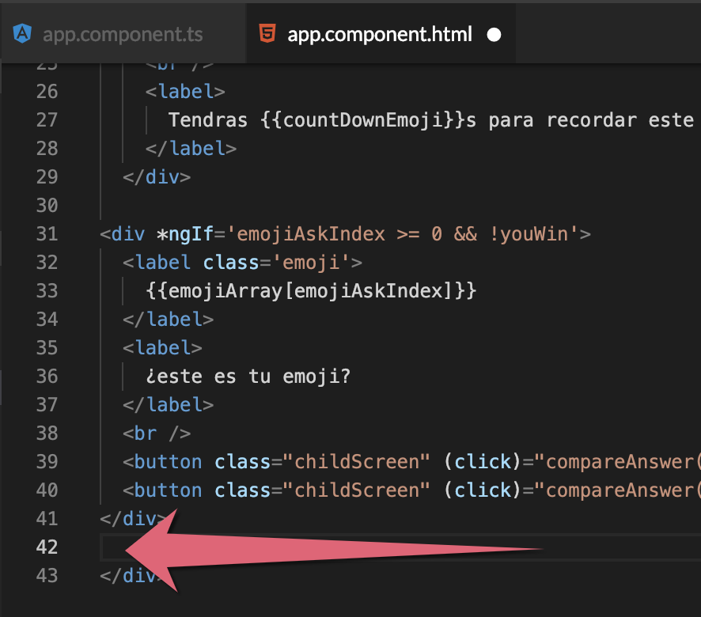



```markup
  <div *ngIf='youWin'>
    <label class='youWinText'>
      ¡Lo lograste!
    </label>
    <br />
    
  </div>
```




**Por si tienes alguna duda. Aquí te explicamos cómo funciona: 👷‍♀️**

**1.** En la condición \***ngIf**='**youWin**' estamos diciendo lo siguiente **➤** Deberá mostrar las líneas de código que contiene solo si la variable **youWin** contiene su valor en **true.  
  
2.** Adicionaremos la etiqueta **img** que hace referencia a la utilización de imágenes, gracias a esta etiqueta podremos visualizar una imagen de un lindo gatito 😻😻.

**3.** En la condición \***ngIf**='**catURL**' estamos diciendo lo siguiente **➤** Deberá mostrar las línea de código que contiene la imagen solo si la variable **catURL** contiene un valor diferente a vacío, dado que aquí se almacena la URL de la imagen del gatito.

**4.** En la estructura **\[src\]**="**catURL**" estamos diciendo lo siguiente ➤ El valor que contenga la variable **catURL** será la propiedad **src** de nuestra etiqueta **img** y de esta manera podremos visualizar la imagen de nuestro gatito. 🎉


## Paso 10: Mensaje finalización del juego 📃

¡Vamos a adicionar la lógica para mostrar el mensaje cuando ganes!   
Ahora vamos a modificar el archivo **app.component.ts**, en este archivo vamos a adicionar las funciones necesarias para que podamos visualizar el mensaje de éxito cuando efectivamente le demos clic al emoji que debíamos memorizar.  
Actualmente nuestro **app.component.ts** tiene el siguiente código, pero vamos a adicionar lo siguiente:

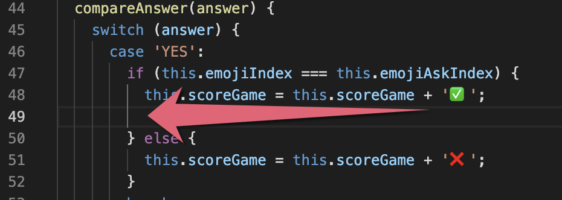

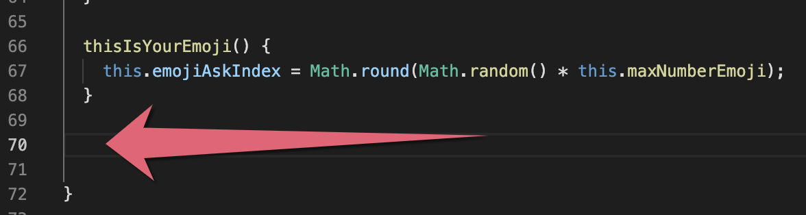



```typescript
// adicionamos en la línea 49
this.finishGame();

// adicionamos en la línea 70
finishGame() {
    this.youWin = true;
  }

```



## Paso 11: Crear servicio retornar imagen gatito 📷

¡Estas a punto de terminar! ¿Qué tal si hacemos algo nuevo?  
Vamos a crear una nueva carpeta llamada **services** y dentro de esta carpeta adicionaremos un archivo llamado **cats.service.ts**, este archivo será nuestro servicio.  Básicamente un servicio es un proveedor de datos que mantiene lógica de acceso a los datos que no están dentro de nuestra aplicación. El servicio será consumido por nuestro componente **app.component.ts**, que dará al servicio la responsabilidad de acceder a la información para que el componente pueda disponer de los datos.

**Debes hacer algo así: 👇**


Ahora en nuestro nuevo archivo **cats.service.ts** adicionaremos esto:

```typescript
import { HttpClient, HttpErrorResponse } from '@angular/common/http';
import { Injectable } from '@angular/core';
import { Observable, throwError as observableThrowError } from 'rxjs';
import { catchError } from 'rxjs/operators';


@Injectable({
  providedIn: 'root'
})
export class CatsService {
    APIUrl: string = 'https://api.thecatapi.com/v1/images/search';

  constructor(private http: HttpClient) { }

  getImage() {
    return this.http
      .get<Array<{}>>(this.APIUrl)
      .pipe(data => data, catchError(this.handleError));
  }

  private handleError(res: HttpErrorResponse | any) {
    console.error(res.error || res.body.error);
    return observableThrowError(res.error || 'Server error');
  }
}
```


**Por si tienes alguna duda. Aquí te explicamos cómo funciona: 👷‍♀️**

**1.** La importación de la función [**HttpClient**](https://angular.io/guide/http) permite realizar el llamado [HTTP](https://developer.mozilla.org/es/docs/Web/HTTP/Methods) para acceder a la [**API**](https://www.abc.es/tecnologia/consultorio/20150216/abci--201502132105.html) donde están las imágenes de los gatitos y [**HttpErrorResponse**](https://angular.io/api/common/http/HttpErrorResponse) nos ayuda a controlar los errores que puedan llegar a pasar.

**2.** La importación de la función **Injectable** nos permite usar el [**decorator**](https://angular.io/tutorial/toh-pt4#injectable-services) para determinar éste como un servicio.

**3.** La importación de las funciones **Observable**, **throwError** y **observableThrowError** nos ayudan a manejar las respuesta que se obtienen de la API. Nosotros recibimos la respuesta como un Observable y la manipulamos en nuestro componente para volverla un array con la subscripción, ya veremos eso mas adelante cuando adicionemos el llamado en **app.component.ts**.

**4.** La variable **APIUrl** nos almacenara la **URL** de la imagen de los gatitos.

**5.** El código **constructor** \(private **http**: **HttpClient**\) { } es la creación de una función que se ejecutara siempre al inicio, como su nombre lo indica construye los valores y funciones iniciales que deben ser llamados para el correcto funcionamiento del servicio, declarando dentro de él la variable **http** para poder realizar el llamado HTTP.

**6.** La función **getImage\(\)** se encargará de lanzar el llamado [**GET**](https://developer.mozilla.org/en-US/docs/Web/HTTP/Methods/GET) para obtener la URL de los gatitos.

**7.** La función **handleError\(\)** se encargara de administrar cualquier error que ocurra cuando se lanza la petición **HTTP**.


Ahora vamos a modificar un archivo que no habíamos tocado el día de hoy, se llama **app.module.ts** y vamos a importar la función **HttpClientModule** que nos permitirá hacer los llamados **HTTP** colocándolo aquí podrá ser usado en toda nuestra aplicación.   
Si tuviéramos más de un componente ¡todos podrían acceder a él!  
Actualmente nuestro **app.module.ts** tiene el siguiente código, pero vamos a adicionar lo siguiente:

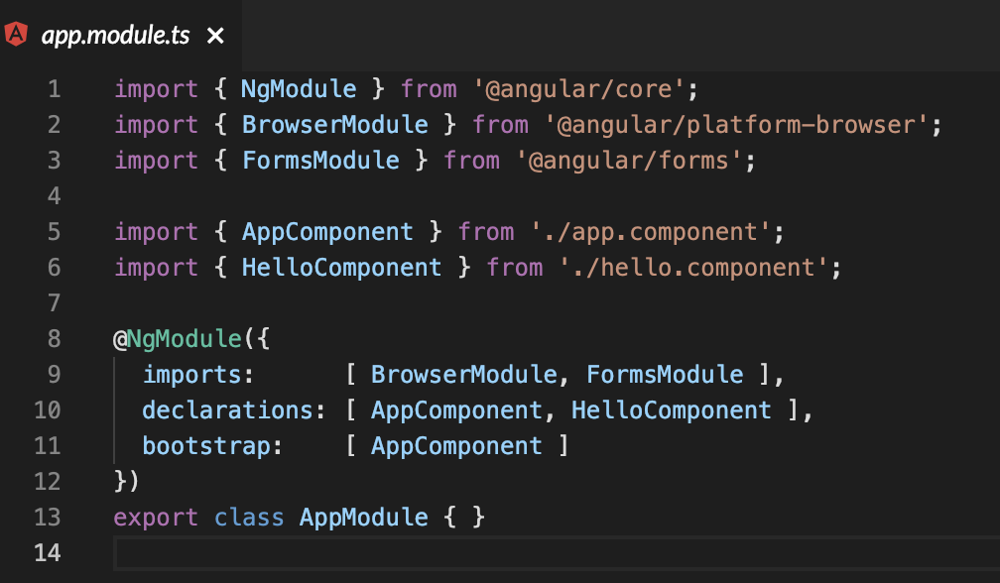



```typescript
// adicionamos en la línea 4
// Realizar llamados Http y va en imports
import { HttpClientModule } from '@angular/common/http';

// Reemplazar la línea imports, por la siguiente.
  imports:      [ BrowserModule, FormsModule, HttpClientModule ],

```



**Deberías ver algo así: 👇**

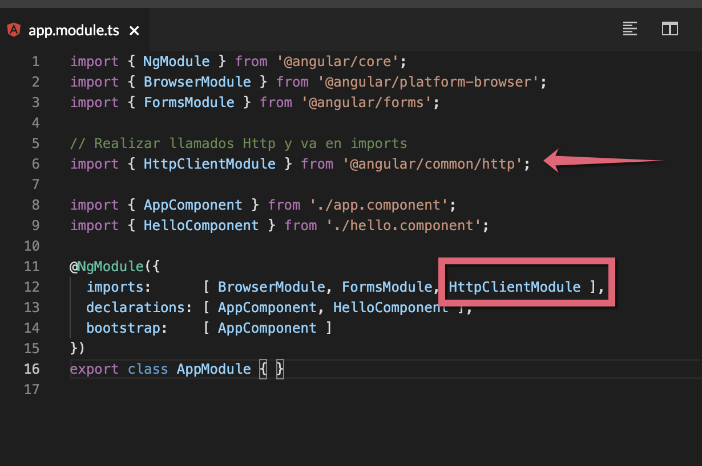

## Paso 12: Utilizar el servicio para retornar gatito 🐱

¡El último paso guiado!  
El servicio será consumido por nuestro componente **app.component.ts** así que vamos a llamarlo de la siguiente manera.  
Actualmente nuestro **app.component.ts** tiene el siguiente código, pero vamos a adicionar el siguiente:

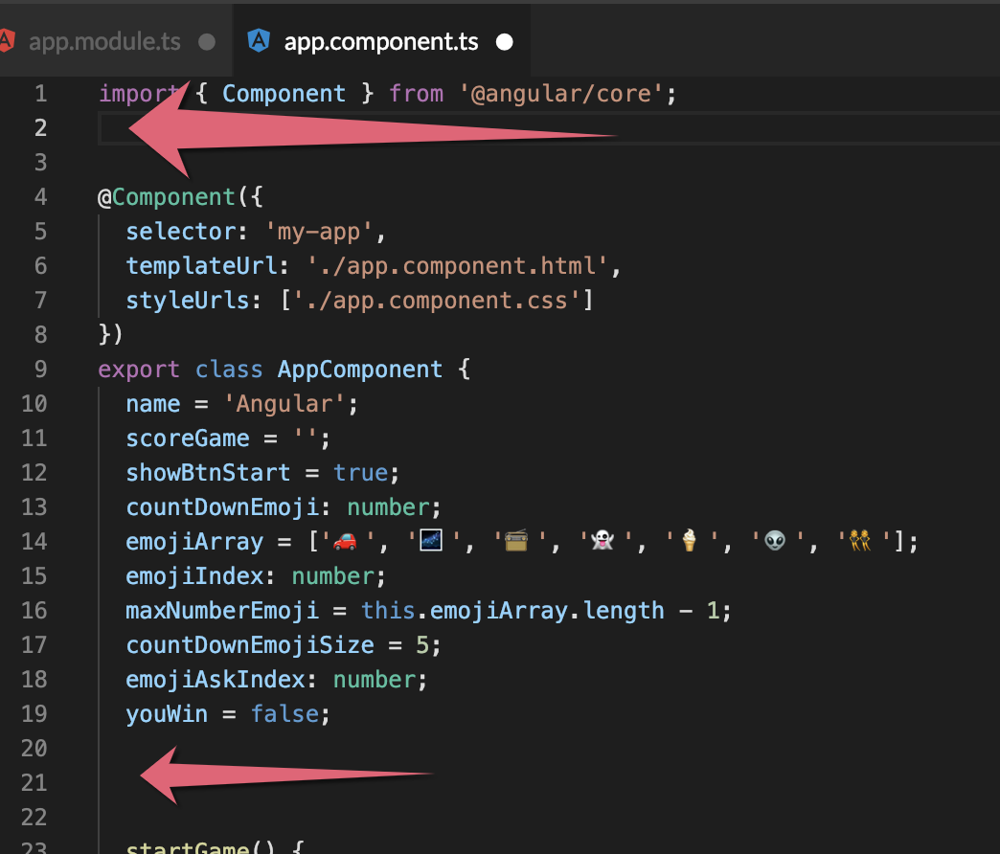

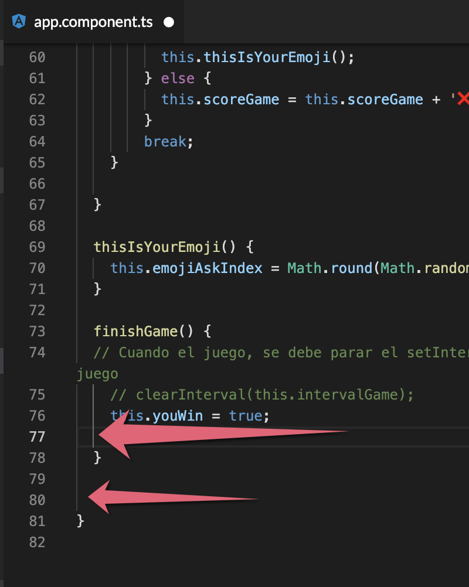



```typescript
// adicionamos en la línea 2
// Servicio
import { CatsService } from './services/cats.service';

// adicionamos en la línea 21
catURL = '';
constructor(private catsService: CatsService) { }

// adicionamos en la línea 77
this.getCatImage();

// adicionamos en la línea 80
getCatImage(): void {
  this.catsService
    .getImage()
    .subscribe(
   resultQuestion => this.catURL = resultQuestion[0].url,
    error => (console.log('Ups! we have an error: ', error))
    )
}
```




**Por si tienes alguna duda. Aquí te explicamos cómo funciona: 👷‍♀️**

**1.** Importamos el servicio **CatsService** para poder usarlo dentro del componente.

**2.** Creamos una función constructor que nos creara la variable **catsService** para poder utilizar el servicio dentro del componente.

**3.**La función **getCatImage\(\)** se encargará de lanzar el llamado a nuestra **API** que se comunicará con él **service** y nos suscribiremos a ese llamado para resolver el observable que el servicio nos devolverá, obteniendo la **URL** de los gatitos.


**Toques finales: 👇**  
Vamos a adicionar estos estilos en nuestro **app.component.css** para ****que ****todo se vea aun mejor cuando ganes.



```css
.youWinText { /* El . hace referencia a una clase, así que va a afectar todos los elementos HTML con esta clase */
    font-size: 60px; /* Determina el tamaño de letra dentro de la sección */
    color: steelblue; /* Determina el color del texto en la sección */
}

img { /* Afecta todas las etiquetas HTML img */
  width: 250px; /* Determina el ancho de nuestra imagen */
  height: 250px; /* Determina la altura de nuestra imagen */
}
```



**Deberías ver algo así: 👇**

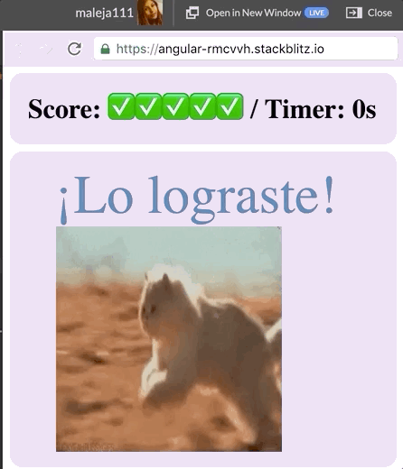

## 😎 Tu Misión 😎

Parece que nuestra aplicación está lista excepto por un pequeño detalle 😵. No está mostrando el **Timer,** este es el encargado de mostrar el tiempo transcurrido en segundos del juego.

⭐️ Utiliza lo que ya conoces como: **data** [**binding**](https://alligator.io/angular/data-binding-angular/)**,**  [**setInterval**](https://css-tricks.com/snippets/javascript/intervals/), ****[**clearInterval**](https://developer.mozilla.org/en-US/docs/Web/API/WindowOrWorkerGlobalScope/clearInterval) ****y así como decrementamos la variable en **countDownEmoji** deberás crear una variable que ahora **incremente** cada segundo.

**💪💪**¡¡Felicitaciones!! ¡Llegaste muy lejos y apenas termines el score habrás terminado todos los desafíos! **💪💪**


\*\*\*\*[**Aquí**](https://stackblitz.com/edit/angular-last-emoji) puedes encontrar el ejercicio resuelto.


## 🎉 ¡**LO LOGRASTE!** 🎉


**Nota:**

Si necesitas mentoría con este ejercicio puedes contactar a:

Alejandra Giraldo  
Twitter: @maleja111  
Correo: magiraldodevelop@gmail.com


