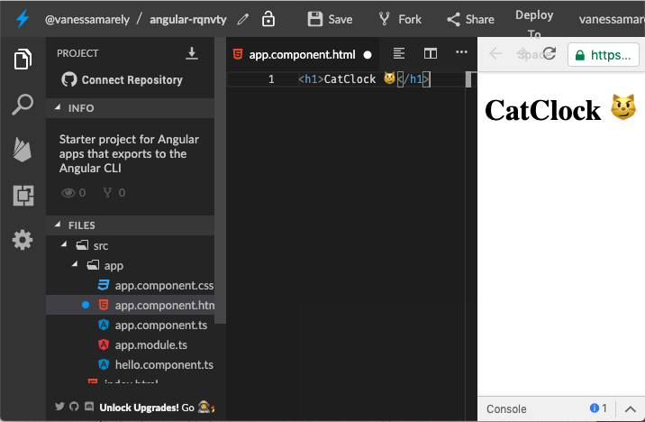
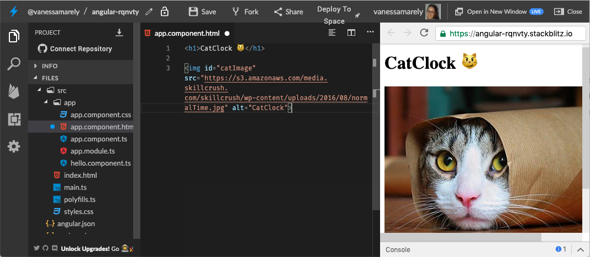

# Básico \#1: CatParty😺

## 💡 Introducción 💡

En este desafío haremos algo divertido aplicando conceptos básicos de Angular, los cuales  iremos describiendo a medida que realicemos cada uno de los pasos descritos abajo.  

\*\*\*\*[**¡Aquí puedes encontrar el demo!**](https://angular-catparty.stackblitz.io/)\*\*\*\*

¿Estás list@?

**Es hora de la Acción!!! 😝**

## Paso 1: **Creemos nuestra App de Angular** ⭐️

Primero iremos a el inicio de Stackbliz y crearemos una App de Angular.


Seleccionamos el texto  del archivo **app.component.html**, lo borramos \(presionando la tecla delete de tu compu 💻\) y guardamos los cambios, seleccionando en la parte superior la opción de 'Save' 💾


## Paso 2: **Añadamos un título** 🏁

Iremos al archivo **app.component.html** y vamos a usar unas etiquetas o tags de HTML para poner un titulo.

Copiaremos lo siguiente en el archivo **app.component.html** 



```markup
<h1>CatClock 😼</h1>
```



Deberías ver algo así: 👇




**¿Qué es una etiqueta?**👇

Las etiquetas o tags son la forma de escribir código HTML, es la semántica del HTML. Son fragmentos de texto rodeados por corchetes angulares `< >,` que tienen funciones y usos específicos, existen muchas etiquetas como **&lt;div&gt;&lt;/div&gt;**, **&lt;p&gt;&lt;/p&gt;**, ****entre otras.

**&lt;h1&gt;:** Es una etiqueta para los títulos

**&lt;img&gt;**: Es una etiqueta para imágenes


## Paso 3: **Añadamos una imágen de un gatito** 🖼️

Debajo de nuestro titulo en el archivo **app.component.html**, ****vamos a añadir la etiqueta para las imágenes, con una imagen de un gatito.

Copiaremos lo siguiente en el archivo **app.component.html** 



```markup
<h1>CatClock 😼</h1>


```



Verás algo así: 👇



## Paso 4: **Añadamos un texto dinámico** 

Vamos a usar un término en Angular llamado **Interpolación** \(conocida en inglés como "string interpolation"\),  nos permite desplegar algo declarado en código en nuestra vista o HTML. Crearemos una variable llamada "**party**" en el archivo **app.component.ts**.

Podemos reemplazar la variable que estaba creada llamada **name** y la renombramos a **party** en el archivo **app.component.ts**.

Le quitamos el valor de **'Angular'** y le pondremos **'Party'**



```typescript
export class AppComponent  {
  party = 'Party';
}
```



Verás algo así: 👇


Ahora añadamos nuestra variable a nuestro título en el archivo **app.component.html**.


**¿qué es una variable?** es como un caja, donde puedes poner cosas 🎁\). Ésta almacenará lo que nosotros queramos, textos, números, etc **👍**


Para usar la interpolación se usan dos llaves **{{ }}** dobles.



```markup
<h1>CatClock 😼 {{party}} </h1>


```



## Paso 5: **Crearemos una imágen dinámica**

Sabemos como crear texto dinámico, ahora vamos a crear una imágen dinámica.

Para ello copiaremos la url de la imágen que esta en el 'src' y la pondremos en una nueva variable.

Crearemos una variable llamada **urlImage** y pondremos la url copiada allí.



```typescript
export class AppComponent  {
  party = 'Party';
  urlImage = 'https://s3.amazonaws.com/media.skillcrush.com/skillcrush/wp-content/uploads/2016/08/normalTime.jpg';
}
```



Luego borraremos del src la url de la imagen y pondremos en su lugar el nombre de la nueva variable entre llaves dobles. 

Quedaría algo así: 👇



```markup
<h1>CatClock 😼 {{party}} </h1>


```




## Paso 6: **Remplacemos nuestra imágen con algo de lógica**

Ahora lo que haremos es que cuando reemplacemos el texto de nuestra imágen en el código, se cambiará nuestra imágen.

Para ellos usaremos algo de lógica, colocaremos un **if** \(nos sirve para preguntar\) en nuestro archivo **app.component.ts**, donde preguntaremos si el texto de la variable **party** es igual a 'Party' se muestre una nueva imágen. 

Copia debajo la variable **urlImage** el siguiente código:



```typescript
export class AppComponent  {
  party = 'Party';
  urlImage = 'https://s3.amazonaws.com/media.skillcrush.com/skillcrush/wp-content/uploads/2016/08/normalTime.jpg';
  
  constructor() {
    if(this.party === 'Party'){
      this.urlImage = 'https://s3.amazonaws.com/media.skillcrush.com/skillcrush/wp-content/uploads/2016/08/partyTime.jpg';
    }
  }
}
```




Si reemplazas el texto del party, podrás ver la imagen inicial y con 'Party' los gatos saltando.

¡Felicitaciones hemos terminado el primer desafío!

🎉 ¡**LO LOGRASTE!** 🎉


\*\*\*\*[**Aquí**](https://stackblitz.com/edit/angular-catparty) puedes encontrar el ejercicio resuelto.


## 😎 Tu Misión 😎

Parece que nuestra aplicación está lista pero debemos editar el texto desde la lógica 😵. 

⭐️ Se podría poner un botón que al darle click nos cambie el texto, pero esto te lo dejamos de tarea ****⭐️

A medida que vas desarrollando los demás desafíos aprenderás como añadir un botón que al presionarlo pueda realizar este cambio, o puedes poner un campo de texto o idearte tu propia solución.

Esta adición es para retar tu curiosidad, podrías proponer la solución que tu quieras, puedes en cualquier momento del taller mostrarme \(Vanessa\) tu propuesta y recibirás un regalito. 


Has completado el **desafío \#1**, ahora vamos a el **desafío \#2 👇**



**Nota:**

Si necesitas mentoría con este ejercicio puedes contactar a los mentores o a:

Vanessa M. Aristizabal  
Twitter: @vanessamarely  
Correo: vanessamarely@gmail.com


