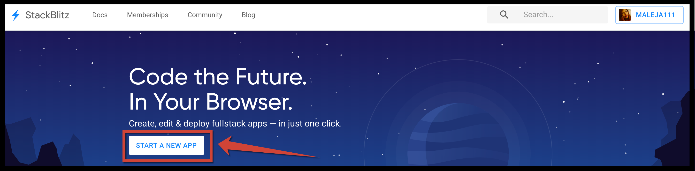

# Básico 2: Directives \|\| pipes

## 💡 Introducción 💡

¡Que divertido fue aprender a usar imagenes de gatos!  
ahora vayamos por... [**¡Aquí puedes encontrar el demo!**](https://stackblitz.com/edit/angular-toma-lista)\*\*\*\*

## Paso 1: **Creemos nuestra App de Angular** ⭐️

Entra a **www.stackblitz.com**, y verás algo como esto:




## Paso 2: **Añadamos un título ✍️**

Vamos a crear el entorno de nuestra aplicación. Para ello iremos al archivo **app.component.html** y borramos todo el contenido para adicionar lo siguiente:



```markup
<div>
	<div>
		<div>
          <h1>Tienes #<span class='highlight'>{{items.length}}</span>
            elementos en la lista.
          </h1>
      </div>
    </div>
</div>
```



Deberías ver algo así: 👇


## 

