# Básico \#3: Calcular la Edad 🧮

## 💡 Introducción 💡

En este desafío haremos algo divertido aplicando los conceptos aprendidos de Angular, para realizar una App que nos permita calcular la edad.  

\*\*\*\*[**¡Aquí puedes encontrar el demo!**](https://angular-agecalculator.stackblitz.io)\*\*\*\*

¿Estás list@?

**Es hora de la Acción!!! 😝**

## Paso 1: **Creemos nuestra App de Angular** ⭐️

Primero iremos a el inicio de Stackbliz y crearemos una App de Angular.

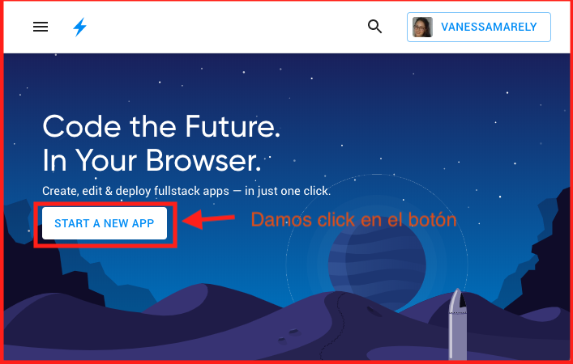

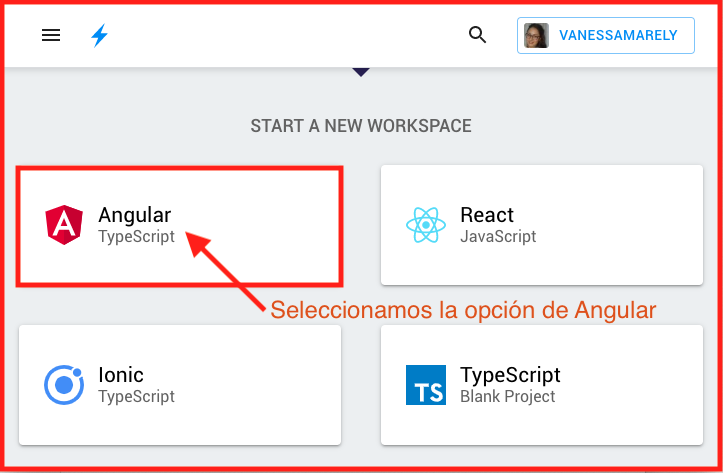

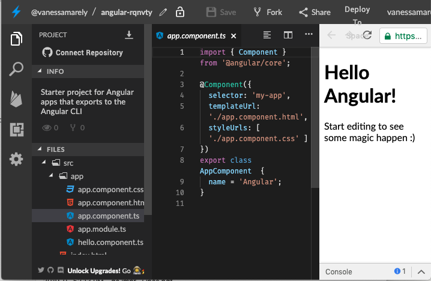

Seleccionamos el texto  del archivo **app.component.html**, lo borramos \(presionando la tecla delete de tu compu 💻\) y guardamos los cambios, seleccionando en la parte superior la opción de 'Save' 💾

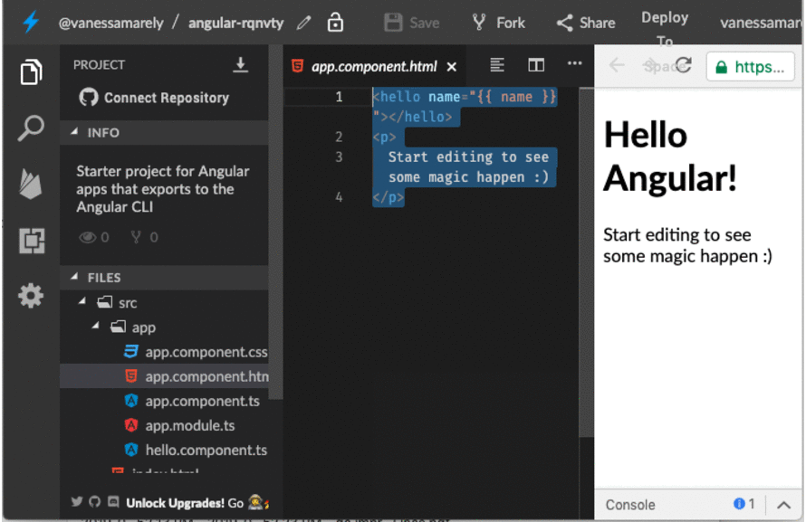

## Paso 2: **Añadamos un título** 🧭

Iremos al archivo **app.component.html** y vamos a usar unas etiquetas o tags de HTML para poner un titulo.

Copiaremos lo siguiente en el archivo **app.component.html** 



```markup
<h1>Calcular la Edad ⏳</h1>
```



Deberías ver algo así: 👇

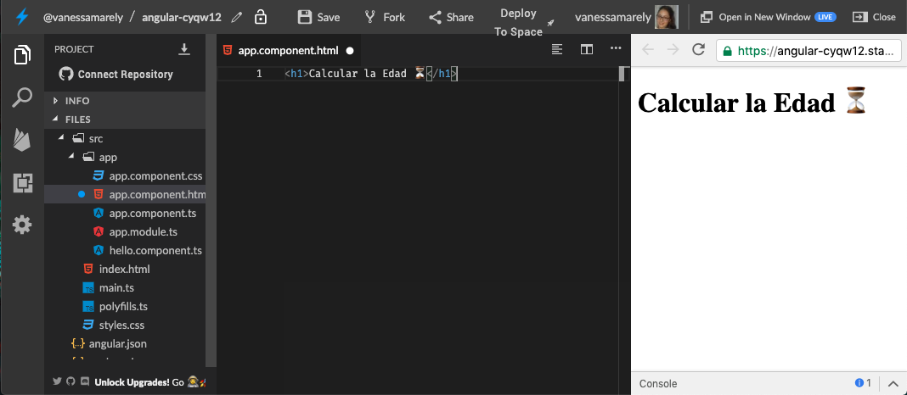


**Recuerda** 

**Una Etiqueta** o tag es una forma de escribir código HTML, es la semántica del HTML. Son fragmentos de texto rodeados por corchetes angulares `< >,` que tienen funciones y usos específicos, existen muchas etiquetas como **&lt;div&gt;&lt;/div&gt;**, **&lt;p&gt;&lt;/p&gt;**, **&lt;h1&gt;&lt;/h1&gt;**, **&lt;img /&gt;**, entre otras


## Paso 3: Añadamos más etiquetas 🏷️

Debajo de nuestro titulo en el archivo **app.component.html**, ****vamos a añadir un campo de texto. Existen muchos tipos de campo de texto, el que vamos a incluir va a ser de tipo fecha.



```markup
<h1>Calcular la Edad ⏳</h1>
<input type="date" />
```



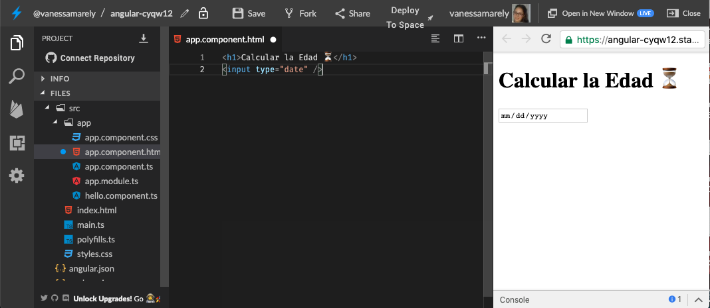

Incluyamos un botón debajo de nuestro campo de texto.



```markup
<h1>Calcular la Edad ⏳</h1>
<input type="date" />
<button type="button"> Calcular </button>
```



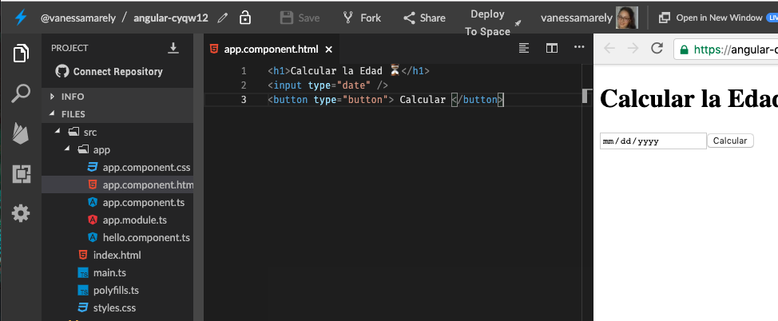

## Paso 4: Creemos la funcionalidad de Calcular 🧠

Ahora a nuestro campo de texto vamos a usar un concepto llamado **two-way-binding**, para esto vamos añadirle algo llamado **banana box \[\(\)\]** y dentro pondremos la palabra **ngModel** y lo haremos igual a una variable llamada **age.** Lo que haremos es que todo lo que escriba en el campo de texto será almacenado en **age**. Todo esto lo vamos a añadirle en nuestro archivo **app.component.html**



```markup
<h1>Calcular la Edad ⏳</h1>
<input type="date" [(ngModel)]="age" />
<button type="button"> Calcular </button>
```



A nuestro botón le vamos a añadir una directiva de evento el **click**, y le asignaremos el nombre de una función en la cual pondremos toda la lógica. 



```markup
<h1>Calcular la Edad ⏳</h1>
<input type="date" [(ngModel)]="age" />
<button type="button" (click)="ageCalculator()"> Calcular </button>
```



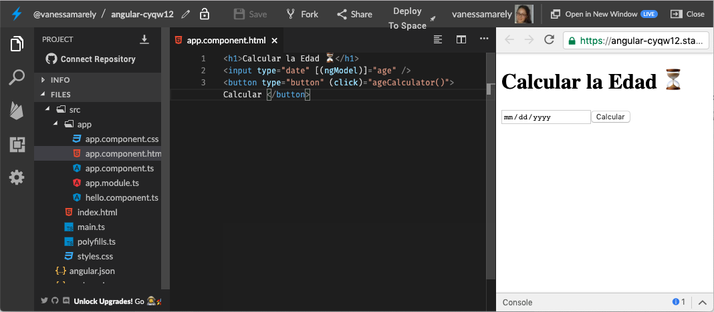

Conceptos vistos hasta ahora: 👇


**Two-way-binding** , 🔁 permite enviar datos desde el componente a la vista \(HTML\) y viceversa.

**Banana box \[\(\)\]**, 🍌 lo llaman así porque si usas tu imaginación parece una banana en una caja.

**Directiva**, se representa como un atributo en una etiqueta HTML, este atributo está dotando al elemento del DOM que la contiene de un comportamiento, ese comportamiento lo definimos nosotros y se puede utilizar en todos los elementos que queramos.

**ngModel** es una directiva que nos permite tener un enlace entre el componente de TS y un elemento en el HTML. Existen varios tipos de directivas.

**\(click\)** es una directiva de evento, con ella podemos controlar la ación del click, en nuestro caso el click del botón.


En nuestro **app.component.ts** vamos a crear una función, llamada **ageCalculator\(\)**, esta función será la que realizará el calculo de la fecha ingresada. Vamos a añadir la función dentro del **export class AppComponent** y ademas reemplazaremos la variable llamada **name='Angular'** y pondremos la función que esta a continuación:



```typescript
export class AppComponent  {
  age;
  showAge;

  ageCalculator(){
    if(this.age){
      const convertAge = new Date(this.age);
      const timeDiff = Math.abs(Date.now() - convertAge.getTime());
      this.showAge = Math.floor((timeDiff / (1000 * 3600 * 24))/365);
    }
  }
}
```



Ahora te explicaré que hicimos en la función anterior: 👇


**ageCalculator**, es el nombre de la función. ****

Pondremos dentro un **if** que nos permitirá realizar el calculo solo si hemos ingresado un valor. Entonces preguntaremos si **age** tiene algún valor, traducido en **if\(this.age\)**

Arriba de la función has visto dos variables, una llamada **age** y **showAge**, las cuales usaremos para el calculo de la edad.

Dentro del **if** crearemos otras variables, las crearemos como constantes, usando la palabra **const** antes del nombre de la variable, ya que el valor de la variable solo se le asignará una sola vez y este no se cambiará.

La constante **convertAge**, toma lo que el usuario a ingresado en el input y lo convierte a una fecha usando el **new Date**, que es propio de JS para las fechas, al **Date** le pasamos la fecha ingresada, entre los paréntesis, que es controlada por la variable **age** y como la variable **age** fue declarada al inicio de nuestra App, fuera de nuestra función debemos usar antes  la palabra **this**.

A la constante **timeDiff**, le asignaremos una función propia de JS **`Math.abs(),`**en esta función haremos la resta de la fecha actual **Date.now\(\)**, menos la fecha almacena en la constante **convertAge**, que además le incluimos la función **getTime\(\)**, esta función devuelve el valor numérico correspondiente a la hora para la fecha especificada según la hora universal.

Teníamos una variable llamada **showAge** a la cual le asignaremos la función **`Math.floor(),`**la cual nos devolverá un valor entero del calculo de la constante **timeDiff** que pasaremos a años. El resultado del calculo asignado a **showAge**, dará como resultados los años de la persona que ingreso la fecha.


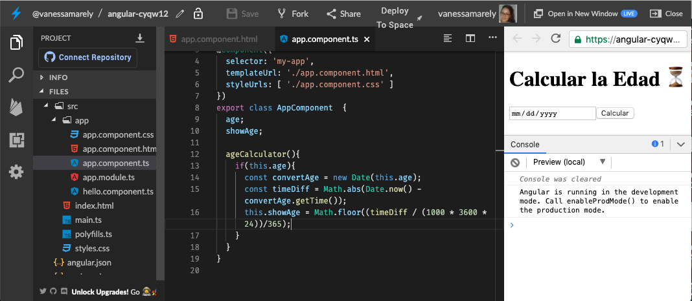

## Paso 5: Mostrar la Edad 🤠

Ya tenemos el cálculo de la fecha ingresada, ahora vamos a mostrarlo, usemos la interpolación que hemos aplicado anteriormente. 

En el archivo **app.component.html** vamos incluir un texto y nuestra variable **showAge**, para mostrar los años de la persona. Debajo de nuestro botón pondremos la siguiente línea: 



```markup
<p>Tu edad es {{ showAge }}</p>
```



Te va a quedar todo parecido a lo siguiente: 👇



```markup
<h1>Calcular la Edad ⏳</h1>
<input type="date" [(ngModel)]="age" />
<button type="button"> Calcular </button>
<p>Tu edad es {{ showAge }}</p>
```



Además vamos a añadir otra directiva **\*ngIf,** para mostrar el texto sólo si se ha ingresado algún valor. Añade en la etiqueta **&lt;p&gt;** el atributo **\*ngIf**.



```markup
<p *ngIf="age">Tu edad es {{ showAge }}</p>
```



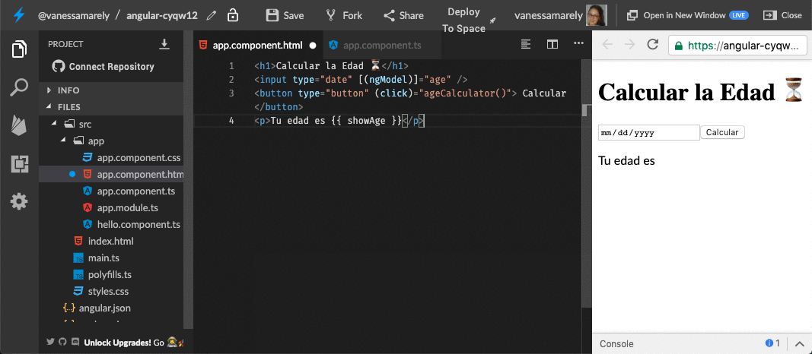

Podemos hacer más bonita nuestra vista añadiendo en el CSS el siguiente código en el archivo **app.component.css**, para que nuestra App luzca así:



```css
button {
  cursor: pointer;
  background: #f45c41;
  border: 0;
  border-radius: 6px;
  color: white;
  font-size: 16px;
  height: 40px;
  margin-bottom: 10px;
  text-align: center;
  min-width: 120px;
}

input {
  border-radius: 10px;
  box-shadow: 5px 5px 20px #cbcdd3;
  color: #333;
  font-size: 16px;
  height: 40px;
  text-align: center;
}

p {
  color: #333;
  font-size: 20px;
  text-transform: uppercase;
}
```



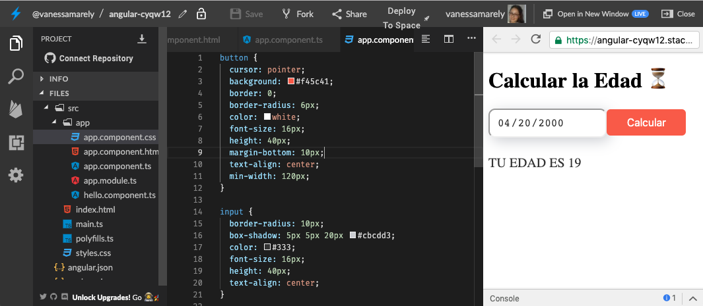

## 😎 Tu Misión 😎 <a id="tu-mision"></a>

Nuestra aplicación se ve lista, podrías si aceptas la misión ponerle algo de estilos para que se vea más bonita **💪**. Sino sabes como hacerlo puedes preguntarle a los mentores como puedes cambiar los estilos de los textos o del botón. 👍

⭐️ Puedes utilizar estilos que has usado en desafíos anteriores

**💪💪**¡¡Felicitaciones!! ¡Llegaste muy lejos! **💪💪**‌

🎉 ¡**LO LOGRASTE!** 🎉


\*\*\*\*[**Aquí**](https://stackblitz.com/edit/angular-agecalculator) puedes encontrar el ejercicio resuelto.



**Nota:**

Si necesitas mentoría con este ejercicio puedes contactar a:

Vanessa M. Aristizabal  
Twitter: @vanessamarely  
Correo: vanessamarely@gmail.com



Has completado los desafíos básicos, ahora vamos a continuar con los **intermedios 👇**



 

