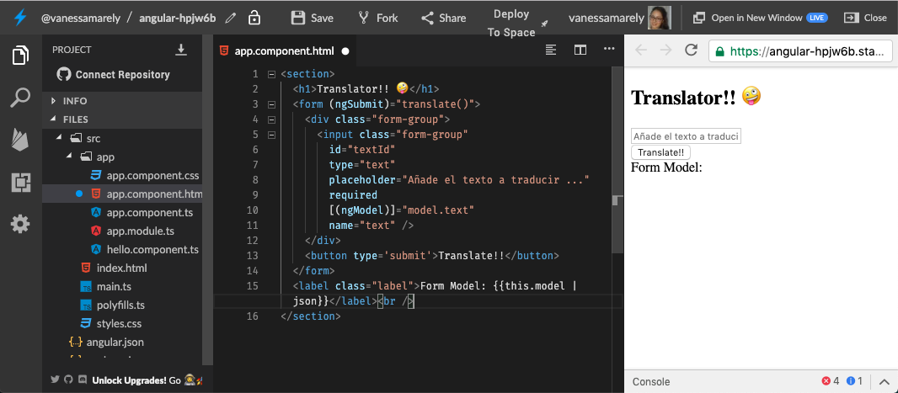

# Intermedio \#2: Traduzcamos nuestro texto 📜

## 💡 Introducción 💡

Como ya sabes inicializar una App de **Angular** en **Stackblitz**, omitiremos el primer paso de todos los desafíos anteriores \(el paso 1 de crear la App de Angular\)

 En este desafío nos divertiremos creando una App, en la cual el texto que ingresemos lo traduciremos a otro lenguaje.

\*\*\*\*[**¡Aquí puedes encontrar el demo!**](https://angular-catparty.stackblitz.io/)\*\*\*\*

¿Estás list@?

**Es hora de la Acción!!! 😝**

## Paso 1: Crearemos un formulario ✍️

Vamos a crear un formulario con un campo de texto, donde pondremos en el todo el texto que deseamos traducir. Nuestro form tendrá un botón que traducirá el texto.

Puedes añadir el siguiente código en **app.component.html**



```markup
<section>
  <h1>Translator!! 🤪</h1>
  <form (ngSubmit)="translate()">
    <div class="form-group">
      <input class="form-group"
        id="textId"
        type="text"
        placeholder="Añade el texto a traducir ..."
        required
        [(ngModel)]="model.text"
        name="text" />
    </div>
    <button type='submit'>Translate!!</button>
  </form>
  <label class="label">Form Model: {{this.model | json}}</label><br />
</section>
```





## Paso 2: Adicionemos la lógica de nuestro formulario

En el archivo **app.component.ts** vamos a crear el objeto model, que nos mostrara el modelo de nuestro formulario y crearemos una función translate que se encargara de la lógica de nuestra App.




```typescript
import { Component } from '@angular/core';


@Component({
  selector: 'my-app',
  templateUrl: './app.component.html',
  styleUrls: ['./app.component.css']
})
export class AppComponent {
  model = {};

  ngOnInit() {
  }

  translate() {
  
  }

```



Deberías hacer algo así, y tu resultado se deberá ver así:👇

¡Felicitaciones hemos terminado nuestro desafío!

🎉 ¡**LO LOGRASTE!** 🎉


\*\*\*\*[**Aquí**](https://stackblitz.com/edit/angular-agecalculator) puedes encontrar el ejercicio resuelto.



**Nota:**

Si necesitas mentoría con este ejercicio puedes contactar a:

Vanessa M. Aristizabal  
Twitter: @vanessamarely  
Correo: vanessamarely@gmail.com



Has completado este desafío, ahora vamos a continuar con nuestro último desafío **👇**



 

