# Intermedio \#2: Formulario de Autenticación 🧒

## 💡 Introducción 💡

Como ya sabes inicializar una App de **Angular** en **Stackblitz**, omitiremos el primer paso de todos los desafíos anteriores \(el paso 1 de crear la App de Angular\)

 En este desafío nos divertiremos creando una App, donde haremos un formulario de autenticación.

\*\*\*\*[**¡Aquí puedes encontrar el demo!**](https://angular-logingithub.stackblitz.io)\*\*\*\*

¿Estás list@?

**Es hora de la Acción!!! 😝**

## Paso 1: Crearemos un formulario ✍️

Vamos a crear un formulario con un campo de texto, donde pondremos el nombre de usuario con el que nos vamos a autenticar en nuestra App. Adicionalmente tendrá un botón para enviar el texto que ingresaremos en el formulario.

Puedes añadir el siguiente código en **app.component.html**


```markup
<section>
  <h1>Autentiquemonos en Github 😉</h1>
  <form #form="ngForm" (ngSubmit)="login(form.value)">
    <div class="form-group">
      <input class="form-group"
        id="username"
        type="text"
        placeholder="Añade el nombre de usuario ..."
        required
        [(ngModel)]="model.username"
        name="username" />
    </div>
    <button type='submit'>Enviar!!</button>
  </form>
  <label class="label">Form Model: {{this.model | json}}</label><br />
</section>
```


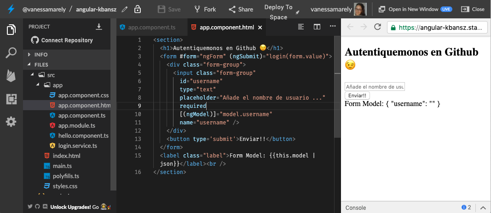

## Paso 2: Creemos la función que se encargará de la autenticación 🏭

En el archivo **app.component.ts** vamos a crear el objeto model, que nos mostrará el modelo de nuestro formulario y crearemos una función login que se encargará de la lógica de nuestra App.


```typescript
import { Component } from '@angular/core';


@Component({
  selector: 'my-app',
  templateUrl: './app.component.html',
  styleUrls: ['./app.component.css']
})
export class AppComponent {
  model = {};

  login() {
  
  }
}
```


En nuestra función llamada **login**, que será accionada cuando el usuario de click en el botón **Enviar**, le añadiremos un parámetro que va a recibir la función que se lo asignaremos a nuestra variable model.


```text
login(form: any) {
  this.model = form;
}
```


Deberías hacer algo así, y tu resultado se deberá ver así:👇

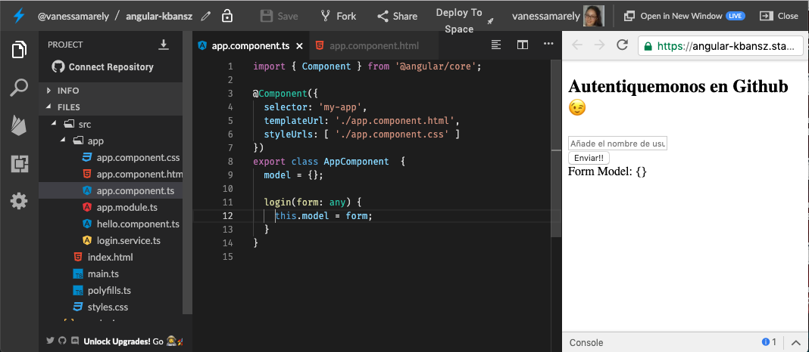

## Paso 3: Crearemos un servicio 💆

Crearemos un 'servicio' dando clic sobre la carpeta 'app', seleccionamos 'service', nombramos el servicio como: '**login**', damos enter y se nos creará un archivo llamado: **login.service.ts**

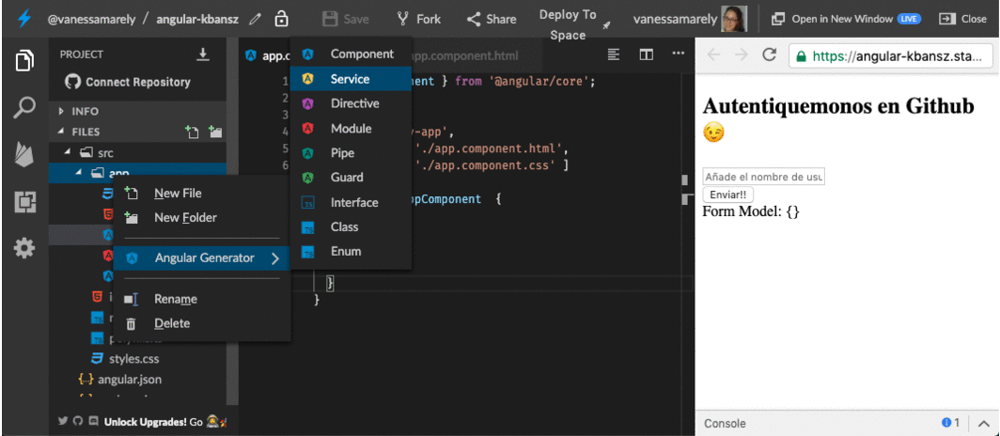

Importamos unas dependencias en nuestro nuevo archivo llamado **login.service.ts**,  y añadimos en el constructor lo siguiente: **http: HttpClient** 


```text
import { Injectable } from '@angular/core';
import { HttpClient, HttpErrorResponse } from '@angular/common/http';
import { Observable, throwError as observableThrowError } from 'rxjs';
import { catchError, map } from 'rxjs/operators';

@Injectable()
export class LoginService {

  constructor(private http: HttpClient) { }

}
```


Incluimos el '**HttpClientModule**' en el archivo **app.module.ts**


```text
import { HttpClientModule } from '@angular/common/http';
```


En los imports incluimos el **HttpClientModule** en el '**app.module.ts'**


```text
@NgModule({
  imports:      [ BrowserModule, FormsModule, HttpClientModule ],
  declarations: [ AppComponent, HelloComponent ],
  bootstrap:    [ AppComponent ],
  providers: [LoginService]
})
export class AppModule { }

```


En nuestro archivo **login.service.ts** crearemos dos funciones, una para manejar los errores: **handleError** y otra que nos obtendrá la data del API **getResponse**:


```text
getResponse(APIRoot: any) {
  return this.http
    .get<Array<{}>>(APIRoot)
    .pipe(map(data => data), catchError(this.handleError)); 
}

private handleError(res: HttpErrorResponse | any) {
  console.error(res.error || res.body.error);
  return observableThrowError(res.error || 'Server error');
}
```


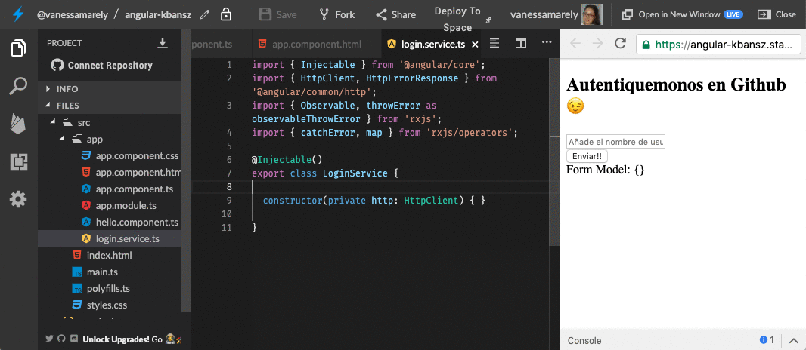

## Paso 4: Hagamos la lógica que llama a nuestro servicio  🍭

En nuestro archivo **app.component.ts**, crearemos una variable, de tipo **string,** donde le asignaremos la url del API.   En nuestra función **login**, crearemos un 'Observable' que nos permitirá subscribirnos a la petición que hacemos de los datos, usando la variable que definimos con la ruta del API de **Github**.

También importaremos en nuestro **app.component.ts** el servicio que creamos, **LoginService,** y crearemos una función **constructor** donde declararemos una función privada del servicio. ****


```typescript
import { Component } from '@angular/core';
import { LoginService } from './login.service';

@Component({
  selector: 'my-app',
  templateUrl: './app.component.html',
  styleUrls: ['./app.component.css']
})
export class AppComponent {
  model = {};
  apiRoot: string = 'https://api.github.com/users/';
  
  constructor(private loginService: LoginService){}
  
  login(form: any) {
    this.model = form;
    console.log(this.model);
    this.loginService
      .getResponse(`${this.apiRoot}${this.model['username']}/repos`)
      .subscribe(
      response => (console.log(response)),
      error => (console.log('Ups! we have an error: ', error))
      )
  }
} 

```


Ahora podemos probar el llamado de nuestra API colocando en el campo de texto el nombre de un usuario de **Github**. Si abres la consola de **Stackblitz** podrás ver el resultado de nuestro **console.log\(response\)**.

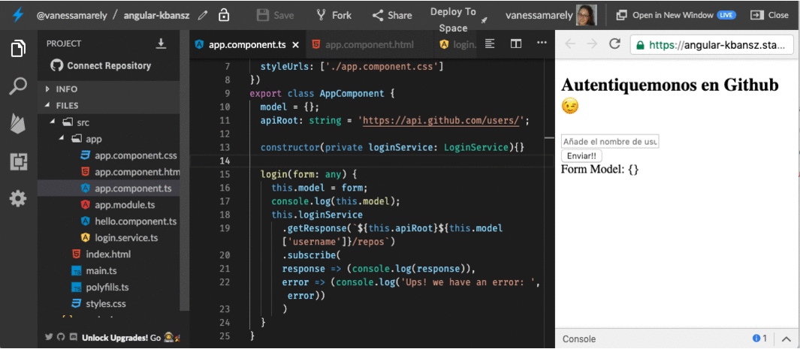

## Paso 5: Mostremos el resultado del API 📰

Crearemos una variable llamada **reposList**, donde almacenaremos el resultado del llamado de nuestra API. Si observas la url de nuestra API, al final tiene '/**repos**', con esta palabra traeremos la lista de todos los repositorios del usuario que estamos consultando, puedes probar quitándole esta palabra y observarás que traerás la información de usuario \(la imagen de perfil, su id en Github, entre otros datos\) .

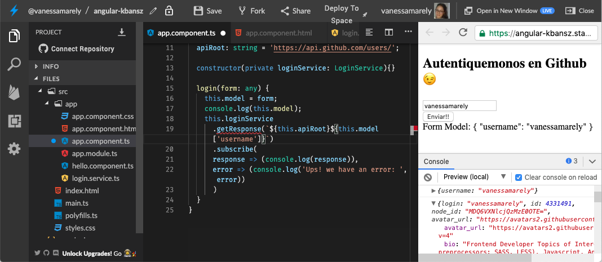

Debajo de nuestra variable apiRoot, crearemos la variable **reposList** y en donde teníamos nuestro **console.log\(response\)**, lo reemplazaremos por: **this.reposList = response**


Si quisiéramos mostrar el resultado en nuestra vista, en el html al final podríamos usar una interpolación de nuestra variable **reposList** añadiéndole a la interpolación un pipe **json**, veríamos algo como esto:

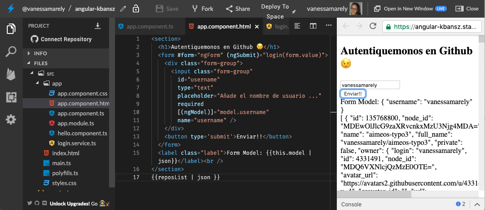

Pero el resultado se mostraría muy desordenado y difícil de leer, así que haremos algo para mostrarlo más bonito.

## Paso 6: Tabla para mostrar los resultados 📋

Crearemos una tabla para mostrar  nuestro resultado y para ello vamos a crear un componente llamado tabla.

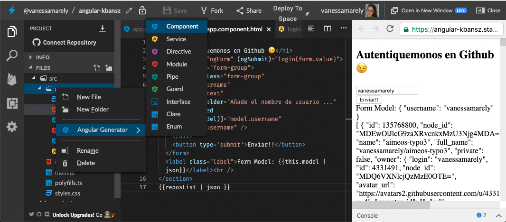

Iremos al archivo **table.component.html** y vamos a crear las etiquetas de tabla \(**&lt;table&gt;&lt;tr&gt;&lt;td&gt;&lt;/td&gt;&lt;/tr&gt;&lt;/table&gt;**\)

En nuestra tabla crearemos una fila para los encabezados dónde vamos a mostrar un nombre, la descripción, el lenguaje del repo, la rama por defecto y la url.


```markup
<table class="table" id="reposTable">
  <thead>
    <tr>
      <th>#</th>
      <th>Name</th>
      <th>Description</th>
      <th>Language</th>
      <th>Default Branch</th>
      <th>Git Url</th>
    </tr>
  </thead>
  <tbody>
    <tr>
      <td></td>
      <td></td>
      <td></td>
      <td></td>
      <td></td>
      <td></td>
    </tr>
  </tbody>
</table>
```


Ahora vamos a añadir nuestro  componente tabla \(**&lt;app-table&gt;&lt;/app-table&gt;**\) en nuestro componente App, en el archivo **app.component.html** 

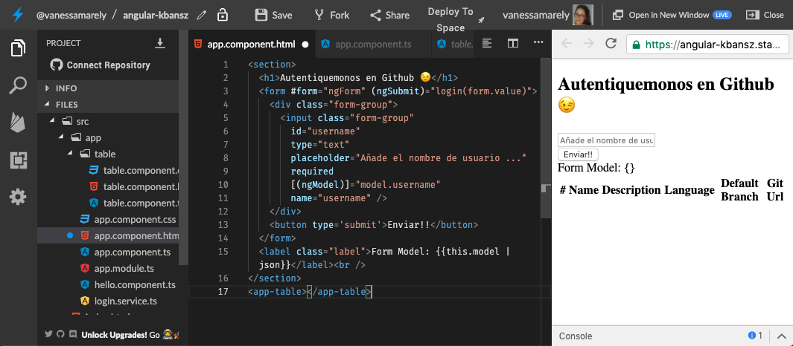

Ahora vamos a pasar la data de un componente a otro. Nuestro App component es el que tendrá toda la lógica de nuestra App, en Angular a estos componentes los llamamos **Smart Components** y a los componentes que no tienen una lógica como la de App y son mas sencillos \(como para mostrar sólo data\) los llamamos **Dumb Component.**

Dentro de **app.component.html** en el componente tabla, encontraremos el **app-table** donde vamos a ****hacer **binding** \(pasaremos la data de un lugar a otro\), crearemos un atributo **\[repos\]** y le asignaremos nuestra variable **reposList.**

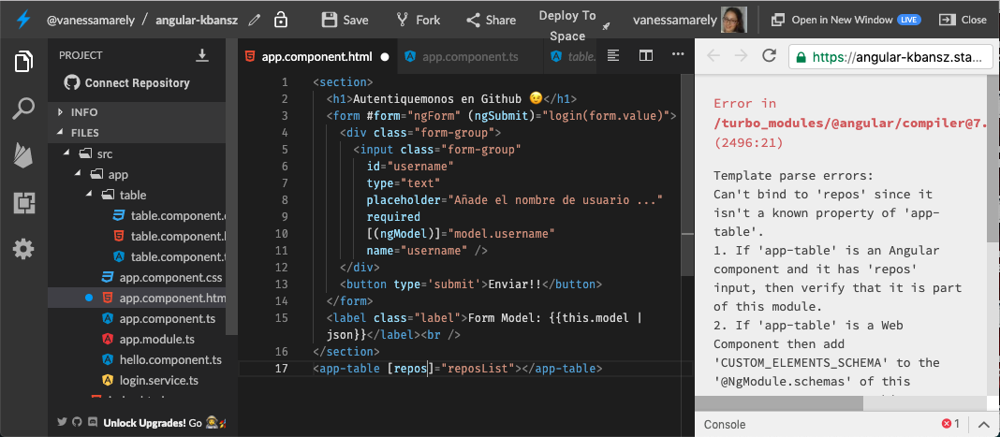

En el **table.component.ts** vamos a usar el decorador **@Input\(\)**, para recibir la data del componente padre, del App.


Un **decorador**, extiende una función mediante otra función, pero sin tocar aquella original, que se está extendiendo. El decorador recibe una función como argumento \(aquella que se quiere decorar\) y devuelve esa función con alguna funcionalidad adicional.


En el archivo **table.component.ts** vamos a importar el Input y recibimos la nueva data.

En la línea donde importamos el **Component**, vamos a añadirle el **Input**, nuestra línea quedaría así: 


```text

import { Component, Input, OnInit } from '@angular/core';
```


En la case **TableComponent** añadimos nuestro decorador **Input** con nuestro **repos** de tipo **array**.


```text
export class TableComponent implements OnInit {

  @Input() repos: [];

  constructor() { }
}


```


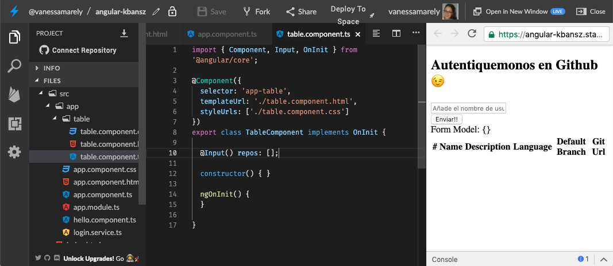

Como en la respuesta podemos recibir más de un elemento en nuestro array, en nuestro HTML \(**table.component.html**\) usaremos la directiva **\*ngFor**, para recorrer todos los valores del array y usaremos la interpolación para colocar los valores que corresponde a cada columna.


```text

<tbody>
    <tr *ngFor="let repo of repos; let i = index">
      <td>{{ i }}</td>
      <td>{{ repo['name'] }}</td>
      <td>{{ repo['description'] }}</td>
      <td>{{ repo['language'] }}</td>
      <td>{{ repo['default_branch'] }}</td>
      <td>{{ repo['git_url'] }}</td>
    </tr>
  </tbody>
```


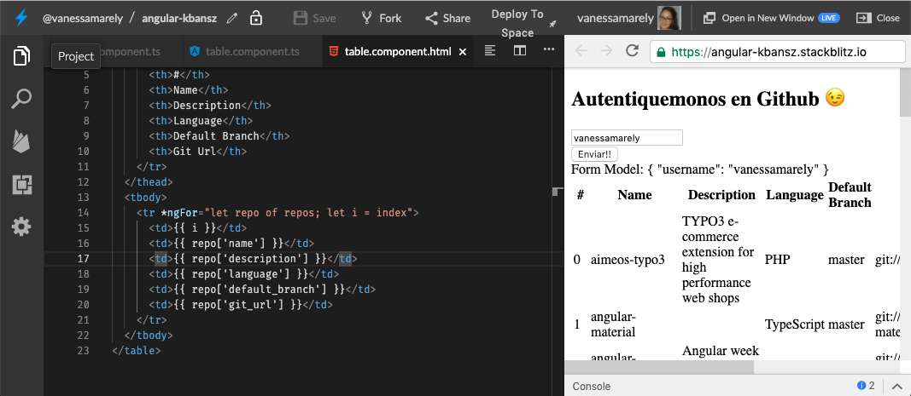

Para ocultar los encabezados podríamos añadirle la directiva **\*ngIf** en nuestro componente de tabla, para que solo muestre la tabla cuando tenga algún resultado, nos quedaría algo como esto:👇

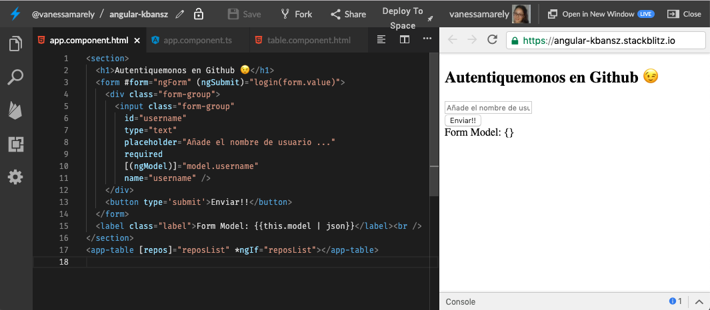

## 🤓¡Tu Misión!🤓

Tenemos una misión para ti y es que pongas bonita la App, en ejercicios pasados hemos añadido CSS para poner los campos de texto y los botones más bonitos, incluso ya sabes poner imágenes.

La idea es que le pongas algo de CSS al mini formulario y a la tabla.

Para la tabla te daremos un poco de ayuda con una página que te permite generar estilos para las tablas:



Solo necesitas copiar los estilos en el archivo **table.component.css** y añadir las clases respectivas en el html **table.component.html**

¡Felicitaciones hemos terminado nuestro desafío!

🎉 ¡**LO LOGRASTE!** 🎉


\*\*\*\*[**Aquí**](https://stackblitz.com/edit/angular-logingithub) puedes encontrar el ejercicio resuelto.



**Nota:**

Si necesitas mentoría con este ejercicio puedes contactar a:

Vanessa M. Aristizabal  
Twitter: @vanessamarely  
Correo: vanessamarely@gmail.com



Has completado este desafío y finalizado con todos los desafíos del taller **Felicitaciones**!! 🎉🎉🎉



 

