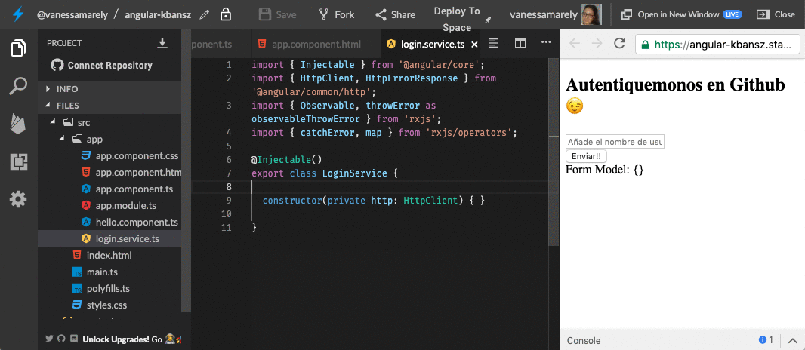

# Intermedio \#2: Formulario de Autenticación 🥳

## 💡 Introducción 💡

Como ya sabes inicializar una App de **Angular** en **Stackblitz**, omitiremos el primer paso de todos los desafíos anteriores \(el paso 1 de crear la App de Angular\)

 En este desafío nos divertiremos creando una App, donde haremos un formulario de autenticación.

\*\*\*\*[**¡Aquí puedes encontrar el demo!**](https://angular-catparty.stackblitz.io/)\*\*\*\*

¿Estás list@?

**Es hora de la Acción!!! 😝**

## Paso 1: Crearemos un formulario ✍️

Vamos a crear un formulario con un campo de texto, donde pondremos el nombre de usuario con el que nos vamos a autenticar en nuestra App. Nuestro formulario tendrá un botón para enviar el texto que ingresaremos en el formulario.

Puedes añadir el siguiente código en **app.component.html**



```markup
<section>
  <h1>Autentiquemonos en Github 😉</h1>
  <form #form="ngForm" (ngSubmit)="login(form.value)">
    <div class="form-group">
      <input class="form-group"
        id="username"
        type="text"
        placeholder="Añade el nombre de usuario ..."
        required
        [(ngModel)]="model.username"
        name="username" />
    </div>
    <button type='submit'>Enviar!!</button>
  </form>
  <label class="label">Form Model: {{this.model | json}}</label><br />
</section>
```




## Paso 2: Creemos la función que se encargará de la autenticación

En el archivo **app.component.ts** vamos a crear el objeto model, que nos mostrara el modelo de nuestro formulario y crearemos una función login que se encargara de la lógica de nuestra App.



```typescript
import { Component } from '@angular/core';


@Component({
  selector: 'my-app',
  templateUrl: './app.component.html',
  styleUrls: ['./app.component.css']
})
export class AppComponent {
  model = {};

  login() {
  
  }

```



En nuestra función llamada **login**, que será accionada cuando el usuario de click en el botón **Enviar**, le añadiremos un parámetro que va a recibir la función que se lo asignaremos a nuestra variable model.



```text
login(form: any) {
  this.model = form;
}
```



Deberías hacer algo así, y tu resultado se deberá ver así:👇


## Paso 3: Crearemos un servicio

Crearemos un 'servicio' dando clic sobre la carpeta 'app', seleccionamos 'service', nombramos el servicio como: '**login**', damos enter y se nos creará un archivo llamado: 'login.service.ts


Importamos unas dependencias en nuestro nuevo archivo llamado **login.service.ts**,  y añadimos en el constructor lo siguiente: **http: HttpClient** 



```text
import { Injectable } from '@angular/core';
import { HttpClient, HttpErrorResponse } from '@angular/common/http';
import { Observable, throwError as observableThrowError } from 'rxjs';
import { catchError, map } from 'rxjs/operators';

@Injectable()
export class LoginService {

  constructor(private http: HttpClient) { }

}
```



Incluimos el 'HttpClientModule' en el archivo **app.module.ts**



```text
import { HttpClientModule } from '@angular/common/http';
```



y también en los imports incluimos el **HttpClientModule** en el 'app.module.ts'



```text
@NgModule({
  imports:      [ BrowserModule, FormsModule, HttpClientModule ],
  declarations: [ AppComponent, HelloComponent ],
  bootstrap:    [ AppComponent ],
  providers: [LoginService]
})
export class AppModule { }

```



En nuestro archivo **login.service.ts** crearemos dos funciones, una para manejar los errores: **handleError** y otra que nos obtendrá la data del Api **get**:



```text
get(APIRoot) {
  return this.http
    .get<Array<{}>>(APIRoot)
    .pipe(map(data => data), catchError(this.handleError));
}

private handleError(res: HttpErrorResponse | any) {
  console.error(res.error || res.body.error);
  return observableThrowError(res.error || 'Server error');
}
```





## Paso 4: Hagamos la lógica que llama a nuestro servicio

En nuestro archivo **app.component.ts**, crearemos una variable, de tipo **string,** donde le asignaremos la url del API.   En nuestra función **login**, crearemos un 'Observable' que nos permitirá subscribirnos, a la petición que hacemos de los datos, usando la variable que definimos con la ruta del API de **Github**.

También importaremos en nuestro **app.component.ts** el servicio que creamos **LoginService** y crearemos una función **constructor** donde declararemos una función privada del servicio. ****



```typescript
import { Component } from '@angular/core';
import { LoginService } from './gender.service';

@Component({
  selector: 'my-app',
  templateUrl: './app.component.html',
  styleUrls: ['./app.component.css']
})
export class AppComponent {
  model = {};
  apiRoot: string = 'https://api.github.com/users/';
  
  constructor(private loginService: LoginService){}
  
  login() {
    this.loginService
      .get(`this.apiRoot${this.model['username]}/repos`)
      .subscribe(
      response => (console.log(response)),
      error => (console.log('Ups! we have an error: ', error))
      )
  }

```



¡Felicitaciones hemos terminado nuestro desafío!

🎉 ¡**LO LOGRASTE!** 🎉


\*\*\*\*[**Aquí**](https://stackblitz.com/edit/angular-agecalculator) puedes encontrar el ejercicio resuelto.



**Nota:**

Si necesitas mentoría con este ejercicio puedes contactar a:

Vanessa M. Aristizabal  
Twitter: @vanessamarely  
Correo: vanessamarely@gmail.com



Has completado este desafío 🎉🎉🎉



 

