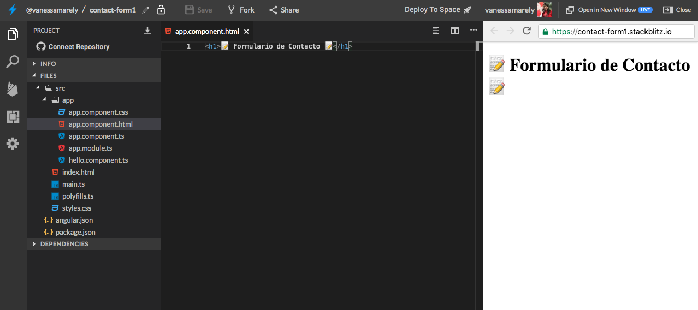
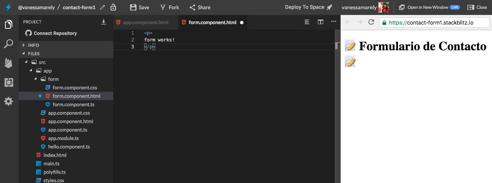
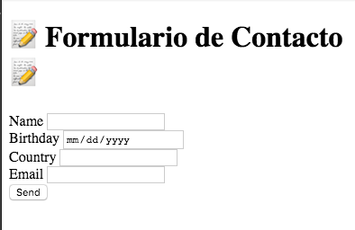

# ✨Avanzado \#1 - Formularios Reactivos✨

## 💡 Introducción 💡

En este desafío crearemos un formulario de contacto aplicando algunos conceptos básicos de Angular, los cuales hemos aprendido en los desafíos anteriores y aprenderemos algunos nuevos a través de este desafío 🤙

**¡**[**Aquí puedes encontrar el demo**](https://contact-form1.stackblitz.io)**!**

¿Estás list@?

**Es hora de la Acción!!! 😝**

## Paso 1: **Creemos nuestra App de Angular** ⭐️

Primero iremos a el inicio de **Stackbliz** y crearemos una App de Angular.


En la parte izquierda donde dice "Files", seleccionaremos el archivo llamado **app.component.html**. 

Dentro del archivo seleccionamos su texto,  lo borramos \(presionando la tecla delete de tu compu 💻\) y guardamos los cambios, seleccionando en la parte superior la opción de '**Save**' 💾 o la tecla rápida **cmd** + **S** o en windows **Ctrl** + **S.** 


## Paso 2: **Añadamos un título** 🏁

En el mismo archivo **app.component.html,** vamos a usar unas etiquetas o tags de **HTML** para poner un título.

Copiaremos lo siguiente en el archivo **app.component.html** 



```markup
<h1>📝 Formulario de Contacto 📝</h1>
```



Deberías ver algo así: 👇



## Paso 3: Añadamos algunos campos de texto

Creemos un componente form y en el añadiremos algunos campos de texto para nuestro formulario.

En la carpeta app daremos clic derecho, seleccionamos la opción Angular Generator y seleccionamos component, le asignaremos el nombre form.



En nuestro nuevo componente vamos a crear un campo de texto para el nombre, teléfono, país de origen, fecha de nacimiento y correo.

Incluiremos este componente form en nuestro app component.



## Paso 4: Volvamos nuestro formulario reactivo

En el **app.module.ts** debemos incluir el modulo **ReactiveFormsModule.**

```typescript
import { ReactiveFormsModule } from '@angular/forms';
```

Lo incluimos en los imports del @NgModule.

```typescript
imports: [BrowserModule, ReactiveFormsModule]
```


Los formularios Reactivos nos permiten crear un modelo de formulario donde queda almacenada nuestra información, hasta que el usuario presione el botón de enviar el formulario.

Para crear el modelo se usa una clase llamada **FormGroup** \(que tiene un grupo de controles o **FormControl**\), este realiza un seguimiento del valor, estado de cambio y validez de los datos. El encargado de crear el FormGroup es un servicio llamado **FormBuilder**


Ahora vamos a incluir en nuestro formulario al **FormGroup** y al **FormBuilder**.

En el archivo **form.component.ts** vamos a declarar una variable de tipo **FormGroup**.

```typescript
public formGroup: FormGroup;
```

Debemos importar la clase y los demás elementos que usaremos para nuestro formulario que nos permitirán controlarlo. En nuestro **form.component.ts** añadiremos el siguiente import: 

```typescript
import { FormControl, FormGroup, FormBuilder } from '@angular/forms'
```

Vamos a incluir algunas funciones y algunos funciones del ciclo de vida de Angular como el **constructor** y el **ngOnInit**.

En el constructor vamos a definir una variable de tipo **FormBuilder**.

```typescript
constructor( private formBuilder: FormBuilder ) { }
```

En nuestro **ngOnInit** invocaremos una función que será la encargada de crear el modelo de nuestro formulario. Eso lo incluiremos en nuestro **form.component.ts**.

```typescript
public ngOnInit() {
    this.buildForm();
 }
private buildForm(){
    this.formGroup = this.formBuilder.group({});
}
```

Dentro del objeto **group** debemos definir los valores, un nombre y una configuración en el caso de que deseemos definir valores requeridos, para la validación. Entonces procederemos a darle un valor a cada elementos que será el nombre que usaremos en cada uno de los elementos de nuestro formulario. 

En nuestra función **buildForm\(\),** definiremos los nombres y pongamos algunos valores por defecto.

```typescript
private buildForm(){
        this.formGroup = this.formBuilder.group({
                name: 'Jhon Doe',
                email: 'defaul@email.com',
                country: 'Colombia',
                birthday: ''
         });
 }
```

Ahora en la vista en nuestro **form.component.html** vamos a asignar los nombres que definimos el el modelo a los elementos correspondientes del **HTML**.


