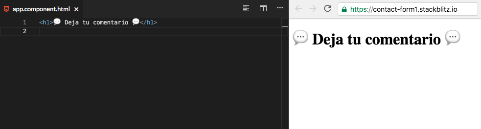
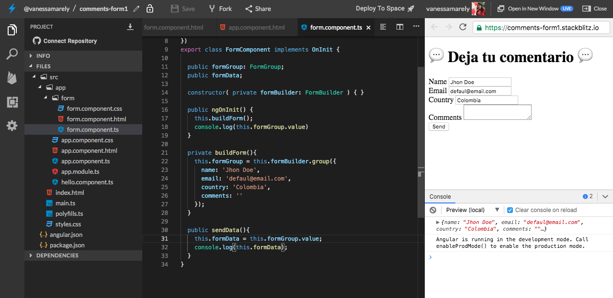

# ✨Avanzado \#1 - Formularios Reactivos - Deja tu comentario 💬 

## 💡 Introducción 💡 

En este desafío crearemos un formulario  aplicando algunos conceptos básicos de Angular, los cuales hemos aprendido en los desafíos anteriores y aprenderemos algunos nuevos a través de esta nueva aplicación 🤙 

**¡**[**Aquí puedes encontrar el demo**](https://contact-form1.stackblitz.io)**!**

¿Estás list@?

**Es hora de la Acción!!! 😝**

## Paso 1: **Creemos nuestra App de Angular** ⭐️

Primero iremos a el inicio de **Stackbliz** y crearemos una App de Angular.


En la parte izquierda donde dice "Files", seleccionaremos el archivo llamado **app.component.html**. 

Dentro del archivo seleccionamos su texto,  lo borramos \(presionando la tecla delete de tu compu 💻\) y guardamos los cambios, seleccionando en la parte superior la opción de '**Save**' 💾 o la tecla rápida **cmd** + **S** o en windows **Ctrl** + **S.** 


## Paso 2: **Añadamos un título** 🏁 

En el mismo archivo **app.component.html,** vamos a usar unas etiquetas o tags de **HTML** para poner un título.

Copiaremos lo siguiente en el archivo **app.component.html** 



```markup
<h1>💬 Deja tu comentario 💬</h1>
```



Deberías ver algo así: 👇 



## Paso 3: Añadamos algunos campos de texto

Creemos un componente form y en el añadiremos algunos campos de texto para nuestro formulario.

En la carpeta app daremos clic derecho, seleccionamos la opción Angular Generator y seleccionamos component, le asignaremos el nombre form.


En nuestro nuevo componente vamos a crear un campo de texto para el nombre, país de origen,  correo y comentarios.

Incluiremos este componente form en nuestro app component.


## Paso 4: Volvamos nuestro formulario reactivo

En el **app.module.ts** debemos incluir el modulo **ReactiveFormsModule.**

```typescript
import { ReactiveFormsModule } from '@angular/forms';
```

Lo incluimos en los imports del @NgModule.

```typescript
imports: [BrowserModule, ReactiveFormsModule]
```


Los formularios Reactivos nos permiten crear un modelo de formulario donde queda almacenada nuestra información, hasta que el usuario presione el botón de enviar el formulario.

Para crear el modelo se usa una clase llamada **FormGroup** \(que tiene un grupo de controles o **FormControl**\), este realiza un seguimiento del valor, estado de cambio y validez de los datos. El encargado de crear el FormGroup es un servicio llamado **FormBuilder**


Ahora vamos a incluir en nuestro formulario al **FormGroup** y al **FormBuilder**.

En el archivo **form.component.ts** vamos a declarar una variable de tipo **FormGroup**.

```typescript
public formGroup: FormGroup;
```

Debemos importar la clase y los demás elementos que usaremos para nuestro formulario que nos permitirán controlarlo. En nuestro **form.component.ts** añadiremos el siguiente import: 

```typescript
import { FormControl, FormGroup, FormBuilder } from '@angular/forms'
```

Vamos a incluir algunas funciones e incluiremos el  **constructor** y el **ngOnInit** que hacen parte del ****ciclo de vida de Angular.

En el **constructor** vamos a definir una variable de tipo **FormBuilder**.

```typescript
constructor( private formBuilder: FormBuilder ) { }
```

En nuestro **ngOnInit** invocaremos una función que será la encargada de crear el modelo de nuestro formulario. Eso lo incluiremos en nuestro **form.component.ts**.

```typescript
public ngOnInit() {
    this.buildForm();
 }
private buildForm(){
    this.formGroup = this.formBuilder.group({});
}
```

Dentro del objeto **group** debemos definir los valores, un nombre y una configuración en el caso de que deseemos definir valores requeridos, para la validación. Entonces procederemos a darle un valor a cada elementos que será el nombre que usaremos en cada uno de los elementos de nuestro formulario. 

En nuestra función **buildForm\(\),** definiremos los nombres y pongamos algunos valores por defecto.

```typescript
private buildForm(){
        this.formGroup = this.formBuilder.group({
                name: 'Jhon Doe',
                email: 'defaul@email.com',
                country: 'Colombia',
                comments: ''
         });
 }
```

Ahora en la vista en nuestro **form.component.html** vamos a asignar los nombres que definimos en el modelo, a los elementos correspondientes del **HTML**.

En el form procederemos a añadir las dos directivas que vienen del modulo de formularios reactivos,  **\[formGroup\]="objetoFormulario"** y **formControlName="nombreDelControl"**.

En nuestra etiqueta form incluiremos la directiva **\[formGroup\]**.

```markup
<form [formGroup]="formGroup">
</form>
```

En nuestros elementos del form: &lt;input&gt; &lt;textarea&gt; pondremos los **formControlName**. Como por ejemplo:

```markup
<input name="name" type="text" formControlName="name" />
```

## Paso 5: Envío de nuestra información

Tenemos nuestro formulario, ahora vamos a hacer uso del botón de enviar  o **Send**, para enviar nuestra información.

Crearemos una función **sendData\(\)** en nuestro **form.component.ts**. En nuestra Clase de formulario crearemos una constante que usaremos en nuestra función para almacenar la información de nuestro formulario.



```typescript

export class FormComponent implements OnInit {
  
  public formData;

  public sendData(){
    this.formData = this.formGroup.value;
    console.log(this.formData);
  }
}
```





En nuestro botón incluiremos nuestra función. 

```markup
<button (click)="sendData()">Send</button>
```

## Paso 6: Visualizar nuestra Data enviada

Para visualizar la información que enviamos, crearemos una sección debajo de nuestro formulario, que indique que nuestra información ha sido enviada con éxito y nos sirve para comprobar la información que incluimos en nuestro formulario.

```markup
<section>
    aquí va nuestra información ...
</section>
```

Incluiremos un titulo y mostraremos la información donde ubicaremos el titulo del campo a la derecha y la información que incluimos en el formulario para ese campo a la izquierda.


