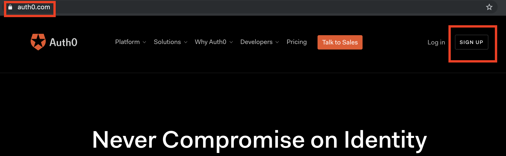
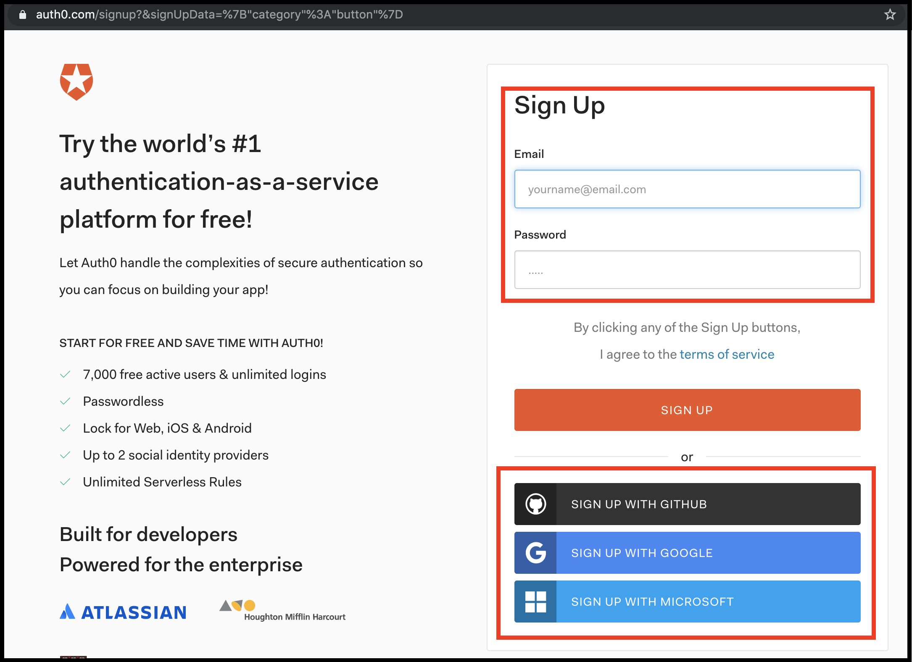
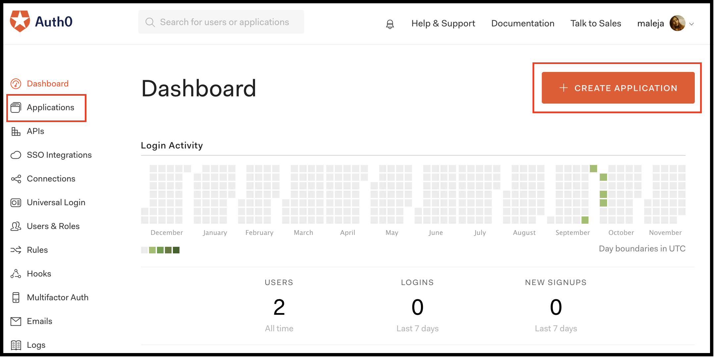
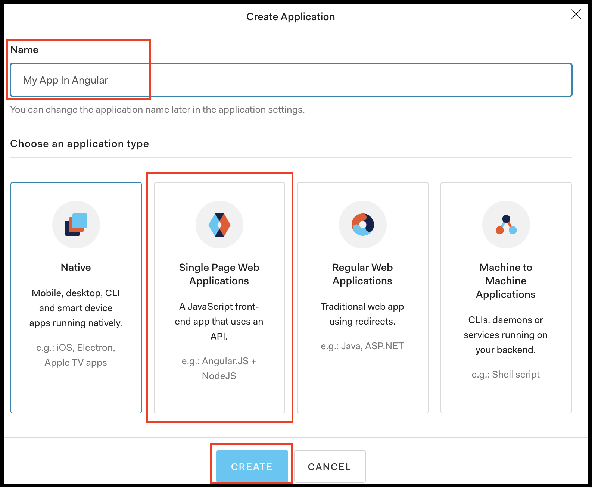
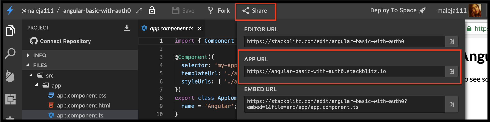
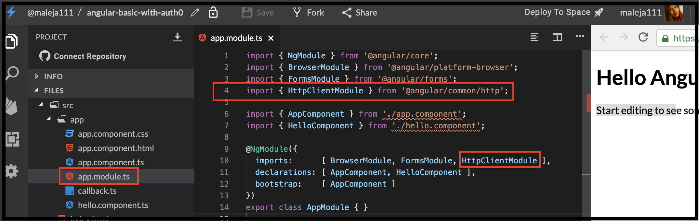
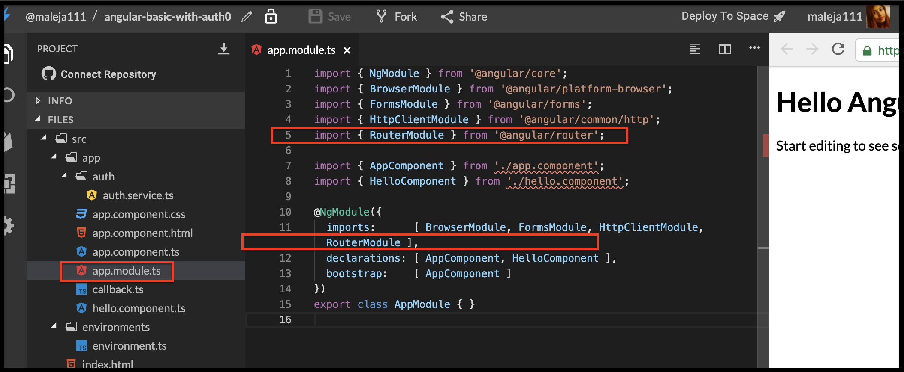
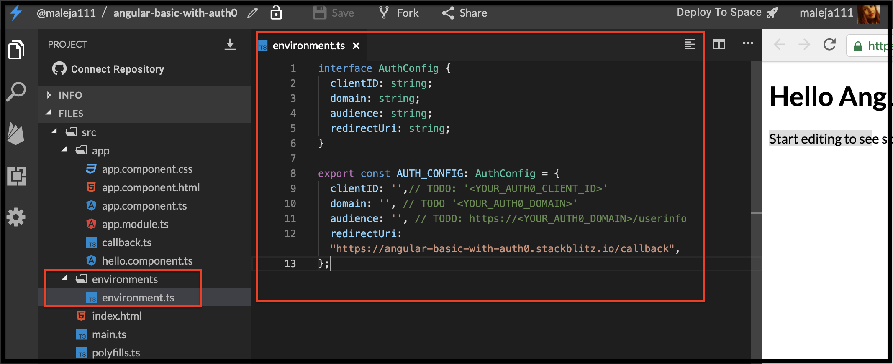
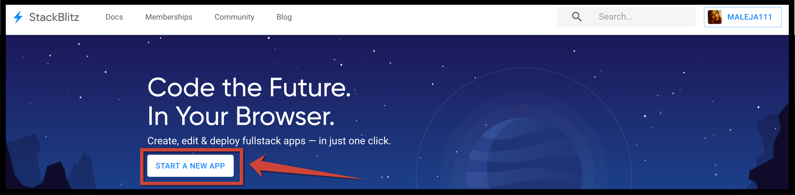
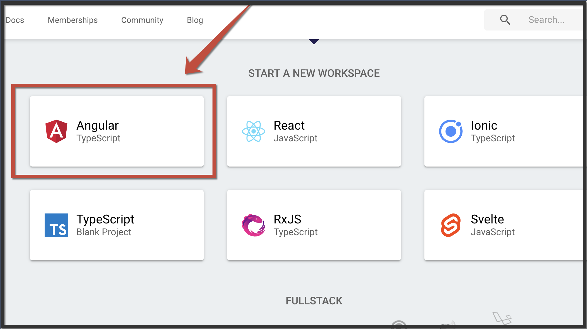

# Avanzado \#2 Autenticación básica con Auth0 🔒

## 💡 Introducción 💡

En este desafío vamos a aprender a tener una autenticación con [Auth0](https://auth0.com/) y las ventajas de usarla.  
En un mundo donde casi tod@s usan la misma contraseña para todo, la fecha de su cumpleaños, el nombre de su mascota, entre otras malas prácticas para protección de datos, te estás asegurando de cuidar la información de manera simple. 🔐

\*\*\*\*[**¡Aquí puedes encontrar un demo!**](https://shorturl.at/byCW0)\*\*\*\*

## Paso 1: **Creemos nuestra App de Angular** 🅰️ <a id="paso-1-creemos-nuestra-app-de-angular"></a>

Entra a [**www.stackblitz.com**](https://stackblitz.com/), y verás algo como esto:


## Paso 2: **Vamos a crear una cuenta en Auth0** 

Esta cuenta es totalmente gratuita, Auth0 se encargará de la autenticación de los usuarios por nosotros, ellos tienen unos servicios, llamados API donde tú los llamas y según la información que le envíes él te responderá si es el usuario correcto, también nos realizará procesos de autenticación de terceros como Google o recordar contraseña, se asegurará que no sea un correo maligno que le este haciendo peticiones cuando intenta recordar la contraseña y que no están tratando de atacar tu aplicación, asiendo así, un inicio de sesión muy seguro.  
  
Entra a [**https://auth0.com/**](https://auth0.com/), y crearas una cuenta así:





Podrás crear una cuenta con un usuario y contraseña o con una cuenta que ya tengas anteriormente por un tercero.  
Yo usare la de Google para este ejemplo.



Cuando ya ingreses a tu cuenta, podrás ver una plataforma de manejo de tus aplicaciones e inicios de sesión en ella, puedes sacar estadísticas, hacer grupos por roles y permisos, decir a que usuario les va a otorgar ciertos accesos y a cuales no. ¡Y mucho más!



Al darle click en **+ Create Application** creamos una nueva instancia para manejar el inicio de sesión de nuestra aplicación.  
Y seleccionamos **Single Page Web Application** como el tipo de autenticación que vamos a usar.


Curando ya tengamos nuestra nueva instancia, Auth0 nos va a proveer de un client ID que usaremos para todos los llamados a su API.


Vamos a tomar la URL de nuestra aplicación que nos genera [https://stackblitz.com/](https://stackblitz.com/) y vamos a usarla para que Auth0 sepa que cuando hagamos un llamado a su API desde nuestra aplicación, nos responda con la configuración que esperamos al respecto.



Esta es la ubicación de la URL de nuestra aplicación en [https://stackblitz.com/](https://stackblitz.com/)  
Guarda los cambios y estas listo para usarla.

## Paso 3: **Vamos insertar la funcionalidad para hacer llamados a funcionalidades externas como una API y adicionaremos router.**

Ya aprendiste como adicionar router, ahora vamos a adicionar la funcionalidad  HTTP Client Module en nuestro  `app.module.ts`  y  luego hacemos su llamado a desde `imports`

```typescript
import { HttpClientModule } from '@angular/common/http';
```



```typescript
import { RouterModule } from '@angular/router';
```



## Paso 4: **Adicionar las variables de configuración**

En este archivo vamos a sacar las variables necesarias para manejar nuestra aplicación, esta va a ser la información que le entregaremos a la API de Auth0 y con ella nos identificaremos.  
vamos a crear un archivo llamado donde las pondremos  **auth0-variables.ts**



```typescript
interface AuthConfig {
  clientID: string;
  domain: string;
  audience: string;
  redirectUri: string;
}

export const AUTH_CONFIG: AuthConfig = {
  clientID: '',// TODO: '<YOUR_AUTH0_CLIENT_ID>'
  domain: '', // TODO '<YOUR_AUTH0_DOMAIN>'
  audience: '', // TODO: https://<YOUR_AUTH0_DOMAIN>/userinfo
  redirectUri: "https://angular-basic-with-auth0.stackblitz.io/callback",
};
```





## **No olvides, que cuando termines el ejercicio debes borrar esas variables, para que personas en internet no usen tu cuenta sin tu autorización.**

## Paso 5: **Crea un servicio de autenticación**

La mejor manera de administrar y coordinar las tareas necesarias para la autenticación del usuario es crear un servicio reutilizable. Con el servicio en su lugar, podrá llamar a sus métodos a través de su aplicación. Se puede crear una instancia del objeto WebAuth de auth0.js en el servicio **AuthService.ts.**

```typescript
import { HttpClientModule } from '@angular/common/http';
```


##  Paso 3: **Vamos a crear nuestra clase Callback**


Para manejar la ruta de devolución de llamada \([http: // localhost: 3000 / callback](https://angular-basic-with-auth0.stackblitz.io/callback)\), definamos este componente, cree un nuevo archivo llamado **callback.ts** dentro del directorio src/App e inserte el siguiente código:



```markup
<div class="center">

	<div class="card">
		<div class="additional">
			<div class=
```



>

  
Yo usare la de Google para este ejemplo.

Entra a [**www.stackblitz.com**](https://stackblitz.com), y verás algo como esto:





## Paso 2: **Vamos a la estructura** básica **HTML 💀**

Vamos a adicionar la estructura básica que va a tener nuestro formulario para que tengamos mucho mas claro como vamos a visualizar nuestros datos.  
Reemplazaremos el contenido del archivo **app.component.html** y adicionaremos lo siguiente:

