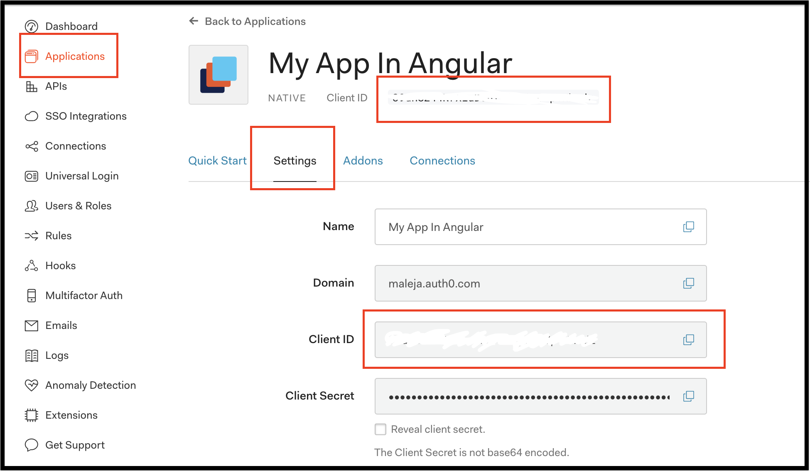

# Avanzado \#2 Autenticación básica con Auth0 🔒

## 💡 Introducción 💡

En este desafío vamos a aprender a tener una autenticación con [Auth0](https://auth0.com/) y las ventajas de usarla.  
En un mundo donde casi tod@s usan la misma contraseña para todo, la fecha de su cumpleaños, el nombre de su mascota, entre otras malas prácticas para protección de datos, te estás asegurando de cuidar la información de manera simple. 🔐

\*\*\*\*[**¡Aquí puedes encontrar un demo!**](https://shorturl.at/byCW0)\*\*\*\*

## Paso 1: **Vamos a crear una cuenta en Auth0** 

Esta cuenta es totalmente gratuita, Auth0 se encargará de la autenticación de los usuarios por nosotros, ellos tienen unos servicios, llamados API donde tú los llamas y según la información que le envíes él te responderá si es el usuario correcto, también nos realizará procesos de autenticación de terceros como Google o recordar contraseña, se asegurará que no sea un correo maligno que le este haciendo peticiones cuando intenta recordar la contraseña y que no están tratando de atacar tu aplicación, asiendo así, un inicio de sesión muy seguro.  
  
Entra a [**https://auth0.com/**](https://auth0.com/), y crearas una cuenta así:

Podrás crear una cuenta con un usuario y contraseña o con una cuenta que ya tengas anteriormente por un tercero.  
Yo usare la de Google para este ejemplo.

Cuando ya ingreses a tu cuenta, podrás ver una plataforma de manejo de tus aplicaciones e inicios de sesión en ella, puedes sacar estadísticas, hacer grupos por roles y permisos, decir a que usuario les va a otorgar ciertos accesos y a cuales no. ¡Y mucho más!

Al darle click en **+ Create Application** creamos una nueva instancia para manejar el inicio de sesión de nuestra aplicación.  
Y seleccionamos **Single Page Web Application** como el tipo de autenticación que vamos a usar.

  
Yo usare la de Google para este ejemplo.

Entra a [**www.stackblitz.com**](https://stackblitz.com), y verás algo como esto:

## Paso 2: **Vamos a la estructura** básica **HTML 💀**

Vamos a adicionar la estructura básica que va a tener nuestro formulario para que tengamos mucho mas claro como vamos a visualizar nuestros datos.  
Reemplazaremos el contenido del archivo **app.component.html** y adicionaremos lo siguiente:

