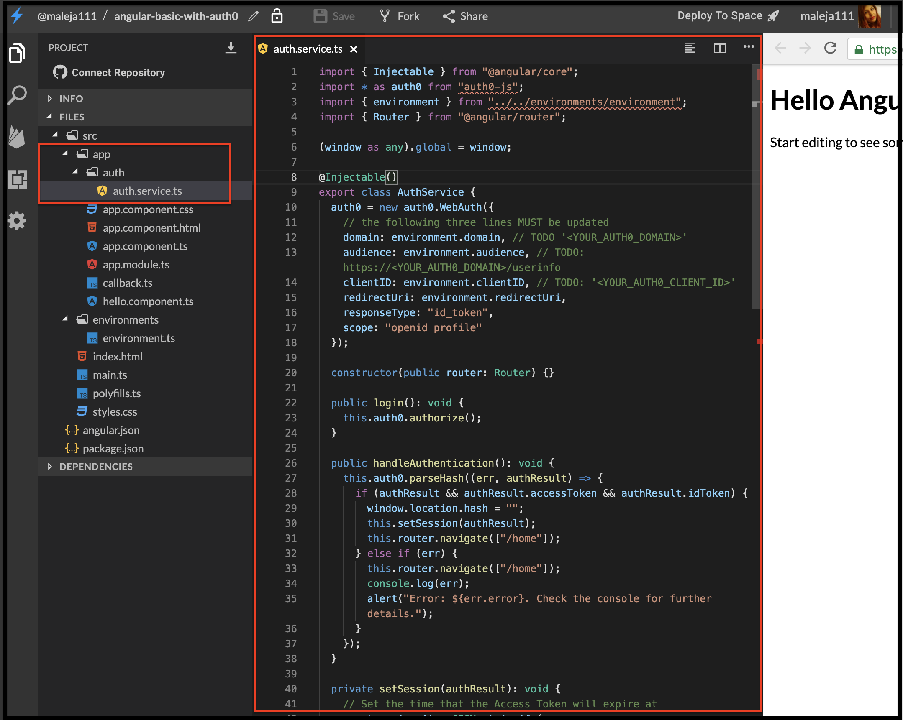
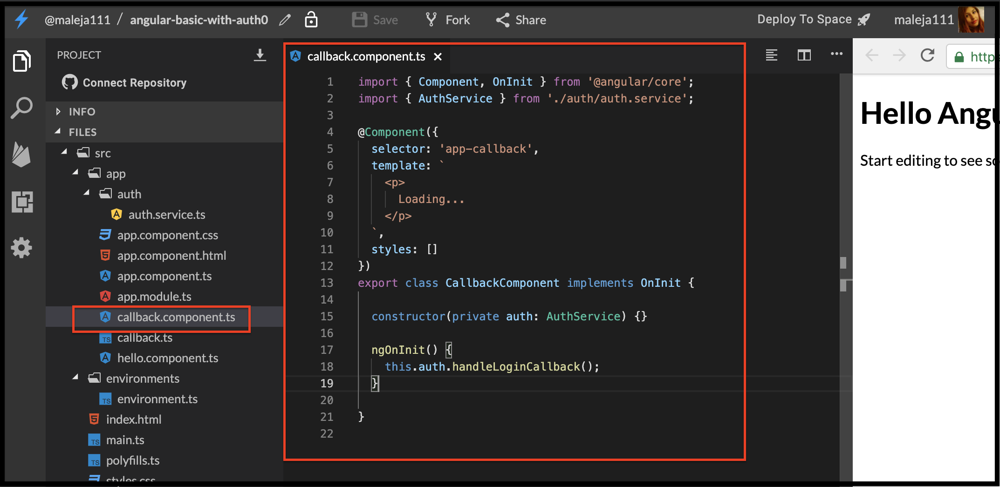
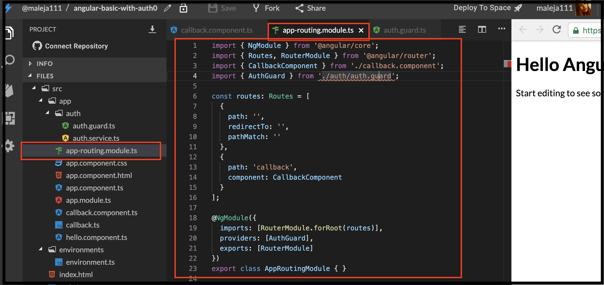
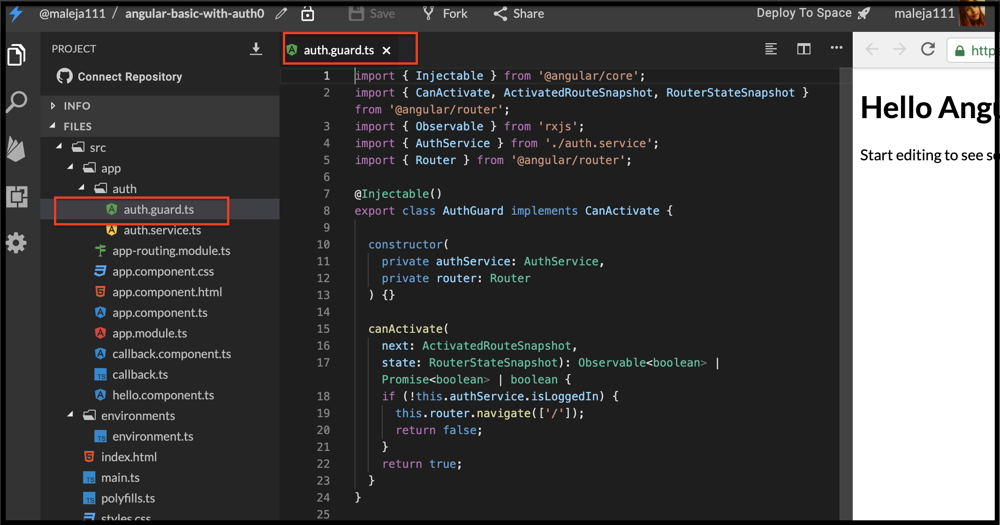
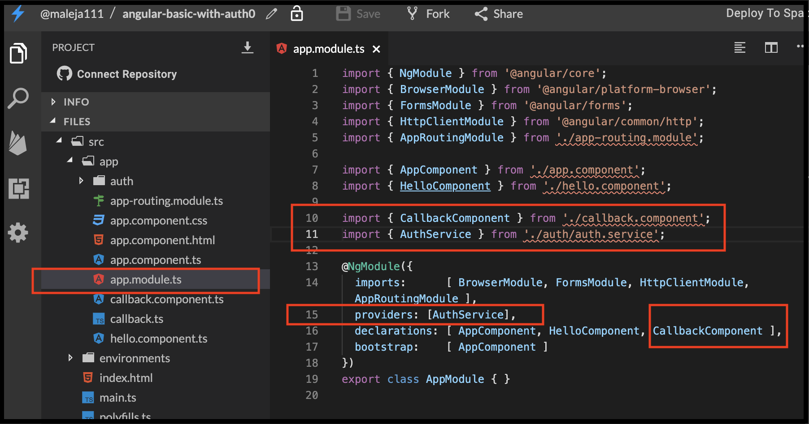
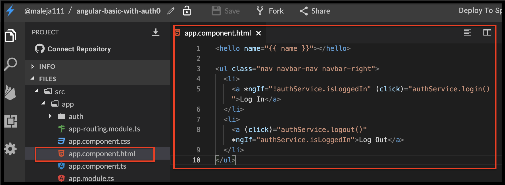
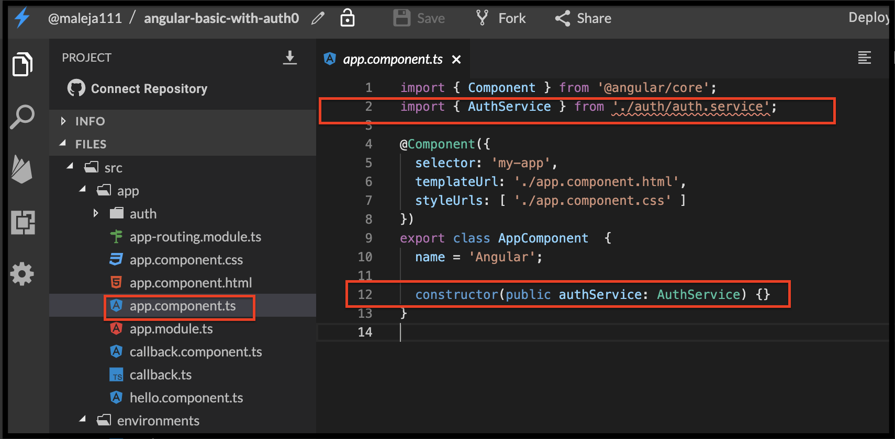
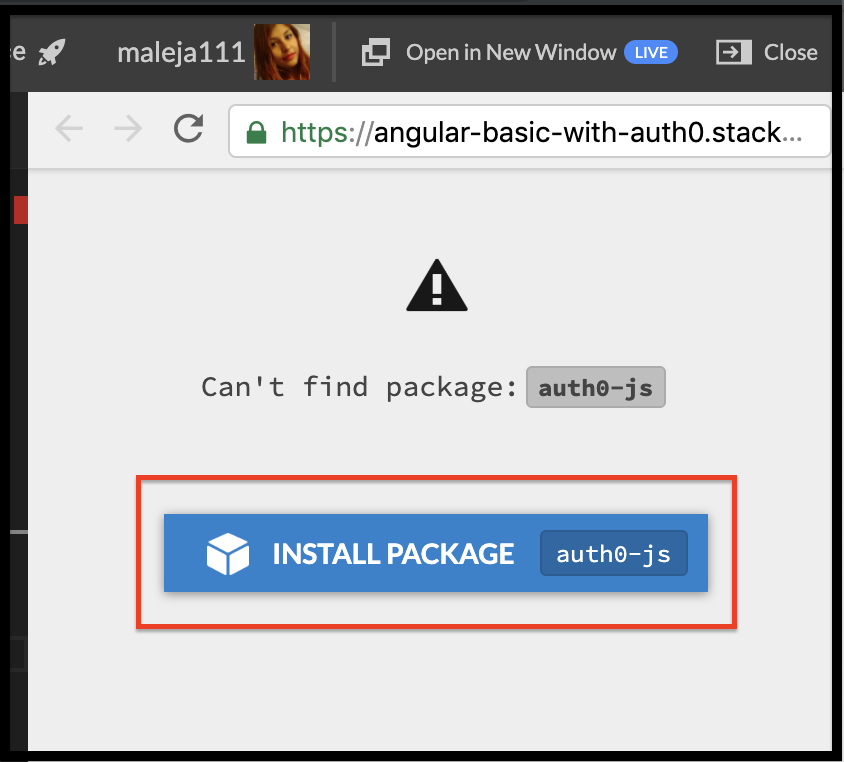

# Avanzado \#2 Autenticación básica Angular.io con Auth0 🔒

## 💡 Introducción 💡

En este desafío vamos a aprender a tener una autenticación con [Auth0](https://auth0.com/) y las ventajas de usarla.  
En un mundo donde casi tod@s usan la misma contraseña para todo, la fecha de su cumpleaños, el nombre de su mascota, entre otras malas prácticas para protección de datos, te estás asegurando de cuidar la información de manera simple. 🔐

**¡Aquí puedes encontrar un demo!**


## Paso 1: **Creemos nuestra App de Angular** 🅰️ <a id="paso-1-creemos-nuestra-app-de-angular"></a>

Entra a [**www.stackblitz.com**](https://stackblitz.com/), y verás algo como esto:


## Paso 2: **Vamos a crear una cuenta en Auth0** 

Esta cuenta es totalmente gratuita, Auth0 se encargará de la autenticación de los usuarios por nosotros, ellos tienen unos servicios, llamados API donde tú los llamas y según la información que le envíes él te responderá si es el usuario correcto, también nos realizará procesos de autenticación de terceros como Google o recordar contraseña, se asegurará que no sea un correo maligno que le este haciendo peticiones cuando intenta recordar la contraseña y que no están tratando de atacar tu aplicación, asiendo así, un inicio de sesión muy seguro.  
  
Entra a [**https://auth0.com/**](https://auth0.com/), y crearas una cuenta así:


Podrás crear una cuenta con un usuario y contraseña o con una cuenta que ya tengas anteriormente por un tercero.  
Yo usaré la de Google para este ejemplo.


Cuando ya ingreses a tu cuenta, podrás ver una plataforma de manejo de tus aplicaciones e inicios de sesión en ella, puedes sacar estadísticas, hacer grupos por roles y permisos, decir a que usuario les va a otorgar ciertos accesos y a cuales no. ¡Y mucho más!


Al darle click en **+ Create Application** creamos una nueva instancia para manejar el inicio de sesión de nuestra aplicación.  
Y seleccionamos **Single Page Web Application** como el tipo de autenticación que vamos a usar.


Curando ya tengamos nuestra nueva instancia, Auth0 nos va a proveer de un client ID que usaremos para todos los llamados a su API.


Vamos a tomar la URL de nuestra aplicación que nos genera [https://stackblitz.com/](https://stackblitz.com/) y vamos a usarla para que Auth0 sepa que cuando hagamos un llamado a su API desde nuestra aplicación, nos responda con la configuración que esperamos al respecto.


Esta es la ubicación de la URL de nuestra aplicación en [https://stackblitz.com/](https://stackblitz.com/)  
Guarda los cambios y estas listo para usarla.

## Paso 3: **Vamos insertar la funcionalidad para hacer llamados a funcionalidades externas como una API y adicionaremos router.**

Ya aprendiste como adicionar router, ahora vamos a adicionar la funcionalidad  HTTP Client Module en nuestro  `app.module.ts`  y  luego hacemos su llamado a desde `imports`

```typescript
import { HttpClientModule } from '@angular/common/http';
```


```typescript
import { AppRoutingModule } from './app-routing.module';
```


## Paso 4: **Adicionar las variables de configuración**

En este archivo vamos a sacar las variables necesarias para manejar nuestra aplicación, esta va a ser la información que le entregaremos a la API de Auth0 y con ella nos identificaremos.  
vamos a crear un archivo llamado donde las pondremos  **auth0-variables.ts**



```typescript
interface AuthConfig {
  clientID: string;
  domain: string;
  audience: string;
  redirectUri: string;
}

export const AUTH_CONFIG: AuthConfig = {
  clientID: '',// TODO: '<YOUR_AUTH0_CLIENT_ID>'
  domain: '', // TODO '<YOUR_AUTH0_DOMAIN>'
  audience: '', // TODO: https://<YOUR_AUTH0_DOMAIN>/userinfo
  redirectUri: "https://angular-basic-with-auth0.stackblitz.io/callback",
};
```




## **No olvides, que cuando termines el ejercicio debes borrar esas variables, para que personas en internet no usen tu cuenta sin tu autorización o roben tu información.**

## Paso 5: **Crea un servicio de autenticación**

La mejor manera de administrar y coordinar las tareas necesarias para la autenticación del usuario es crear un servicio reutilizable. Con el servicio en su lugar, podrá llamar a sus métodos a través de su aplicación. Se puede crear una instancia del objeto WebAuth de auth0.js en el servicio **AuthService.ts.**



```typescript
import { Injectable } from "@angular/core";
import * as auth0 from "auth0-js";
import { environment } from "../../environments/environment";
import { Router } from "@angular/router";

(window as any).global = window;

@Injectable()
export class AuthService {
  auth0 = new auth0.WebAuth({
    // the following three lines MUST be updated
    domain: environment.domain, // TODO '<YOUR_AUTH0_DOMAIN>'
    audience: environment.audience, // TODO: https://<YOUR_AUTH0_DOMAIN>/userinfo
    clientID: environment.clientID, // TODO: '<YOUR_AUTH0_CLIENT_ID>'
    redirectUri: environment.redirectUri,
    responseType: "token",
    scope: "openid profile"
  });
// Store authentication data
  expiresAt: number;
  userProfile: any;
  accessToken: string;
  authenticated: boolean;

  constructor(private router: Router) {
    this.getAccessToken();
  }

  login() {
    // Auth0 authorize request
    this.auth0.authorize();
  }

  handleLoginCallback() {
    // When Auth0 hash parsed, get profile
    this.auth0.parseHash((err, authResult) => {
      if (authResult && authResult.accessToken) {
        window.location.hash = '';
        this.getUserInfo(authResult);
      } else if (err) {
        console.error(`Error: ${err.error}`);
      }
      this.router.navigate(['/']);
    });
  }

  getAccessToken() {
    this.auth0.checkSession({}, (err, authResult) => {
      if (authResult && authResult.accessToken) {
        this.getUserInfo(authResult);
      }
    });
  }

  getUserInfo(authResult) {
    // Use access token to retrieve user's profile and set session
    this.auth0.client.userInfo(authResult.accessToken, (err, profile) => {
      if (profile) {
        this._setSession(authResult, profile);
      }
    });
  }

  private _setSession(authResult, profile) {
    // Save authentication data and update login status subject
    this.expiresAt = authResult.expiresIn * 1000 + Date.now();
    this.accessToken = authResult.accessToken;
    this.userProfile = profile;
    this.authenticated = true;
  }

  logout() {
    // Log out of Auth0 session
    // Ensure that returnTo URL is specified in Auth0
    // Application settings for Allowed Logout URLs
    this.auth0.logout({
      returnTo: 'http://localhost:4200',
      clientID: environment.auth.clientID
    });
  }

  get isLoggedIn(): boolean {
    // Check if current date is before token
    // expiration and user is signed in locally
    return (Date.now() < this.expiresAt) && this.authenticated;
  }
}


```






**Por si tienes alguna duda. Aquí te explicamos cómo funciona: 👷‍♀️  
  
1.** En `auth0.WebAuth(` estamos asignando las variables de configuración que creamos en el paso anterior.  
**2.** El servicio incluye varios métodos para manejar la autenticación. **login:** las llamadas autorizan desde auth0.js que inicia el inicio de sesión universal.   
**handleAuthentication:** busca un resultado de autenticación en el hash de URL y lo procesa con el método parseHash de auth0.js.  
**setSession:** establece el token de acceso del usuario, el token de identificación y la hora en que caducará el token de acceso cerrar sesión: elimina los tokens del usuario del almacenamiento del navegador.  
**isAuthenticated:** verifica sí el tiempo de vencimiento del token de acceso ha pasado.


## Paso 6: **Crea una clase que nos  manejará el callback**

Para manejar la ruta de devolución de llamada \([https://angular-basic-with-auth0.stackblitz.io/callback](https://angular-basic-with-auth0.stackblitz.io/callback)\), vamos a definir un componente que se encargará solo de esto, crea un nuevo archivo llamado **callback.component.ts** dentro del directorio app e inserta el siguiente código:



```typescript
import { Component, OnInit } from '@angular/core';
import { AuthService } from './auth/auth.service';

@Component({
  selector: 'app-callback',
  template: `
    <p>
      Loading...
    </p>
  `,
  styles: []
})
export class CallbackComponent implements OnInit {

  constructor(private auth: AuthService) { }

  ngOnInit() {
    this.auth.handleLoginCallback();
  }

}

```





## Paso 7: **Vamos a crear el routing model de nuestra aplicación**

Para manejar la ruta de desde nuestra a aplicación al inicio de sesión universal solo necesitamos crear un **app-routing.module.ts** que nos controlará cada vez que vayamos a autenticarnos y volvamos a nuestra aplicación:



```typescript
import { NgModule } from '@angular/core';
import { Routes, RouterModule } from '@angular/router';
import { CallbackComponent } from './callback.component';
import { AuthGuard } from './auth/auth.guard';

const routes: Routes = [
  {
    path: '',
    redirectTo: '',
    pathMatch: ''
  },
  {
    path: 'callback',
    component: CallbackComponent
  }
];

@NgModule({
  imports: [RouterModule.forRoot(routes)],
  providers: [AuthGuard],
  exports: [RouterModule]
})
export class AppRoutingModule { }


```





Para manejar complementar el manejo de la ruta usaremos esta clase `AuthGuard` **auth.guard.ts** nos ayudará a manejar la ruta de autenticación:

> 
> 
> ```typescript
> import { Injectable } from '@angular/core';
> import { CanActivate, ActivatedRouteSnapshot, RouterStateSnapshot } from '@angular/router';
> import { Observable } from 'rxjs';
> import { AuthService } from './auth.service';
> import { Router } from '@angular/router';
>
> @Injectable()
> export class AuthGuard implements CanActivate {
>
>   constructor(
>     private authService: AuthService,
>     private router: Router
>   ) {}
>
>   canActivate(
>     next: ActivatedRouteSnapshot,
>     state: RouterStateSnapshot): Observable<boolean> | Promise<boolean> | boolean {
>     if (!this.authService.isLoggedIn) {
>       this.router.navigate(['/']);
>       return false;
>     }
>     return true;
>   }
> }
> ```
> 
> 



## Paso 8: **Vamos a terminar de configurar nuestro app.module.ts**

Acabamos de crear CallbackComponent y AuthService vamos a incluirlos también. en el **app.module.ts**

```typescript
import { CallbackComponent } from './callback.component';
import { AuthService } from './auth/auth.service';

```



## Paso 9: Vamos a poner el login en la interfaz de nuestra aplicación

Usaremos la siguiente lógica para llamar al método de autenticación y así determinar si debemos mostrar un elemento de IU específico o no. Como ejemplo, solo queremos mostrar el enlace de Log In si no está autenticado, y Log Out si no está autenticado.  
En el archivo app.component.html pondremos lo siguiente:

> 
> 
> ```markup
> <ul class="nav navbar-nav navbar-right">
>   <li>
>     <a *ngIf="!authService.isLoggedIn" (click)="authService.login()">Log In</a>
>   </li>
>   <li>
>     <a (click)="authService.logout()" *ngIf="authService.isLoggedIn">Log Out</a>
>   </li>
> </ul>
> ```
> 
> 



En el archivo **app.component.ts** pondremos lo siguiente:

> 
> 
> ```typescript
> import { AuthService } from './auth/auth.service';
>
> constructor(public authService: AuthService) {}
> ```
> 
> 



Nos daremos cuenta que el mismo [**stackblitz**](https://stackblitz.com) se da cuenta que nos hace falta instalar un paquete y nos pide que instalemos el de **Auth0.js** y damos clic en `install package`



 ¡**LO LOGRASTE!** 🎉


\*\*\*\*[**Aquí**](https://stackblitz.com/edit/angular-basic-with-auth0) puedes encontrar el ejercicio resuelto.


## 😎 Tu Misión 😎

Con lo que aprendiste en el ejercicio de hoy, crea un inicio de sesión con personalidad, ¡ponle estilo!

La primer chica en mostrarme que termino este ejercicio se gana automáticamente una camiseta de Auth0 🎉


Has completado este desafío y finalizado con todos los desafíos del taller ¡¡**Felicitaciones**!! 🎉🎉🎉



**Nota:**

Si necesitas ayuda con este ejercicio puedes contactar a:

Alejandra Giraldo  
Twitter: @maleja111  
Correo: magiraldodevelop@gmail.com



No olvides este super importante paso [`Clic`](https://shecodes.gitbook.io/she-codes-angular/workshop-v.3/avanzado-2#no-olvides-que-cuando-termines-el-ejercicio-debes-borrar-esas-variables-para-que-personas-en-internet-no-usen-tu-cuenta-sin-tu-autorizacion-o-roben-tu-informacion) eliminar las variables de Auth0


