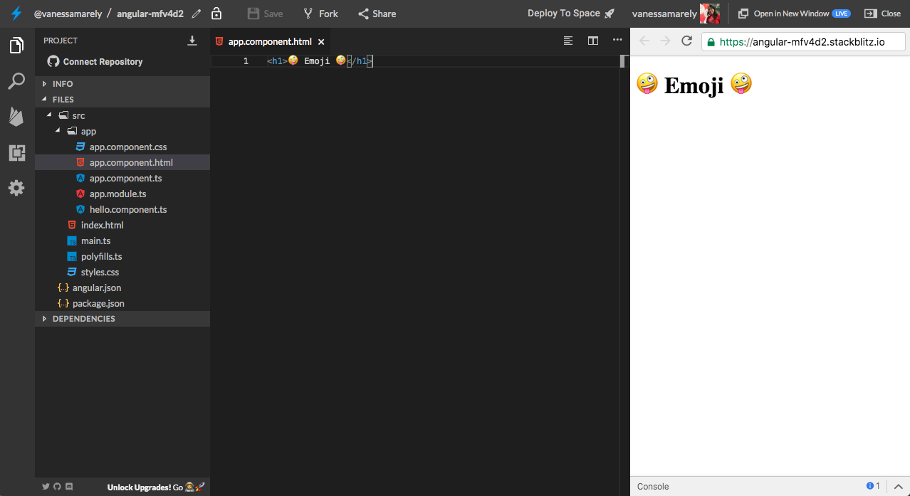
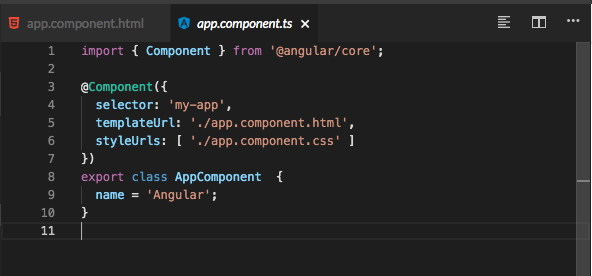
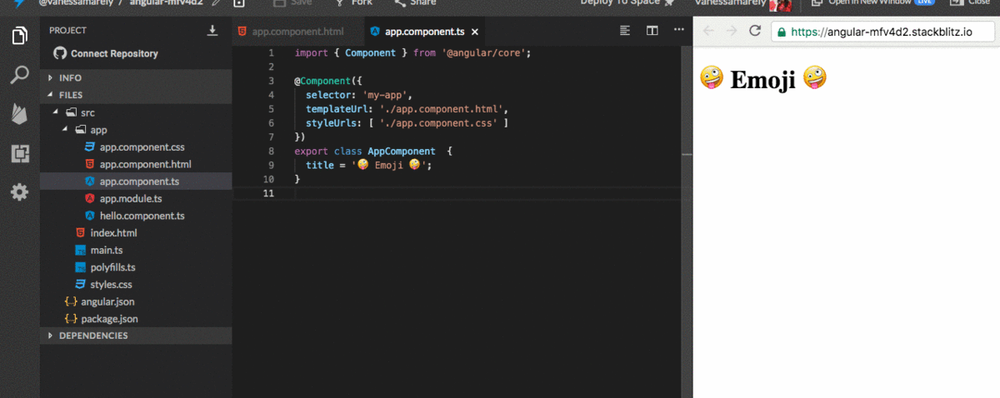
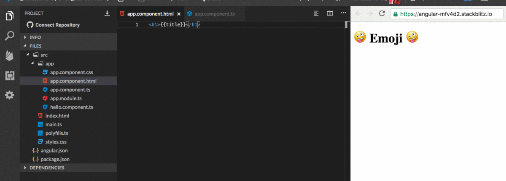
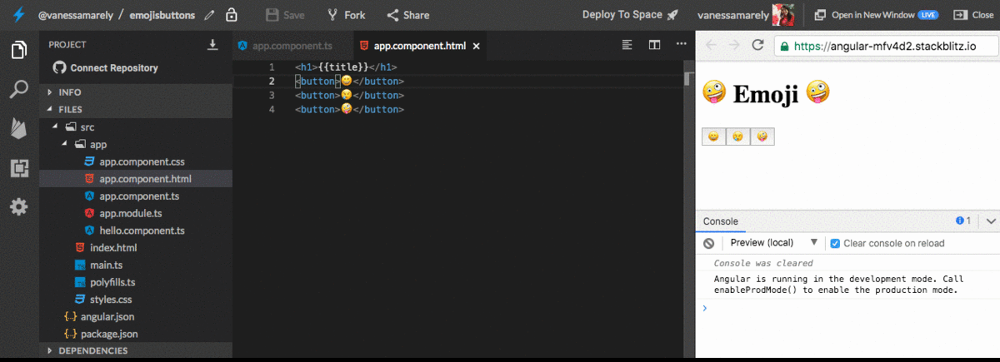
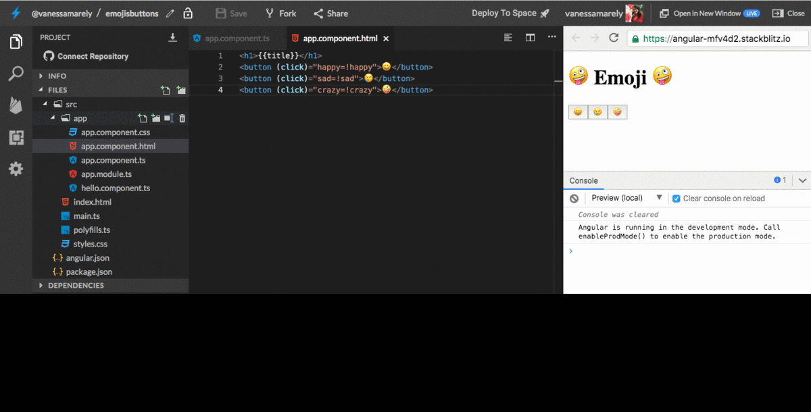
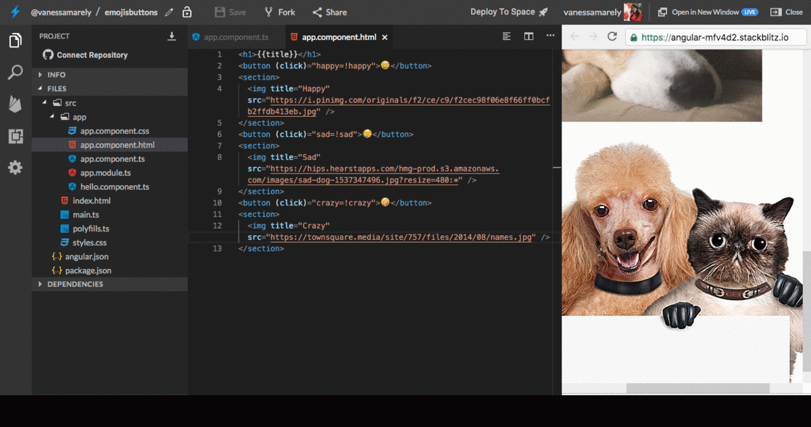
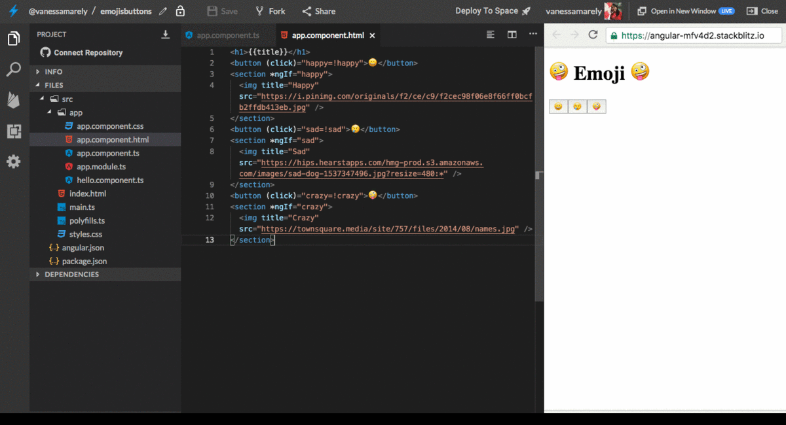

# 👮 Básico \#1 - Directivas👮

## 💡 Introducción 💡

En este desafío haremos algo divertido aplicando conceptos básicos de Angular, en especial sobre directivas, los cuales  iremos describiendo a medida que realicemos cada uno de los pasos descritos abajo.  

**¡**[**Aquí puedes encontrar el demo**](https://buttons-emojis.stackblitz.io)**!**

¿Estás list@?

**Es hora de la Acción!!! 😝**

## Paso 1: **Creemos nuestra App de Angular** ⭐️

Primero iremos a el inicio de **Stackbliz** y crearemos una App de Angular.


En la parte izquierda donde dice "Files", seleccionaremos el archivo llamado **app.component.html**. 

Dentro del archivo seleccionamos su texto,  lo borramos \(presionando la tecla delete de tu compu 💻\) y guardamos los cambios, seleccionando en la parte superior la opción de '**Save**' 💾 o la tecla rápida **cmd** + **S** o en windows **Ctrl** + **S.** 


## Paso 2: **Añadamos un título** 🏁

En el mismo archivo **app.component.html,** vamos a usar unas etiquetas o tags de **HTML** para poner un título.

Copiaremos lo siguiente en el archivo **app.component.html** 



```markup
<h1>🤪 Emoji 🤪</h1>
```



Deberías ver algo así: 👇




**¿Qué es una etiqueta?**👇

Como lo vimos anteriormente, las etiquetas o tags son la forma de escribir código HTML, es la semántica del HTML. Son fragmentos de texto rodeados por corchetes angulares `< >,` que tienen funciones y usos específicos, existen muchas etiquetas como **&lt;div&gt;&lt;/div&gt;**, **&lt;p&gt;&lt;/p&gt;**, ****entre otras.

**&lt;h1&gt;:** Es una etiqueta para los títulos más grandes


Existe un concepto en Angular que se llama la **interpolación**, la cual nos permite mostrar lo que definamos en la lógica, puede ser un titulo y mostrarlo en la vista o **HTML**.

Así que usaremos la interpolación para nuestro título.

En el archivo **app.component.ts**, vas a encontrar varias líneas de código, como el siguiente:



Nuestro código lo pondremos dentro de las llaves que inician en la línea 8. Entonces modificaremos la variable **name** y le pondremos **title** y dentro de las comillas pondremos el texto que colocamos en nuestras etiquetas &lt;h1&gt;&lt;/h1&gt;. Así:



```typescript
import { Component } from '@angular/core';

@Component({
  selector: 'my-app',
  templateUrl: './app.component.html',
  styleUrls: [ './app.component.css' ]
})
export class AppComponent  {
  title = '🤪 Emoji 🤪';
}
```



 

En el archivo de **app.component.html** dentro de las etiquetas &lt;h1&gt;&lt;/h1&gt; pondremos nuestra variable definida. Así:



```markup
<h1>{{title}}</h1>
```





## Paso 3: **Añadamos un botón** 🆒

En nuestra vista o **HTML** incluiremos no solo uno sino varios botones y en lugar de poner dentro de ellos texto, pondremos emojis.

Entonces manos a la obra 😀.

En nuestro **app.component.html** añadiremos las etiquetas de un botón, &lt;button&gt;&lt;/button&gt; y repetiremos esta línea 3 veces y dentro de ella pondremos diferentes emojis.



```markup
<h1>{{title}}</h1>
<button></button>
```





Nuestro **app.component.html** quedaría así:



```markup
<h1>{{title}}</h1>
<button>😀</button>
<button>😢</button>
<button>🤪</button>
```



## Paso 4: Pongamos algunas Directivas

Las Directivas son unas instrucciones que nos permiten añadir ciertos comportamientos a nuestra vista. Comportamientos como mostrar u ocultar el código. nos permite recorrer una colección de datos, entre otros.

Entonces usaremos nuestros botones para que al darles clic nos muestre una imagen que represente el emoji de nuestro botón, y al dar clic nuevamente sobre el mismo botón la oculte. Seguiremos los siguientes pasos:

* Crearemos 3 variables llamadas: **happy**, **sad**, **crazy** y a todas les asignaremos el valor de false. Estas variables las pondremos debajo de nuestra variable title en nuestro **app.component.ts**.


**Te recuerdo ¿Qué es una variable?** es como un caja, \(donde puedes poner cosas 🎁\). Ésta almacenará lo que nosotros queramos, textos, números, etc **👍**




```typescript
import { Component } from '@angular/core';

@Component({
  selector: 'my-app',
  templateUrl: './app.component.html',
  styleUrls: [ './app.component.css' ]
})
export class AppComponent  {
  title = '🤪 Emoji 🤪';
  happy= false;
  sad= false;
  crazy= false;
}

```



* Como queremos que al darle clic a nuestros botones este muestre o oculte una imagen, entonces debemos de añadirle a cada uno el evento clic \(Este hace referencia a un concepto que se llama **Event Binding**\).


**Event Binding.** Ella nos permite agregar eventos a nuestra vista. En este caso utilizamos el evento de **Click**, pero pueden ser muchos tipos: **\(keyup\)**, **\(change\)**, **\(resize\)**, etc  💻


Entonces a nuestras etiquetas le  añadiremos el click, y le asignaremos a cada botón la variable que creamos respectiva a cada botón, pero para cambiar ese valor de **false**, le pondremos a cada una de nuestras variables el signo de admiración **!**, esto lo que hace es negar nuestra variable.  Si nuestra variable tenia un valor de **true**, al darle clic esta se negara, significa que se convertirá en **false**. Si nuestra variable tenia asignado un **false**, al darle clic se negará en otras palabras se convertirá en **true**. 





```markup
<h1>{{title}}</h1>
<button (click)="happy=!happy">😀</button>
<button (click)="sad=!sad">😢</button>
<button (click)="crazy=!crazy">🤪</button>
```



Si damos clic en cada botón, visualmente no notaremos el cambio, así que es hora de poner nuestras imágenes.

* Colocaremos nuestras imágenes, para esto pondremos dentro de una etiqueta &lt;section&gt;, la etiqueta &lt;img&gt; \(puedes usar la imagen que desees\), como son tres botones pondremos 3 &lt;section&gt;. Ubiquemos nuestras etiquetas debajo de cada etiqueta &lt;button&gt;&lt;/button&gt;. Así:



El código que aparece en la imagen es el siguiente:



```markup
<h1>{{title}}</h1>
<button (click)="happy=!happy">😀</button>
<section>
  
</section>
<button (click)="sad=!sad">😢</button>
<button (click)="crazy=!crazy">🤪</button>
```



* Dupliquemos el código de &lt;section&gt; para los otros dos botones y le cambiamos el title de la imagen y el src.

Duplicado queda así:



```markup
<h1>{{title}}</h1>
<button (click)="happy=!happy">😀</button>
<section>
  
</section>
<button (click)="sad=!sad">😢</button>
<section>
  
</section>
<button (click)="crazy=!crazy">🤪</button>
<section>
  
</section>
```



 Si cambiamos los title y el src, nos queda así:


Tu código debería quedar similar al siguiente, pero con las imágenes que hayas agregado de tu preferencia.



```markup
<h1>{{title}}</h1>
<button (click)="happy=!happy">😀</button>
<section>
  
</section>
<button (click)="sad=!sad">😢</button>
<section>
  
</section>
<button (click)="crazy=!crazy">🤪</button>
<section>
  
</section>
```



* Ahora que tenemos nuestras imágenes vamos a añadir la directiva encargada de ocultar y mostrar el contenido. 

Para ello en cada &lt;section&gt; incluiremos el **\*ngIf**, esta directiva se encarga de ocultar o mostrar algo de acuerdo a la variable o función de la cual deseemos que se evalué algo.

Nosotros deseamos evaluar que si nuestras variables: **happy, sad, crazy** son verdaderas nos muestre la imagen que representa cada botón.

Para esa evaluación añadiremos en cada etiqueta nuestra directiva así:

```markup
<section *ngIf="happy">
```

Entonces por cada &lt;section&gt; incluiremos un **\*ngIf** con su variable.



Como muestra la imagen anterior, al añadir nuestra directiva se irá ocultando la imagen.

Si damos clic sobre cada botón mostrará y ocultara nuestra imagen.




¡Felicitaciones hemos terminado el primer desafío básico!

🎉 ¡**LO LOGRASTE!** 🎉


\*\*\*\*[**Aquí** ](https://stackblitz.com/edit/buttons-emojis)puedes encontrar el ejercicio resuelto.


## 😎 Tu Misión Especial 😎

Parece que nuestra aplicación está lista 😀. 

⭐️ Como vez la aplicación no luce tan bonita, entonces tu misión especial es ponerle algunos estilos para que luzca super cool!! ****⭐️


Has completado el **desafío \#1 de nivel básico**, ahora vamos al **desafío básico \#2 👇**



**Nota:**

Si necesitas mentoría con este ejercicio puedes contactar a:

Vanessa M. Aristizabal  
Twitter: @vanessamarely  
Correo: vanessamarely@gmail.com


