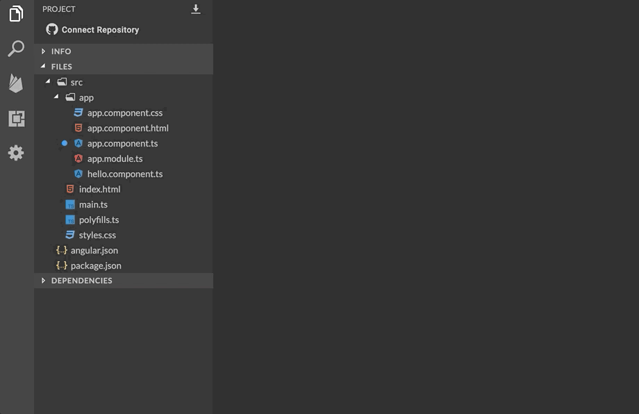

# Básico \#2 - Trasformando data 🗳🗂

## 💡 Introducción 💡 <a id="paso-1-creemos-nuestra-app-de-angular"></a>

Hora de aplicar lo aprendido, vamos a jugar con HTML, Css y Angular 😎   
Realizaremos una aplicación que nos permita cambiar la manera en la que vemos la información en pantalla.

\*\*\*\*[**¡Aquí puedes encontrar el demo!**](https://angular-transformando-data.stackblitz.io)\*\*\*\*

## Paso 1: **Creemos nuestra App de Angular** 🅰️

Entra a [**www.stackblitz.com**](https://stackblitz.com), y verás algo como esto:


## Paso 2: **Vamos a crear unas variables 🗳**

Ya dominas perfectamente el concepto de que es una variable 🤓vamos a crear las variables que van a contener la información que vamos a mostrar en nuestra aplicación.  
Copiaremos lo siguiente en el archivo **app.component.ts.**



```typescript
flipCard = false;
today = new Date();
totalBill = 203094.12;
text = 'SHe CoDes AnGulAr';
```



Deberías hacer algo así, y tu resultado se deberá ver así:👇




**Por si tienes alguna duda. Aquí te explicamos cómo funciona: 👷‍♀️  
  
1.** Vamos a crear una variable llamada`flipCard`para manejar un efecto muy lindo que tendremos de voltear el rectángulo donde pondremos nuestros datos a mostrar, dónde le asignaremos un valor _booleano_ en **false**.  
**2.** Vamos a crear una variable llamada `today,` dónde le asignaremos el valor de una función propia de JavaScript que obtiene la fecha actual.  
**3.** En la variable `totalBill` vamos a almacenar un número con decimales.  
**4.** Y finalmente en la variable `text` vamos a almacenar una cadena de caracteres o también llamado dató string.


## Paso 3: **Vamos a construir el esqueleto de nuestra aplicación 💀**

En esta parte vamos a crear la estructura HTML que le dará vida y estructura a la forma en que presentaremos los datos en pantalla.  
En este archivo llamado  **app.component.html** vamos a reemplazar su contenido, por el siguiente código.



```markup
<div>
	<div class="centerTitle">
		<h1>Vamos a cambiar la forma en la que vemos nuestra información en pantalla</h1>
	</div>

	<div>
		<div class="cardContainer">
			<div class="card" [class.flipped]="flipCard" (click)="onClickCard()">
				<div class="front">
					<h3 class="cardTitle">
						¡¡¡ Dame Click !!!
						<!-- TODO: Aquí colocaremos datos sin modificar -->
            </h3>
				</div> <!-- close card front -->

				<div class="back">
					<div class="content">
						<h3 class="cardTitle">
							<!-- TODO: Aquí colocaremos los mismos datos modificados -->
              </h3>
					</div> <!-- close card back content -->
				</div> <!-- close card back -->

			</div> <!-- close card -->
		</div> <!-- close cardContainer -->
	</div>

</div>
```




Deberías hacer algo así, y tu resultado se deberá ver así:👇



**Por si tienes alguna duda. Aquí te explicamos cómo funciona: 👷‍♀️  
  
1.** En nuestro código HTML tenemos la etiqueta H1, que nos presenta el titulo de la aplicación.  
**2.** Tenemos un `<div>` que nos contiene una clase llamada **"cardContainer"**, aquí meteremos toda la información que queremos mostrar.  
**3.** Dentro de el `<div>` que contiene la clase llamada "**card"**, tenemos unas etiquetas que nunca habíamos visto.  
       **3.1** la primera es **\[class.flipped\]="flipCard"** \(será el responsable de darnos el efecto de girar una tarjeta\), vemos la variable `flipCard` que creamos anteriormente, que funciona así: cuando el valor es true en nuestra estructura HTML se adicionara la clase f**lipped**, solo y solo si, la variable es true, si su valor es false entonces no nos va a adicionar la clase **flipped** en nuestra estructura HTML.  
       **3.2** la segunda es \(click\)="onClickCard\(\)" aquí capturaremos el evento click donde nos mostrará u ocultará la información con la data transformada o sin transformar dependiendo del caso. \(en un siguiente paso veremos que contiene la función\).  
**4.** Ten presente los 2 comentarios que estás viendo que contienen   
**&lt;!-- TODO: Aquí .... --&gt;**  
 porque estas líneas nos servirán de referencia para poner código en un siguiente paso.


## Paso 4: U**na función pequeñita 👶🍼**

Vamos a crear una función simple, pero poderosa 💪🏽con ella controlaremos el valor de nuestra variable **flipCard**.    
Adicionaremos en el archivo  **app.component.ts** el siguiente código debajo de la declaración de variable text.



```typescript
onClickCard() {
this.flipCard = !this.flipCard;
}
```



Deberías hacer algo así, y tu resultado se deberá ver así:👇



**Por si tienes alguna duda. Aquí te explicamos cómo funciona: 👷‍♀️  
  
1.** La lógica de nuestra función **onClickCard\(\)** manejara el valor de la variable `flipCard`, `this.flipCard = !this.flipCard;` haciendo esto almacenaremos en esta variable el valor contrario al que tiene originalmente, ejemplo:  
Si el valor de `flipCard` es **true**, con `!this.flipCard` le asignamos un valor **false**.  
Si el valor de `flipCard` es **false**, con `!this.flipCard` le asignamos un valor **true**.


## Paso 5: **Hora de transformar nuestros datos 🧾⚡️🔖**

Llego la hora de cambiar el contenido de nuestras variables, sin cambiar el contenido de nuestras variables 🤨💬what? 🥴¡sí! nuestro objetivo será mostrar el valor de nuestras variables, sin asignarle un valor diferente, solo modificaremos la forma en la que se ve el mismo valor en pantalla.  
En este archivo llamado **app.component.html** vamos a reemplazar la línea "&lt;!-- TODO: Aquí colocaremos datos sin modificar --&gt;", por el siguiente código.



```markup
<br/>
Hoy: {{ today | date }}
<br/>
<!-- USD - American dollar -->
Valor factura: {{totalBill | currency:'USD'}}
<br/>
Redeondeo Número: {{totalBill | number}}
<br/>
Minúsculas: {{text | lowercase}}
```



Deberías hacer algo así, y tu resultado se deberá ver así:👇


En este archivo llamado **app.component.html** vamos a reemplazar la línea "&lt;!-- TODO: Aquí colocaremos los mismos datos modificados --&gt;", por el siguiente código.



```markup
Hoy: {{ today | date:'fullDate' }}
<br/>
<!-- CLP - Chilean Peso -->
Valor factura: {{totalBill | currency:'CLP'}}
<br/>
Redeondeo Número: {{totalBill | number:'1.0-0'}}
<br/>
Mayúsculas: {{text | uppercase}}
```



Deberías hacer algo así, y tu resultado se deberá ver así:👇



**Por si tienes alguna duda. Aquí te explicamos cómo funciona: 👷‍♀️  
  
1.** Recordemos el concepto de interpolación que es la forma de visualizar las variables en nuestra template \(archivo HTML\), utilizamos las llaves dobles {{}} donde en medio de ellas ponemos nuestra variable y de esta manera podremos verla en pantalla.  
**2.** Los [pipes](https://angular.io/guide/pipes) son utilidades que nos permiten evitar programar varias veces la misma función, son funciones fáciles y muy pequeñas, estas pueden ser colocadas en cualquier parte de nuestra aplicación.  
Podemos ver que un **pipe** en angular se activa usando **`|`**  y el nombre de la funcionalidad que deseas, ejemplo: `«date»,` en este caso solo muestra la fecha pero podemos cambiar el formato.  
**3.** Tipos de pipes que usaremos hoy:  
   \* date: Fechas.  
   \* currency: Monedas.  
   \* number: Números.  
   \* lowercase: Minúscula.  
   \* uppercase: Mayúscula.  
4. Podemos adicionar propiedades extra a nuestros pipes, por ejemplo:   
date:'fullDate' el elemento _fullDate_ me indica que deseo la fecha completa, también puedo poner  '_shortDate_' o simplemente el formato de fecha que deseo '"_MM/dd/yy_"'.  
  
**Nota:** Lista de algunos pipes [https://angular.io/api/common\#pipes](https://angular.io/api/common#pipes)  


## Paso 6: Agregar estilos al tablero de juego 🎨🖌

Ya hicimos toda la lógica 🧠, ahora vamos a ponerle personalidad 👩‍🎨  
Reemplaza el contenido de **styles.css** con el siguiente código:



```css
/* Add application styles & imports to this file! */
@import url(https://fonts.googleapis.com/css?family=Roboto+Slab:400,100,300,700);

body {
  font-family: 'Roboto Slab', serif;
  font-weight: 300;
  font-size: 16px;
  color: #333;
  background: #eee;
  background-image: url(https://subtlepatterns.com/patterns/gplaypattern.png);
  background-position: center center;
}

h1 {
  margin: 0.5em 0 1em 0;
  font-size: 1.8em;
  font-weight: 700;
  color: #096AA3;
}

.animation {
  -webkit-transition: all 0.3s ease;
  -moz-transition: all 0.3s ease;
  -ms-transition: all 0.3s ease;
  -o-transition: all 0.3s ease;
  transition: all 0.3s ease;
}

.centerTitle {
  padding: 3%;
  margin: 20px auto;
  text-align: center;
}

.cardContainer 
{
 
  -webkit-transition: all .3s ease;
  -moz-transition: all .3s ease;
  -ms-transition: all .3s ease;
  transition: all .3s ease;

  
  /*depth of the elements */
  -webkit-perspective: 800px;
  -moz-perspective: 800px;
  -o-perspective: 800px;
  perspective: 800px;

  /*border: 1px solid #ff0000;*/
  padding-left: 1%;
}

.card 
{
  width: 99%;
  height: 200px;
  cursor: pointer;
  
  /*transition effects */
  -webkit-transition: -webkit-transform 0.6s;
  -moz-transition: -moz-transform 0.6s;
  -o-transition: -o-transform 0.6s;
  transition: transform 0.6s;
  -webkit-transform-style: preserve-3d;
  -moz-transform-style: preserve-3d;
  -o-transform-style: preserve-3d;
  transform-style: preserve-3d;
}

.card.flipped 
{
  -webkit-transform: rotateY( 180deg );
  -moz-transform: rotateY( 180deg );
  -o-transform: rotateY( 180deg );
  transform: rotateY( 180deg );
}
.card .front,
.card .back {
  display: block;
  height: 100%;
  width: 100%;
  line-height: 60px;
  color: white;
  text-align: center;
  font-size: 1.5em;
  position: absolute;
  -webkit-backface-visibility: hidden;
  -moz-backface-visibility: hidden;
  -o-backface-visibility: hidden;
  backface-visibility: hidden;
  box-shadow: 3px 5px 20px 2px rgba(0, 0, 0, 0.25);
  -webkit-box-shadow: 0 2px 10px rgba(0, 0, 0, 0.16), 0 2px 5px rgba(0, 0, 0, 0.26);
  box-shadow: 0 2px 10px rgba(0, 0, 0, 0.16), 0 2px 5px rgba(0, 0, 0, 0.26);
}

.card .back {
  width: 100%;
  padding-left: 3%;
  padding-right: 3%;
  font-size: 25px;
  line-height: 25px;
}

.card .back {
  background: #03446A;
  -webkit-transform: rotateY( 180deg );
  -moz-transform: rotateY( 180deg );
  -o-transform: rotateY( 180deg );
  transform: rotateY( 180deg );
}

/*Colors for front and back applied here*/
.cardContainer:first-child .card .front {
  background: #2aa9e0;
}

.cardContainer:first-child .card .back {
  background: #2aa9e0;
}

h3.cardTitle {
  line-height: 1.2em;
  font-weight: 600;
}
.content h3.cardTitle
{
  margin-top: 0%;
}

.content {
  padding: 2% 0% 4% 1%;
  font-weight: 100;
  font-weight: bold;
}
```



Deberías hacer algo así, y tu resultado se deberá ver así:👇


🎉 ¡**LO LOGRASTE!** 🎉


\*\*\*\*[**Aquí**](https://stackblitz.com/edit/angular-transformando-data) puedes encontrar el ejercicio resuelto.


## 😎 Tu Misión 😎

Con lo que aprendiste en el ejercicio de hoy, crea una nueva card, que contenga un pipe diferente a los usados hoy \(aquí un pastelito [https://angular.io/api/common\#pipes](https://angular.io/api/common#pipes)\)**,** ponle el color que quieras 🎨👩‍🎨y asegúrate que cuando le des click las card se volteen de forma independiente \(solo crea una variable que funcione como flipCard 😉\). 

Esta adición es para retar tu curiosidad, podrías proponer la solución que tu quieras. 


Has completado los **Trasformando data 🗳🗂** ahora vamos para nuestro siguiente desafío **👇**



**Nota:**

Si necesitas ayuda con este ejercicio puedes contactar a:

Alejandra Giraldo  
Twitter: @maleja111  
Correo: magiraldodevelop@gmail.com


