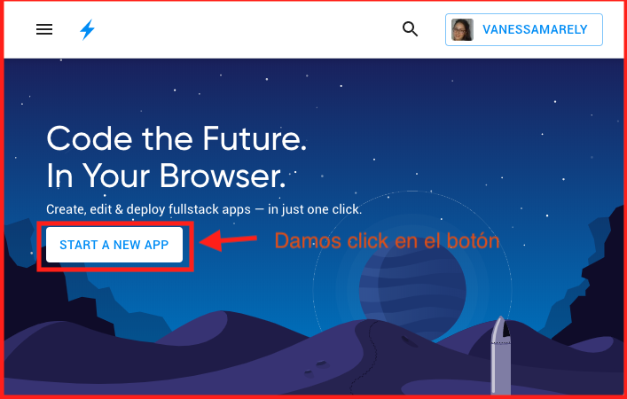
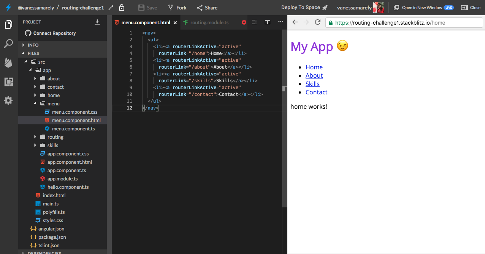

# 📬Intermedio \#1 - Enrutamiento 📬

## 💡 Introducción 💡

En este desafío haremos algo divertido aplicando el concepto de enrutamiento, en cada uno de los pasos iremos abordando algunos conceptos de Angular, y crearemos nuestra nueva aplicación, que para este desafío haremos nuestra página personal o portafolio 😉.

**¡**[**Aquí puedes encontrar el demo**](https://routing-challenge1.stackblitz.io)**!**

¿Estás list@?

**Es hora de la Acción!!! 😝**

## Paso 1: **Creemos nuestra App de Angular** ⭐️

Primero iremos a el inicio de **Stackbliz** y crearemos una App de Angular.




En la parte izquierda donde dice "Files", seleccionaremos el archivo llamado **app.component.html**. 

Dentro del archivo seleccionamos su texto,  lo borramos \(presionando la tecla delete de tu compu 💻\) y guardamos los cambios, seleccionando en la parte superior la opción de '**Save**' 💾 o la tecla rápida **cmd** + **S** o en windows **Ctrl** + **S.** 


## Paso 2: **Añadamos un título** 🏁

En el mismo archivo **app.component.html,** vamos a usar unas etiquetas o tags de **HTML** para poner un título.

Copiaremos lo siguiente en el archivo **app.component.html** 



```markup
<h1>My App 😉</h1>
```




Este paso es muy sencillo y ya lo hemos realizado en pasos anteriores, entonces le pondremos una clase a nuestro título y algo de estilos e incluso podemos incluirle una tipografía a nuestra aplicación.

Para la fuente puedes usar cualquier tipografía de google como la siguiente e importarla en el archivo styles.css y aplicar la fuente a todos los elementos, así:



```css
/* Add application styles & imports to this file! */
@import url('https://fonts.googleapis.com/css?family=Open+Sans&display=swap');
* {
  font-family: 'Open Sans', sans-serif;
}
```



O puedes usar alguna otra del catalogo:

[https://fonts.google.com/](https://fonts.google.com/)

A nuestro título, lo pondremos dentro de la etiqueta header y le añadiremos un atributo clase. Como este es el nivel intermedio y ya sabes como poner algunos elementos, entonces no te mostraremos como poner la etiqueta o el color en el paso a paso.

##  Paso 3: Crearemos varios componentes 💪

Angular esta compuesto por varios **componentes**. En nuestra aplicación base existe un componente **App**, en él hemos estado añadiendo las diferentes instrucciones de los diferentes desafíos.

Cuando visitas una página Web, puedes observar que ella tiene muchas secciones como información de una empresa/producto, detalles de servicios, información de contacto entre otras. En este paso crearemos varios componentes, que serán donde iremos a colocar cada una de las secciones de nuestra página.

Dando clic derecho sobre la carpeta App, se desplegará un menu, en el seleccionaremos la opción **Angular Generator** y luego seleccionamos componente.


Nos aparece un campo de texto donde colocaremos el nombre para nuestro componente.


Le colocaremos el nombre home y presionamos enter y se nos creará nuestro nuevo componente.


Repetiremos el mismo paso para la creación del componente para crear otros 3 nuevos componentes, los llamaremos about, skills y contact.

Nuestra carpeta app, lucirá así:


## Paso 4: Añadiendo un Menu 📋

Añadamos un componente para crear nuestro menu en el.

Entonces seguimos los pasos anteriores y crearemos nuestro componente menu.


En el archivo **menu.component.html** vamos a poner la etiqueta &lt;nav&gt; donde pondremos cada uno de los links que nos llevarán a cada componente. Esos links los pondremos en una lista.


Nuestra lista se verá parecida al siguiente código, pero en la vista o **HTML** aún  no veremos nuestra lista hasta que la incluyamos en nuestro componente  App. 



```markup
<nav>
  <ul>
    <li><a>About</a></li>
    <li><a>Skills</a></li>
    <li><a>Contact</a></li>
  </ul>
</nav>
```



En el archivo **app.component.ts** existe una línea donde encuentras el '**selector**' y ese es el que se debe añadir en el **app.component.html**

Copia el selector y añádelo como etiqueta en la vista del componente App.


Ahora debemos unir cada uno de los links a los respectivos componentes.

## Paso 5: Uniendo los componentes a sus links 🕹️

Vamos a crear un modulo para controlar todas nuestras rutas.

En la carpeta **app**, vamos a dar clic derecho y en la opción Angular Generator, seleccionaremos Module


En nuestro nuevo archivo vamos a incluir las rutas y para ello debemos importar el RouterModule  e incluir en los import la colección de nuestras rutas.

* Incluimos el import

```typescript
import { RouterModule } from '@angular/router';
```

* en los import colocaremos la colección usando el forRoot.

```typescript
RouterModule.forRoot([
      { path: 'about', component: AboutComponent },
      { path: 'contact', component: ContactComponent },
      { path: 'home', component: HomeComponent },
      { path: 'skills', component: SkillsComponent },
      { path: '**', redirectTo: 'home' }
    ])
```

* Debemos también importar los componentes que estamos mencionando en la colección de rutas, para que no salga error en nuestra aplicación.

```typescript
import { AboutComponent } from '../about/about.component';
import { ContactComponent } from '../contact/contact.component';
import { HomeComponent } from '../home/home.component';
import { SkillsComponent } from '../skills/skills.component';
```

* Debemos incluir también nuestros componentes en los declarations.

```typescript
declarations: [ AboutComponent, ContactComponent, HomeComponent, SkillsComponent]
```


También podemos crear una variable donde almacenemos la colección de nuestras rutas y la pondremos en nuestro forRoot, pero esta es solo otra alternativa.



```typescript
import { NgModule } from '@angular/core';
import { CommonModule } from '@angular/common';
import { RouterModule } from '@angular/router';
import { AboutComponent } from '../about/about.component';
import { ContactComponent } from '../contact/contact.component';
import { HomeComponent } from '../home/home.component';
import { SkillsComponent } from '../skills/skills.component';

@NgModule({
  imports: [
    CommonModule,
    RouterModule.forRoot([
      { path: 'about', component: AboutComponent },
      { path: 'contact', component: ContactComponent },
      { path: 'home', component: HomeComponent },
      { path: 'skills', component: SkillsComponent },
      { path: '**', redirectTo: 'home' }
    ])
  ],
  declarations: [ AboutComponent, ContactComponent, HomeComponent, SkillsComponent]
}) 
export class RoutingModule { }
```



* Aún no hemos incluido el archivo routing.module en nuestro app, para esto en el archivo **app.module.ts**, importamos nuestro archivo **routing.module.ts**



```typescript
import { RoutingModule } from './routing/routing.module';
```



Incluimos en la colección de imports nuestro '**RoutingModule**'

```typescript
imports:      [ BrowserModule, FormsModule, RoutingModule ],
```

En nuestro **app.module.ts** aparecen importados los componentes que ya incluimos en el **routing.module.ts**, entonces lo que haremos es borrar los que ya están en el routing. Nuestro **app.module.ts** quedará así:



```typescript
import { NgModule } from '@angular/core';
import { BrowserModule } from '@angular/platform-browser';
import { FormsModule } from '@angular/forms';

import { AppComponent } from './app.component';
import { MenuComponent } from './menu/menu.component';

import { RoutingModule } from './routing/routing.module';

@NgModule({
  imports:      [ BrowserModule, FormsModule, RoutingModule ],
  declarations: [ AppComponent, MenuComponent ],
  bootstrap:    [ AppComponent ]
})
export class AppModule { }

```



* Nos falta incluir estas rutas que creamos de nuestros componentes en el menu que incluimos y usar la etiqueta &lt;router-outlet&gt; que nos ayudará a mostrar el contenido de nuestros componentes

En nuestro **app.component.html** vamos a incluir nuestra etiqueta &lt;router-outlet&gt; &lt;/router-outlet&gt;, dentro de estas etiquetas se va a mostrar todo el contenido de nuestros componentes.



```markup
<header class="header">
  <h1>My App 😉</h1>
</header>
<app-menu></app-menu>
<router-outlet></router-outlet>
```



Al incluir nuestra etiqueta saldrá un error parecido al siguiente y es porque nos falta exportar nuestro Modulo de Routing, y para esto es solo que incluyamos el export, en nuestro NgModule, en el **routing.module.ts** así:



```typescript

@NgModule({
  imports: [
    CommonModule,
    RouterModule.forRoot([
      { path: 'about', component: AboutComponent },
      { path: 'contact', component: ContactComponent },
      { path: 'home', component: HomeComponent },
      { path: 'skills', component: SkillsComponent },
      { path: '**', redirectTo: 'home' }
    ])
  ],
  declarations: [ AboutComponent, ContactComponent, HomeComponent, SkillsComponent],
  exports: [
    RouterModule,
  ]
}) 

```



* Solo falta incluir en nuestros links la ruta de nuestros componentes y para ello vamos a hacer uso de unos atributos que tiene el enrutamiento o Routing, llamados **routerLinkActive** y **routerLink**. En cada uno de nuestros links incluiremos que nuestro link esta activo y le pondremos en el routerLink el path que asignamos en el RouterModule. En el archivo **menu.component.html** añadiremos lo mencionado.



```markup
<nav>
  <ul>
    <li><a routerLinkActive="active" 
      routerLink="/home">Home</a></li>
    <li><a routerLinkActive="active" 
      routerLink="/about">About</a></li>
    <li><a routerLinkActive="active" 
      routerLink="/skills">Skills</a></li>
    <li><a routerLinkActive="active" 
      routerLink="/contact">Contact</a></li>
  </ul>
</nav>
```





Si damos clic en cada uno de los links podremos ver el contenido de cada componente.


Como puedes notar no hay mucho contenido en nuestros componentes, entonces podemos incluir alguno de contenido en ellos. 

## Paso 6: Añadamos algo de contenido 🤡

En nuestro componente home, podemos incluir algo de texto introductorio a nuestra aplicación, esta aplicación es como tu portafolio. Entonces incluye un texto para darle la bienvenida a tu visitante y algo de contexto de la página. En nuestro **home.component.html** colocaremos las etiquetas y el texto.



```markup
<section>
  <p>Bienvenidos!!</p>
  <p>
  Esta es mi página y en ella incluire mi portafolio, el cual estan todos invitados a conocer.
  </p>
</section>
```



En el component about, **about.component.html**,  podemos colocar un título.



```markup
<section>
  <header>
    <h1>Sobre Mí</h1>
  </header>
</section>
```



Nuestro portafolio se verá así:


¡Sí has llegado hasta aquí, Felicitaciones!!! 

Estas a un paso de completar este desafío, solo te falta realizar la misión especial 👍

😉


\*\*\*\*[**Aquí**](https://stackblitz.com/edit/routing-challenge1) puedes encontrar el ejercicio resuelto.


## 😎 Tu Misión Especial 😎

Parece que nuestra aplicación está casi lista 😀. 

👍 Para completarla debes  añadir contenido en los componentes restantes, recuerda que estas construyendo tu portafolio, entonces añade información sobre ti en cada componente y si necesitas ayuda con los estilos o añadiendo el contenido nos puedes pedir ayuda 👍

Si completas tu portafolio y me muestras este desafío completado, te daré un pequeño detalle 😁


Has completado el **desafío \#2 de nivel básico**, ahora vamos al **desafío Intermedio \#2 👇**



**Nota:**

Si necesitas mentoría con este ejercicio puedes contactar a:

Vanessa M. Aristizabal  
Twitter: @vanessamarely  
Correo: vanessamarely@gmail.com


