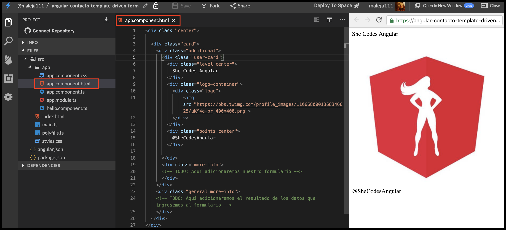
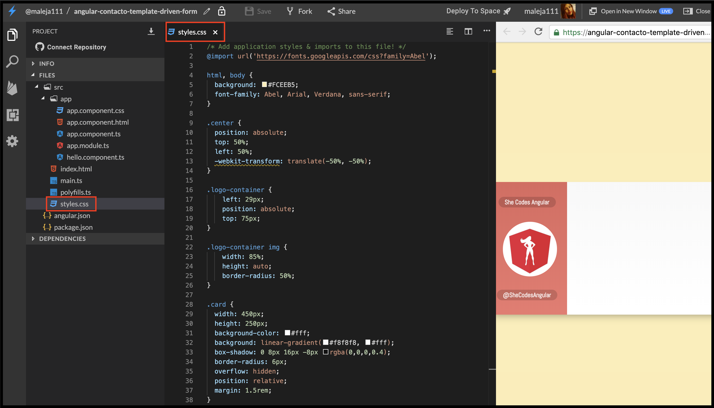
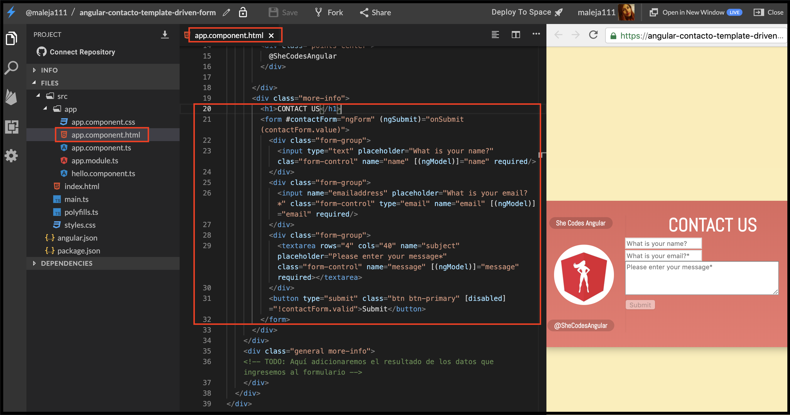

# Intermedio \#2: Crea un formulario de contacto ✉️

## 💡 Introducción 💡

En este desafío vamos a mostrar de forma muy creativa datos que tú mismo vas a ingresar en un formulario de contacto, la cual es una funcionalidad básica de las páginas web. 📬

\*\*\*\*[**¡Aquí puedes encontrar el demo!**](https://angular-contacto-template-driven-form.stackblitz.io)\*\*\*\*

## Paso 1: **Creemos nuestra App de Angular** 🅰️

Entra a [**www.stackblitz.com**](https://stackblitz.com), y verás algo como esto:


## Paso 2: **Vamos a la estructura** básica **HTML 💀**

Vamos a adicionar la estructura básica que va a tener nuestro formulario para que tengamos mucho mas claro como vamos a visualizar nuestros datos.  
Reemplazaremos el contenido del archivo **app.component.html** y adicionaremos lo siguiente:



```markup
<div class="center">

	<div class="card">
		<div class="additional">
			<div class="user-card">
				<div class="level center">
					She Codes Angular
				</div>
        <div class="logo-container">
          <div class="logo">
              
          </div>
        </div>
				<div class="points center">
					@SheCodesAngular
				</div>
				
			</div>
			<div class="more-info">
      <!-- TODO: Aquí adicionaremos nuestro formulario -->
			</div>
		</div>
		<div class="general more-info">
    <!-- TODO: Aquí adicionaremos el resultado de los datos que ingresemos al formulario -->
		</div>
	</div>
</div>
```



Deberías hacer algo así, y tu resultado se deberá ver así:👇



## Paso 3: **Dale personalidad y color a nuestra aplicación 🎨**

Vamos a hacer algo diferente esta vez, siempre dejamos la estructura CSS para el final, pero en esta ocasión vamos a dejarla lista y nos enfocaremos en la lógica de nuestro formulario de contacto.  
Reemplazaremos el contenido del archivo **styles.css** y adicionaremos lo siguiente:



```css
/* Add application styles & imports to this file! */
@import url('https://fonts.googleapis.com/css?family=Abel');

html, body {
  background: #FCEEB5;
  font-family: Abel, Arial, Verdana, sans-serif;
}

.center {
  position: absolute;
  top: 50%;
  left: 50%;
  -webkit-transform: translate(-50%, -50%);
}

.logo-container {
    left: 29px;
    position: absolute;
    top: 75px;
}

.logo-container img {
    width: 85%;
    height: auto;
    border-radius: 50%;
}

.card {
  width: 450px;
  height: 250px;
  background-color: #fff;
  background: linear-gradient(#f8f8f8, #fff);
  box-shadow: 0 8px 16px -8px rgba(0,0,0,0.4);
  border-radius: 6px;
  overflow: hidden;
  position: relative;
  margin: 1.5rem;
}

.card h1 {
  text-align: center;
}

.card .additional {
  position: absolute;
  width: 150px;
  height: 100%;
  background: linear-gradient(#dE685E, #EE786E);
  transition: width 0.4s;
  overflow: hidden;
  z-index: 2;
}

.card:hover .additional {
  width: 100%;
  border-radius: 0 5px 5px 0;
}

.card .additional .user-card {
  width: 150px;
  height: 100%;
  position: relative;
  float: left;
}

.card .additional .user-card::after {
  content: "";
  display: block;
  position: absolute;
  top: 10%;
  right: -2px;
  height: 80%;
  border-left: 2px solid rgba(0,0,0,0.025);
}

.card .additional .user-card .level,
.card .additional .user-card .points {
  top: 15%;
  color: #fff;
  font-size: 0.75em;
  font-weight: bold;
  background: rgba(0,0,0,0.15);
  padding: 0.125rem 0.75rem;
  border-radius: 100px;
  white-space: nowrap;
}

.card .additional .user-card .points {
  top: 85%;
}

.card .additional .more-info {
  width: 300px;
  float: left;
  position: absolute;
  left: 150px;
  height: 100%;
}

.card .additional .more-info h1 {
  color: #fff;
  margin-bottom: 0;
}

.card .additional .coords {
  margin: 0 1rem;
  color: #fff;
  font-size: 1rem;
}

.card .additional .coords .strong {
  font-weight:bold;
}

.card .general {
  width: 300px;
  height: 100%;
  position: absolute;
  top: 0;
  right: 0;
  z-index: 1;
  box-sizing: border-box;
  padding: 1rem;
  padding-top: 0;
}

.card .general .more {
  position: absolute;
  bottom: 1rem;
  right: 1rem;
  font-size: 0.9em;
}

.margin-left {
  margin-left: 40px;
}
```



Deberías hacer algo así, y tu resultado se deberá ver así:👇



## Paso 3: **Aprendamos a hacer un formulario en Angular.io 📝🅰️**

Ya tienes la estructura básica, hora nos concentraremos en la creación de un formulario, este formulario tendrá 3 campos, un campo para ingresar tu nombre, otro para ingresar tu correo electrónico y un campo para ingresar un mensaje.  
  
Adicionaremos el siguiente contenido reemplazando la línea de comentario `<!-- TODO: Aquí adicionaremos nuestro formulario -->`  en el archivo **app.component.html.**



```markup
<form #contactForm="ngForm" (ngSubmit)="onSubmit(contactForm.value)">
  <div class="form-group">
    <input type="text" placeholder="What is your name?"  clas="form-control" name="name" [(ngModel)]="name" required/>
  </div>
  <div class="form-group">
    <input name="emailaddress" placeholder="What is your email?*" class="form-control" type="email" name="email" [(ngModel)]="email" required/>
  </div>
  <div class="form-group">
    <textarea rows="4" cols="40" placeholder="Please enter your message*" class="form-control" name="message" [(ngModel)]="message" required></textarea>
  </div>
  <button type="submit" class="btn btn-primary" [disabled]="!contactForm.valid">Submit</button>
</form>
```



Deberías hacer algo así, y tu resultado se deberá ver así **cuando pases el mouse sobre la aplicación**:👇




**Por si tienes alguna duda. Aquí te explicamos cómo funciona: 👷‍♀️  
  
1.** En Angular.io existen 2 tipos de Formularios [Template-driven](https://angular.io/guide/forms#template-driven-forms) y [Reactive Forms](https://angular.io/guide/reactive-forms#reactive-forms), en esta oportunidad trabajaremos con los formularios tipo [Template-driven](https://angular.io/guide/forms#template-driven-forms). su diferencia radica en el tipo de aplicaciones que necesites crear, para formularios simples y sin lógica personalizadas, esta es tu mejor opción, cuando necesitas validaciones personalizadas o creación de campos que aparezcan dinámicamente [Reactive Forms](https://angular.io/guide/reactive-forms#reactive-forms) es tu mejor opción.  
**2.** En nuestro código HTML tenemos una nueva etiqueta`form`que contendrá nuestro [formulario](https://www.w3schools.com/html/html_forms.asp).  
**3.** En nuestro código HTML tenemos`contactForm="ngForm"`, que es la referencia a nuestro formulario, en Angular se llama Template reference, y básicamente nos ayuda a potenciar una simple etiqueta HTML `form` con todo el poder que tienen Angular para ofrecernos. el `NgForm` le da propiedades como validación o  poner el campo como requerido y muchísimas más funcionalidades con lógica sin necesidad de tanto código.  
**4.** En nuestro código HTML tenemos `(ngSubmit)="onSubmit(contactForm.value):`Con él`(ngSubmit)` estamos usando un evento para hacer acceder a nuestra función `onSubmit()` que va a contener la información de los valores `contactForm.value` que son nuestros datos del formulario en el momento que le demos click a el botón de guardar los datos del formulario. \(aun que no los estemos guardando en ninguna base de datos realmente\)  
**5.** En nuestro código HTML tenemos una nueva etiqueta `input` esta etiqueta nos ayudara a ingresar información a nuestro formulario, en nuestro caso, los campos name y email tienen la etiqueta [input](https://www.w3schools.com/tags/tag_input.asp) que nos permitirá tener control sobre la información ingresada.  
6**.** En nuestro código HTML tenemos una nueva etiqueta `textarea` esta etiqueta nos ayuda ingresando información a nuestro formulario que podría ser de más de una línea, se usa generalmente para párrafos. Nosotros lo usamos para el campo message [textarea](https://www.w3schools.com/tags/tag_textarea.asp).


