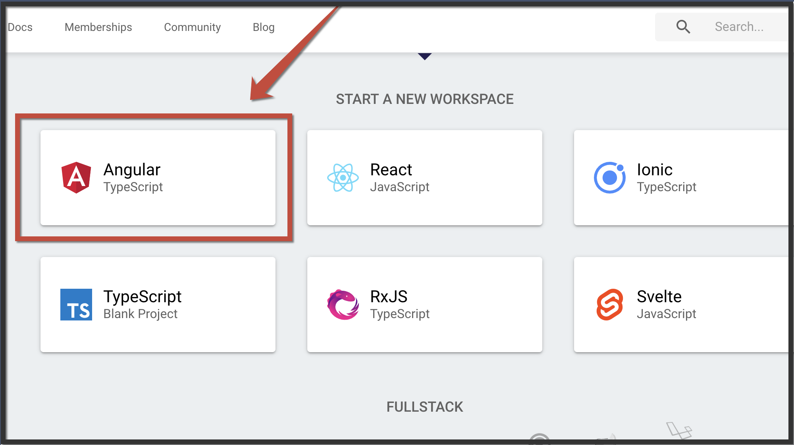

# Intermedio \#2: Crea tu perfil 👤✏️

## 💡 Introducción 💡

En este desafío vamos a mostrar de forma muy creativa tus datos personales, crearemos un formulario que te va a permitir llenar dinámicamente la información que deseas mostrar en tu propio perfil. 🧙🏼‍♀️

\*\*\*\*[**¡Aquí puedes encontrar el demo!**](https://angular-crea-tu-perfil.stackblitz.io)\*\*\*\*

## Paso 1: **Creemos nuestra App de Angular** 🅰️

Entra a [**www.stackblitz.com**](https://stackblitz.com), y verás algo como esto:

