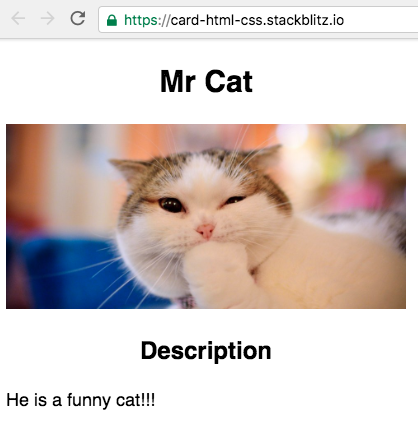
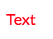
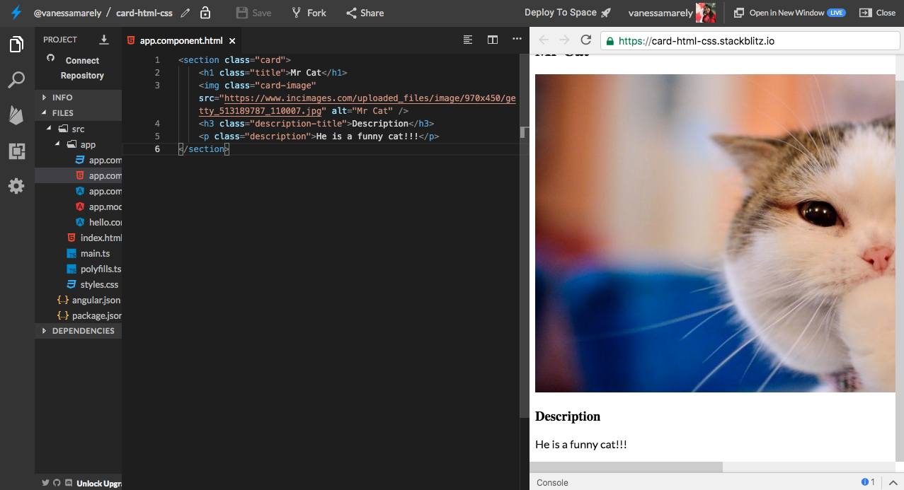
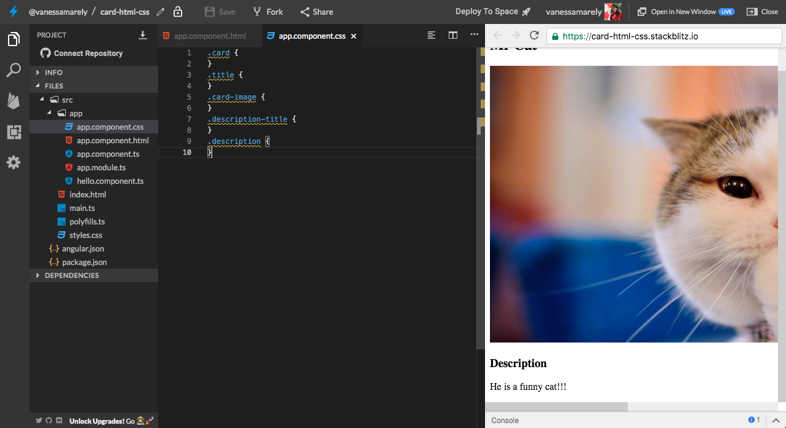
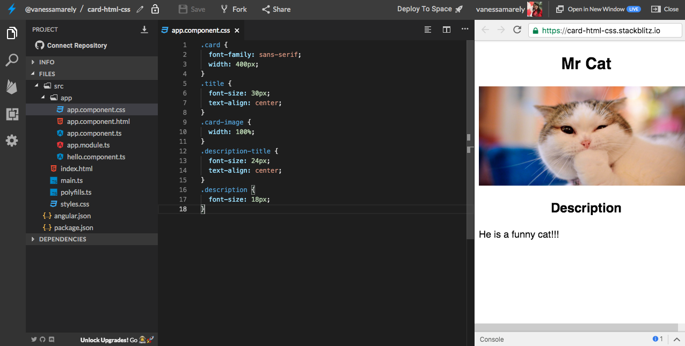
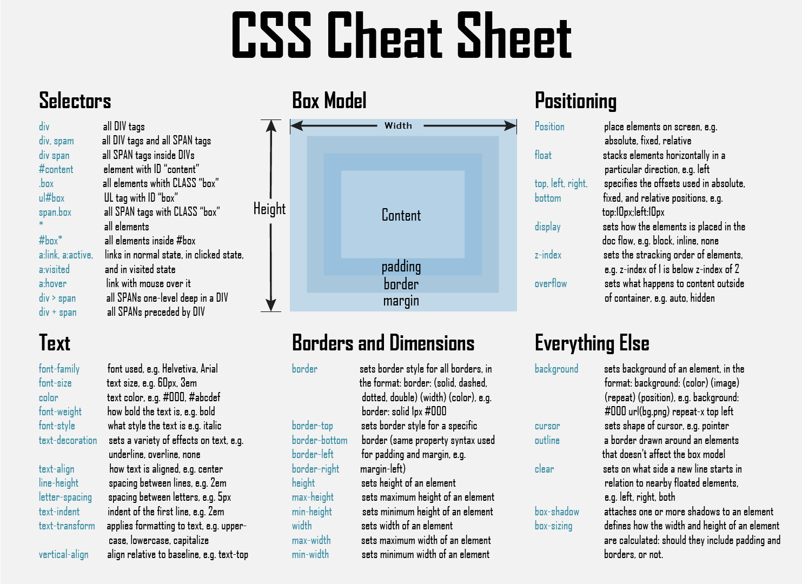

# Primeros Pasos: Html 📝 & CSS 🎨

## 💡Introducción al HTML💡

Las siglas de HTML en ingles significan: **HyperText Markup Language** o lenguaje de marcado de Hipertexto en nuestro idioma.

El HTML, es el lenguaje base con el que se hacen las páginas web.

No es un lenguaje de programación, sino una lenguaje descriptivo, una serie de etiquetas 🏷️ que el navegador reconoce para mostrar el contenido en la pantalla 💻.

### Estructura básica de una página Web

Una página o documento HTML contiene unas etiquetas que son indispensables:

**&lt;html&gt;** Aquí irá todo el contenido de nuestra página **&lt;/html&gt;** 

Dentro de las etiquetas anteriores van dos pares de etiquetas muy importantes:

**&lt;head&gt;** Son etiquetas cabecera del documento, contienen información sobre la página**&lt;/head&gt;**

**&lt;body&gt;** Estas etiquetas son el cuerpo del documento, aquí es donde incluimos todas las etiquetas para nuestro contenido, como: **&lt;div&gt;&lt;/div&gt;&lt;p&gt;&lt;/p&gt;**, entre otras**&lt;/body&gt;**


Todas las etiquetas deben cerrarse. Hay etiquetas que tienen una que abre y cierra como esta: **&lt;p&gt;&lt;/p&gt;**

y hay otras etiquetas que no requieren un par, se puede hacer el cierre en una sola, como: **&lt;img /&gt;**


**Es hora de la Acción!!! 😝**

En este desafío crearemos una **"Card**" de un personaje, paso a paso.

Crearemos algo como lo siguiente: 



¿Estás list@?

## Paso 1: **Creemos nuestra App de Angular** ⭐️

Primero iremos a el inicio de **Stackbliz** y crearemos una App de Angular.


Seleccionamos el texto  del archivo **app.component.html**, lo borramos \(presionando la tecla delete de tu compu 💻\) y guardamos los cambios, seleccionando en la parte superior la opción de 'Save' 💾


Como vamos a usar **Stackbliz** y la estructura de una aplicación de Angular, en este archivo **app.componen.html**, no necesitamos incluir las etiquetas bases \(&lt;html&gt;&lt;head&gt;&lt;body&gt;\), estas ya vienen creadas por defecto 

## Paso 2: Crearemos la estructura de nuestra Card

Para esto vamos incluir unas etiquetas que nos van a ayudar a organizar la información de nuestra card.

En el archivo **app.component.html**, ****incluiremos lo siguiente:



```markup
<section>
</section>
```




Las etiquetas anteriores nos sirven para definir una sección de nuestro documento.

Dentro de las etiquetas &lt;section&gt;&lt;/section&gt;, vamos a añadir un titulo, una imagen y una descripción.

En el archivo **app.component.html**, ****incluiremos lo siguiente:



```markup
<section>
    <h1>Mr Cat</h1>
    
    <h3>Description</h3>
    <p>He is a funny cat!!!</p>
</section>
```




En el código anterior incluimos varias etiquetas, las cuales te explicare a continuación:

**&lt;h1&gt;&lt;/h1&gt;** Sirve para colocar un titulo muy grande.

**&lt;img /&gt;** Sirve para incluir una imagen, puede ser incluso un gif animado.

**&lt;h3&gt;&lt;/h3&gt;** Sirve para colocar un titulo un poco grande

**&lt;p&gt;&lt;/p&gt;** Sirve para poner un párrafo.


Hasta el momento tendremos nuestro código así:


Puedes incluirle más texto si lo deseas. Incluirle más párrafos \(&lt;p&gt;&lt;/p&gt;\)

## 🎨Introducción al CSS🎨

Las siglas de CSS significan “Cascade Style Sheet” o "Hoja de estilo en cascada". 

Son un conjunto de instrucciones que nos permiten definir la apariencia de los diferentes elementos o etiquetas del HTML.

Hay diferentes formas de aplicar el CSS, podemos colocarlo en cada etiqueta o podemos hacerlo haciendo uso de un archivo adicional.

Si queremos aplicar por ejemplo un color a un párrafo, dentro de la etiqueta &lt;p&gt;&lt;/p&gt;, se haría algo así: 

```markup
<p style="color:red">Text</p>
```



Ahora usaremos nuestra card para colocarle algo de estilos.

¿Estás list@?

## Paso 1: Incluiremos selectores a nuestra Card

En el CSS existe algo llamado selectores, que nos permiten definir sobre que tipo de elemento vamos a aplicar un conjunto de reglas o propiedades para cambiar la apariencia de los elementos HTML.

Existen selectores de tipo, de clase, Id, universales y de atributo.


**Selectores de tipo**: Aplica los estilos al elemento que coincide con su nombre. Por ejemplo: h1 { color: red}

**Selectores de Clase**:  Aplica los estilos al elemento que tiene el atributo class. Por ejemplo: &lt;p class="text"&gt;&lt;/p&gt;

**Selectores de Id**: Aplica los estilos al elemento que tiene el atributo Id especificado. Por ejemplo: &lt;p id="text"&gt;&lt;/p&gt;

**Selectores universales**: Selecciona todos los elementos. Por ejemplo: \* {}

**Selectores de atributo**: Aplica los estilos al elemento basándose en el valor de un determinado atributo. Por ejemplo: 

```css
a[title] {
  color: purple;
}
```


Incluiremos selectores tipo clase en nuestra Card en el app.component.html. Nuestro código quedaría así:



```markup
<section class="card">
    <h1 class="title">Mr Cat</h1>
    
    <h3 class="description-title">Description</h3>
    <p class="description">He is a funny cat!!!</p>
</section>
```





Añadimos las clases en nuestro CSS, para esto en e app.component.css, vamos a colocar cada una de las clases que creamos en el HTML.



```css
.card {
}
.title {
}
.card-image {
}
.description-title {
}
.description {
}
```



Nuestro **Stackblitz** se vería así:



## Paso 2: Daremos estilo a nuestra Card

Hasta ahora hemos añadido los selectores de clase. Lo que vamos a añadirle son algunas propiedades para que nuestra card se vea más bonita.

En el archivo **app.component.css**, incluiremos lo siguiente:

1. Vamos a centrar los títulos, para esto usaremos la propiedad: **text-align: center;**
2. Colocaremos un ancho por defecto a nuestra sección de card, usaremos la propiedad: **width: 400px;**
3. Le colocaremos a todo el card una fuente de sans-serif, quedaría así: **font-family: sans-serif;**
4. Colocaremos un tamaño de fuente para la descripción y para los títulos. A la clase del elemento &lt;h1&gt; le pondremos 30px, al &lt;h3&gt; una fuente de 24px y al párrafo &lt;p&gt; una de 18px. Para esto usaremos la propiedad: **font-size**.

Todas las propiedades las incluiremos dentro de las respectivas clases de los elementos, en el archivo **app.component.css.**



```css
.card {
  font-family: sans-serif;
  width: 400px;
}
.title {
  font-size: 30px;
  text-align: center;
}
.card-image {
  width: 100%;
}
.description-title {
  font-size: 24px;
  text-align: center;
}
.description {
  font-size: 18px;
}
```



Podemos incluirle todos los estilos que queramos y usar tantas propiedades como lo desees.



A continuación encontrarás una hoja con algunas propiedades, para que puedas aplicar en tu Card.



¡Felicitaciones hemos terminado el primer desafío!

🎉 ¡**LO LOGRASTE!** 🎉


\*\*\*\*[**Aquí**](https://stackblitz.com/edit/angular-catparty) puedes encontrar el ejercicio resuelto.


## 😎 Tu Misión Especial 😎

Parece que nuestra Card está lista, pero tiene pocos estilos y no se ve tan bonita 😵. 

Tu misión especial es que le pongas un lindo color de fondo a tu Card y añadas algunos colores a los títulos y la descripción.

Puedes añadirle más cosas adicionales si lo deseas, como más imágenes, emojis, entre otros.


Has completado el **desafío \#0 de HTL & CSS**, ahora vamos a el **desafío \#0 de JavaScript 👇**




**Nota:**

Si necesitas mentoría adicional con este ejercicio puedes contactar a:

Vanessa M. Aristizabal  
Twitter: @vanessamarely  
Correo: vanessamarely@gmail.com


