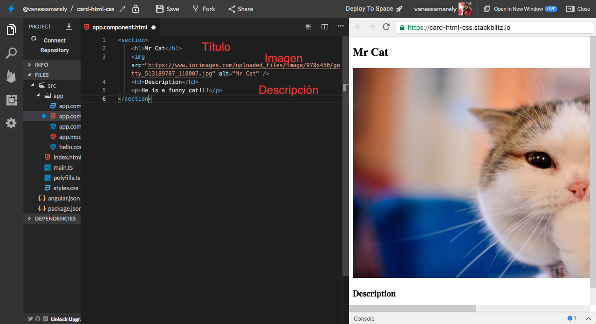

# Primeros Pasos: Html 📝 & CSS 🎨

## 💡Introducción al HTML💡

Las siglas de HTML en ingles significan: **HyperText Markup Language** o lenguaje de marcado de Hipertexto en nuestro idioma.

El HTML, es el lenguaje base con el que se hacen las páginas web.

No es un lenguaje de programación, sino una lenguaje descriptivo, una serie de etiquetas 🏷️ que el navegador reconoce para mostrar el contenido en la pantalla 💻.

### Estructura básica de una página Web

Una página o documento HTML contiene unas etiquetas que son indispensables:

**&lt;html&gt;** Aquí irá todo el contenido de nuestra página **&lt;/html&gt;** 

Dentro de las etiquetas anteriores van dos pares de etiquetas muy importantes:

**&lt;head&gt;** Son etiquetas cabecera del documento, contienen información sobre la página**&lt;/head&gt;**

**&lt;body&gt;** Estas etiquetas son el cuerpo del documento, aquí es donde incluimos todas las etiquetas para nuestro contenido, como: **&lt;div&gt;&lt;/div&gt;&lt;p&gt;&lt;/p&gt;**, entre otras**&lt;/body&gt;**


Todas las etiquetas deben cerrarse. Hay etiquetas que tienen una que abre y cierra como esta: **&lt;p&gt;&lt;/p&gt;**

y hay otras etiquetas que no requieren un par, se puede hacer el cierre en una sola, como: **&lt;img /&gt;**


**Es hora de la Acción!!! 😝**

En este desafío crearemos una **"Card**" de un personaje, paso a paso.

¿Estás list@?

## Paso 1: **Creemos nuestra App de Angular** ⭐️

Primero iremos a el inicio de **Stackbliz** y crearemos una App de Angular.


Seleccionamos el texto  del archivo **app.component.html**, lo borramos \(presionando la tecla delete de tu compu 💻\) y guardamos los cambios, seleccionando en la parte superior la opción de 'Save' 💾


Como vamos a usar **Stackbliz** y la estructura de una aplicación de Angular, en este archivo **app.componen.html**, no necesitamos incluir las etiquetas bases \(&lt;html&gt;&lt;head&gt;&lt;body&gt;\), estas ya vienen creadas por defecto 

## Paso 2: Crearemos la estructura de nuestra Card

Para esto vamos incluir unas etiquetas que nos van a ayudar a organizar la información de nuestra card.

En el archivo **app.component.html**, ****incluiremos lo siguiente:



```markup
<section>
</section>
```




Las etiquetas anteriores nos sirven para definir una sección de nuestro documento.

Dentro de las etiquetas &lt;section&gt;&lt;/section&gt;, vamos a añadir un titulo, una imagen y una descripción.

En el archivo **app.component.html**, ****incluiremos lo siguiente:



```markup
<section>
    <h1>Mr Cat</h1>
    
    <h3>Description</h3>
    <p>He is a funny cat!!!</p>
</section>
```




En el código anterior incluimos varias etiquetas, las cuales te explicare a continuación:

**&lt;h1&gt;&lt;/h1&gt;** Sirve para colocar un titulo muy grande.

**&lt;img /&gt;** Sirve para incluir una imagen, puede ser incluso un gif animado.

**&lt;h3&gt;&lt;/h3&gt;** Sirve para colocar un titulo un poco grande

**&lt;p&gt;&lt;/p&gt;** Sirve para poner un párrafo.


Hasta el momento tendremos nuestro código así:



Puedes incluirle más texto si lo deseas. Incluirle más párrafos \(&lt;p&gt;&lt;/p&gt;\)

## 🎨Introducción al CSS🎨


